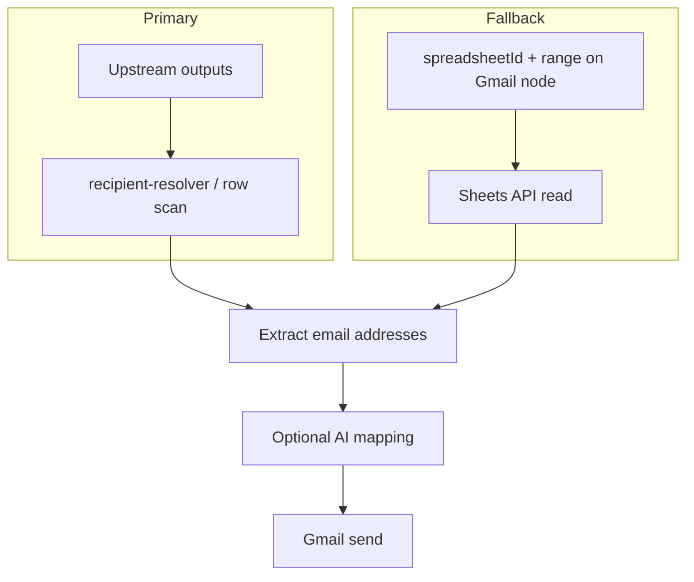

# Gmail + Google Sheets hybrid extraction

## Decision (confirmed)

- **Primary**: Use **upstream node output** (typically `google_sheets` before `google_gmail`) — existing `recipient-resolver` / upstream scan behavior.
- **Fallback**: If usable row data is **not** available from upstream, and the user configured **inline** `spreadsheetId` + sheet identifier (name or range) on **Gmail**, the Gmail execution path **fetches rows** via **Google Sheets API**, then applies the same extraction (heuristics and/or optional AI).
- **User choice from discussion**: Implement **both** paths; **precedence must be explicit**.

## Precedence rule (must document in UI + docs)

1. If **upstream outputs** contain extractable emails (or row arrays the resolver can scan) → **use them**; **do not** call Sheets API from Gmail for that run.
2. Else if **inline** sheet ID + range/name are set on Gmail → **fetch** via Sheets API, then extract.
3. Else → fail with a clear error (missing recipients / missing configuration).

## Architecture sketch

## Implementation phases

### Phase 1 — Registry and UI

- Extend `[worker/src/services/nodes/node-library.ts](worker/src/services/nodes/node-library.ts)` `google_gmail` optional fields: e.g. `spreadsheetId`, `sheetName` or `range` (align naming with `google_sheets` for consistency), **requiredIf** `{ field: recipientSource, equals: extract_from_sheet }` only if product requires them always in extract mode — **prefer optional** so upstream-only workflows stay valid.
- Thread through `[unified-node-registry.ts](worker/src/core/registry/unified-node-registry.ts)` `libraryFieldUi` and `[node-definition.ts](worker/src/core/types/node-definition.ts)` `toLegacy()`.
- `[ctrl_checks` PropertiesPanel / schemaConverter](ctrl_checks/src/lib/schemaConverter.ts): show inline fields when `extract_from_sheet`; copy already supports `requiredIf` / conditional visibility.

### Phase 2 — Execution (core)

- In `[worker/src/core/registry/overrides/google-gmail.ts](worker/src/core/registry/overrides/google-gmail.ts)` (or registry `execute`): after building `upstreamList`, call existing `resolveRecipients` / equivalent.
- If **no recipients** and **inline** sheet config present → import shared Sheets read helper (reuse logic from **google_sheets** execution path, **not** duplicated HTTP in multiple places — extract a small service module if needed).
- **Scopes**: Ensure OAuth token used for Gmail can access Sheets API for fallback fetch, or document that user must connect Google with both Gmail + Sheets scopes.

### Phase 3 — Optional AI extraction

- Add a **contracted** step: input = array of row objects, output = string[] emails (or structured result + errors). Implement via existing AI/LLM utilities in worker, **not** LLM writing arbitrary JSON into node config at runtime.
- Gate behind config flag e.g. `useAiRecipientMapping: boolean` in registry.

### Phase 4 — Validation and tests

- `[validateWorkflow](worker)` / graph rules: when `extract_from_sheet`, warn or error if **no** upstream `google_sheets` and **no** inline sheet fields (policy TBD: soft warning vs hard error).
- Unit tests: precedence (upstream wins), fallback fetch mock, resolver tests in `[recipient-resolver.test.ts](worker/src/core/utils/__tests__/recipient-resolver.test.ts)`.

## Out of scope / non-goals

- Silent LLM mutation of **all** Gmail JSON fields every run.
- Duplicate spreadsheet configuration **without** precedence — avoided by rules above.

## References

- Existing upstream scan: `[worker/src/core/utils/recipient-resolver.ts](worker/src/core/utils/recipient-resolver.ts)`
- Gmail override: `[worker/src/core/registry/overrides/google-gmail.ts](worker/src/core/registry/overrides/google-gmail.ts)`
- Orchestrator rules: workspace `.cursor/rules/unified-graph-orchestrator-edge-ownership.mdc`

