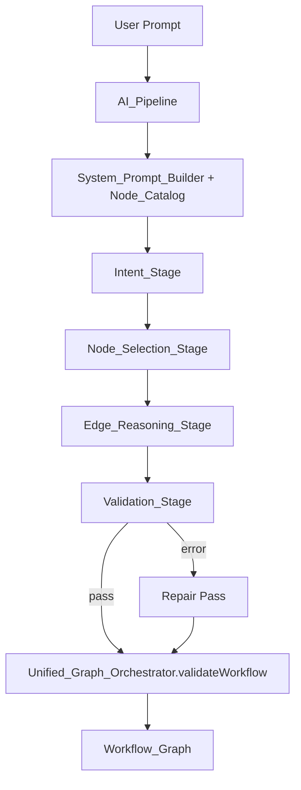
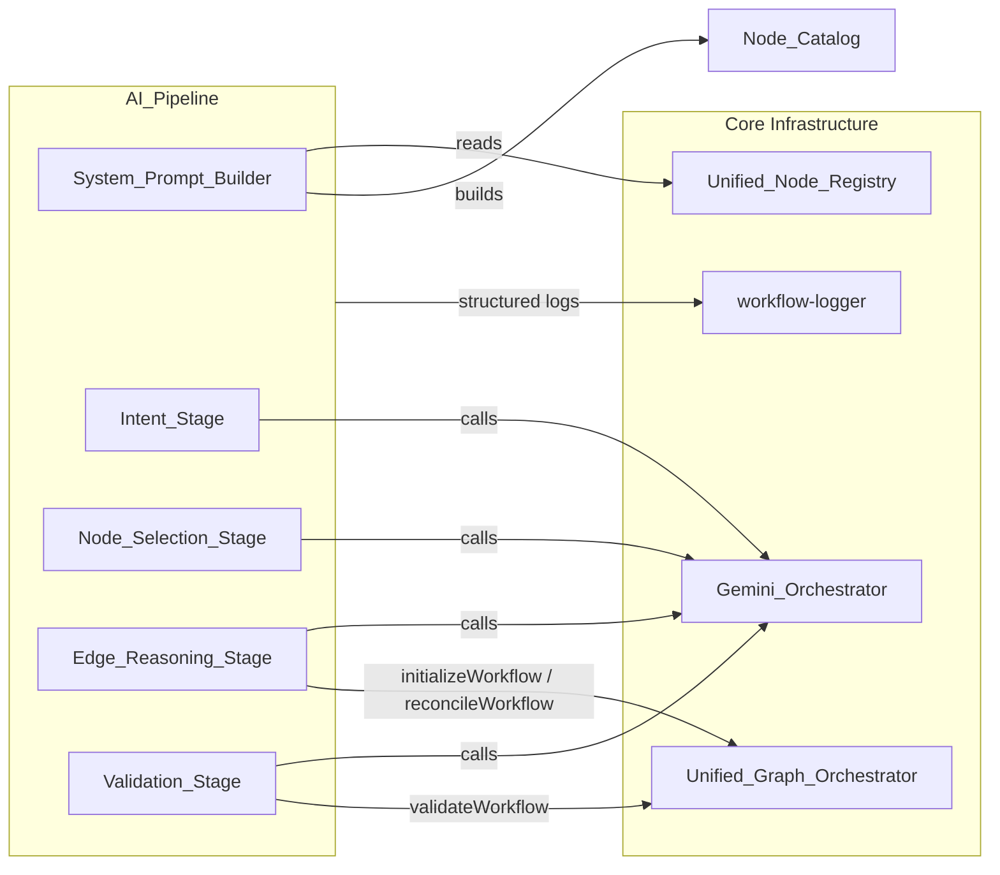

# Design Document: AI-First Workflow Generation Pipeline

## Overview

The current workflow generation pipeline is a hybrid: the LLM handles intent understanding, but every downstream stage — node detection, execution order, edge wiring, and validation — relies on deterministic keyword matching, topological sort, and hardcoded registry contracts. These deterministic layers cannot understand intent; they can only match exact keywords, which makes the system brittle for any prompt phrasing that deviates from expected patterns.

This design replaces every hardcoded stage with an AI-driven equivalent. The `Unified_Node_Registry` remains the single source of truth for node definitions and is used read-only to construct a `Node_Catalog` that the LLM reasons over. The `Unified_Graph_Orchestrator` remains the single authority for structural graph mutations. Everything between intent parsing and graph finalization is driven by the LLM, guided by dynamically assembled system prompts.

The new pipeline is the only pipeline. There is no feature flag, no parallel hybrid path, and no fallback. The existing hybrid pipeline and all its hardcoded components are deleted as each AI-driven stage is implemented and verified.

---

## Architecture

### High-Level Flow



### Component Relationships



### Single Entry Point

`generate-workflow.ts` invokes `AiFirstPipeline` directly — no conditional branching, no feature flag:

```typescript
const pipeline = new AiFirstPipeline(deps);
return pipeline.run({ userPrompt, userId, correlationId });
```

The existing `WorkflowPipelineOrchestrator` is deleted once the AI pipeline is verified operational. There is no fallback path.

---

## Components and Interfaces

### 1. System_Prompt_Builder

**Location:** `worker/src/services/ai/system-prompt-builder.ts`

Responsible for assembling LLM system prompts at runtime. It is the only component that reads the registry for catalog construction. It is stateless and deterministic: the same inputs always produce the same prompt.

```typescript
export type PipelineStage =
  | 'intent'
  | 'node_selection'
  | 'edge_reasoning'
  | 'validation'
  | 'repair';

export interface SystemPromptBuilderInput {
  stage: PipelineStage;
  nodeCatalog: NodeCatalogText;       // pre-built catalog string
  userIntent: string;                  // original user prompt
  stageContext?: StageContext;         // stage-specific extras (see below)
}

export interface StageContext {
  selectedNodes?: SelectedNode[];      // for edge_reasoning, validation, repair
  edgeList?: ProposedEdge[];           // for validation, repair
  validationIssues?: ValidationIssue[]; // for repair
  cycleInfo?: string;                  // for edge_reasoning re-prompt
}

export interface SystemPromptBuilderOutput {
  systemPrompt: string;
  outputSchema: object;  // JSON Schema the LLM must conform to
}

export class SystemPromptBuilder {
  build(input: SystemPromptBuilderInput): SystemPromptBuilderOutput;
}
```

Each stage produces a prompt with four mandatory sections:
1. **Role and objective** — what the LLM is doing in this stage
2. **Node_Catalog** (or relevant subset) — the available nodes
3. **Output format** — exact JSON schema the LLM must return
4. **Hard constraints** — DAG rules, minimal node set, etc.

### 2. Node_Catalog Construction

**Location:** `worker/src/services/ai/node-catalog-builder.ts` (extended)

The existing `buildNodeCatalog()` function is extended with token budget enforcement and priority truncation.

```typescript
export interface NodeCatalogOptions {
  tokenBudget: number;          // max characters (approx tokens * 4)
  priorityOrder: NodeCategory[]; // e.g. ['trigger', 'logic', 'data', 'ai', 'communication', 'transformation', 'utility']
}

export type NodeCatalogText = string; // compact JSON or DSL string

export function buildNodeCatalogText(options: NodeCatalogOptions): NodeCatalogText;
```

**Priority truncation algorithm:**
1. Collect all node definitions from `unifiedNodeRegistry.getAllTypes()`
2. Sort by `priorityOrder` (trigger first, utility last)
3. Serialize each entry to compact JSON
4. Accumulate entries until `tokenBudget` is reached
5. Drop remaining entries (always utility-category last)

Each catalog entry is a compact object:
```json
{
  "type": "google_gmail",
  "label": "Gmail",
  "category": "communication",
  "description": "Send and read Gmail messages",
  "inputSummary": ["to", "subject", "body"],
  "outputSummary": ["messageId", "threadId"],
  "credentials": ["google_oauth"],
  "isTrigger": false,
  "isBranching": false
}
```

### 3. AI_Pipeline

**Location:** `worker/src/services/ai/ai-first-pipeline.ts`

The top-level orchestrator for the four-stage pipeline.

```typescript
export interface AiPipelineInput {
  userPrompt: string;
  userId: string;
  correlationId: string;
}

export interface AiPipelineOutput {
  workflow: Workflow;
  validationIssues: ValidationIssue[];  // empty on clean pass
  stageTrace: StageTrace[];             // observability
}

export class AiFirstPipeline {
  constructor(deps: AiPipelineDeps);
  async run(input: AiPipelineInput): Promise<AiPipelineOutput>;
}
```

### 4. Intent_Stage

Extracts structured intent from the raw user prompt.

**LLM Input:**
```json
{
  "userPrompt": "Send me a Slack message every morning with a summary of my unread Gmail"
}
```

**LLM Output Schema:**
```json
{
  "type": "object",
  "required": ["intent", "triggerType", "actions", "dataFlows"],
  "properties": {
    "intent": { "type": "string" },
    "triggerType": { "enum": ["schedule", "webhook", "form", "chat_trigger", "manual_trigger"] },
    "actions": {
      "type": "array",
      "items": { "type": "string" }
    },
    "dataFlows": {
      "type": "array",
      "items": {
        "type": "object",
        "properties": {
          "from": { "type": "string" },
          "to": { "type": "string" },
          "dataDescription": { "type": "string" }
        }
      }
    },
    "constraints": { "type": "array", "items": { "type": "string" } }
  }
}
```

### 5. Node_Selection_Stage

Selects node types from the Node_Catalog based on structured intent. No keyword pre-filter is applied before the LLM call.

**LLM Input:**
```json
{
  "structuredIntent": { "...": "..." },
  "nodeCatalog": "[...compact catalog JSON...]"
}
```

**LLM Output Schema:**
```json
{
  "type": "object",
  "required": ["selectedNodes"],
  "properties": {
    "selectedNodes": {
      "type": "array",
      "items": {
        "type": "object",
        "required": ["type", "role", "reason"],
        "properties": {
          "type": { "type": "string" },
          "role": { "enum": ["trigger", "action", "logic", "terminal"] },
          "reason": { "type": "string" }
        }
      }
    }
  }
}
```

**Post-LLM validation:** Each `type` is checked against `unifiedNodeRegistry.has(type)`. Unknown types are discarded with a warning log. If zero valid types remain, the pipeline returns a structured error (no fallback to keyword matching).

### 6. Edge_Reasoning_Stage

Determines execution order and edge connections. The LLM receives the selected nodes, the Node_Catalog, and the original intent.

**LLM Output Schema:**
```json
{
  "type": "object",
  "required": ["orderedNodes", "edges"],
  "properties": {
    "orderedNodes": {
      "type": "array",
      "items": { "type": "string" }
    },
    "edges": {
      "type": "array",
      "items": {
        "type": "object",
        "required": ["source", "target", "type"],
        "properties": {
          "source": { "type": "string" },
          "target": { "type": "string" },
          "type": { "enum": ["main", "true", "false", "case_1", "case_2", "case_3", "case_n"] }
        }
      }
    }
  }
}
```

**Cycle detection:** After receiving the LLM response, the stage runs a DFS cycle check on the proposed edge list. If a cycle is detected, the stage re-prompts the LLM once with the cycle path identified. If the second response still contains a cycle, the stage returns an error.

**Graph materialization:** Once a valid edge list is produced, the stage calls `unifiedGraphOrchestrator.initializeWorkflow(orderedNodes)` to produce the canonical `Workflow_Graph`. It never writes to `workflow.edges` directly.

### 7. Validation_Stage

Validates the assembled graph for structural correctness and semantic alignment.

**LLM Input:**
```json
{
  "workflowGraph": { "nodes": [...], "edges": [...] },
  "nodeCatalog": "[...compact catalog JSON...]",
  "originalIntent": "..."
}
```

**LLM Output Schema:**
```json
{
  "type": "object",
  "required": ["status", "issues"],
  "properties": {
    "status": { "enum": ["pass", "fail"] },
    "issues": {
      "type": "array",
      "items": {
        "type": "object",
        "required": ["severity", "description"],
        "properties": {
          "severity": { "enum": ["error", "warning"] },
          "description": { "type": "string" },
          "suggestedFix": { "type": "string" }
        }
      }
    }
  }
}
```

**Repair loop:** If `status === "fail"` and any issue has `severity === "error"`, the pipeline attempts one repair pass by re-prompting the LLM with the issues and requesting a corrected graph. If errors remain after the repair pass, the pipeline returns the partially repaired graph plus the remaining issues — it never silently returns an invalid graph.

**Structural safety net:** After AI validation (pass or repaired), `unifiedGraphOrchestrator.validateWorkflow(workflow)` is always called. Any violations it reports are treated as pipeline contract errors.

---

## Data Models

### SelectedNode
```typescript
interface SelectedNode {
  type: string;           // registry node type identifier
  role: 'trigger' | 'action' | 'logic' | 'terminal';
  reason: string;         // LLM's rationale
  nodeId: string;         // assigned after selection, before edge reasoning
}
```

### ProposedEdge
```typescript
interface ProposedEdge {
  source: string;   // nodeId
  target: string;   // nodeId
  type: 'main' | 'true' | 'false' | `case_${number}`;
}
```

### ValidationIssue
```typescript
interface ValidationIssue {
  severity: 'error' | 'warning';
  description: string;
  suggestedFix?: string;
}
```

### StageTrace (observability)
```typescript
interface StageTrace {
  stage: PipelineStage;
  startedAt: number;       // epoch ms
  completedAt: number;     // epoch ms
  durationMs: number;
  inputSummary: string;    // truncated/hashed
  outputSummary: string;   // node count, edge count, issue count
  llmCall?: {
    model: string;
    temperature: number;
    promptTokens: number;
    completionTokens: number;
  };
  error?: string;
}
```

### AiPipelineDeps
```typescript
interface AiPipelineDeps {
  geminiOrchestrator: GeminiOrchestrator;
  unifiedGraphOrchestrator: UnifiedGraphOrchestrator;
  systemPromptBuilder: SystemPromptBuilder;
  logger: WorkflowLogger;
  nodeCatalogOptions: NodeCatalogOptions;
}
```

---

## Correctness Properties

*A property is a characteristic or behavior that should hold true across all valid executions of a system — essentially, a formal statement about what the system should do. Properties serve as the bridge between human-readable specifications and machine-verifiable correctness guarantees.*

### Property 1: Node_Catalog completeness

*For any* set of node definitions registered in the Unified_Node_Registry, every registered type identifier SHALL appear in the Node_Catalog produced by `buildNodeCatalogText()`, provided the token budget is not exceeded.

**Validates: Requirements 1.1, 1.6**

---

### Property 2: Node_Catalog entry schema

*For any* node definition in the Unified_Node_Registry, the corresponding catalog entry SHALL contain all required fields: type identifier, label, description, input schema summary, output schema summary, category, and credential requirements.

**Validates: Requirements 1.2**

---

### Property 3: Token budget enforcement with priority preservation

*For any* registry and any configured token budget, the catalog text produced by `buildNodeCatalogText()` SHALL NOT exceed the budget, AND trigger-category and logic-category nodes SHALL appear in the output before any utility-category node is dropped.

**Validates: Requirements 1.3, 1.4**

---

### Property 4: LLM receives prompt and catalog on every Node_Selection call

*For any* user prompt, the Node_Selection_Stage SHALL invoke the LLM with both the user prompt (or structured intent) and the Node_Catalog present in the request — no call may omit either input.

**Validates: Requirements 2.1**

---

### Property 5: Unknown node types are discarded without pipeline failure

*For any* LLM response from the Node_Selection_Stage that contains node type identifiers not present in the Unified_Node_Registry, the pipeline SHALL discard those identifiers, log a warning, and continue — it SHALL NOT throw or return an error solely due to unknown types.

**Validates: Requirements 2.3, 2.4**

---

### Property 6: Node_Selection prompt contains trigger and minimal-set constraints

*For any* invocation of the System_Prompt_Builder with `stage = 'node_selection'`, the produced prompt SHALL contain instructions requiring exactly one trigger node and a minimal necessary node set.

**Validates: Requirements 2.5**

---

### Property 7: Edge_Reasoning prompt contains DAG constraints

*For any* invocation of the System_Prompt_Builder with `stage = 'edge_reasoning'`, the produced prompt SHALL contain all DAG constraint rules: no cycles, exactly one trigger with in-degree zero, all non-terminal nodes with at least one outgoing edge, and branching nodes with correctly labeled outgoing edges.

**Validates: Requirements 3.5**

---

### Property 8: Cycle detection triggers re-prompt

*For any* edge list produced by the LLM that contains a directed cycle, the Edge_Reasoning_Stage SHALL detect the cycle and issue exactly one re-prompt to the LLM before returning an error if the cycle persists.

**Validates: Requirements 3.6**

---

### Property 9: Unified_Graph_Orchestrator is always called for graph materialization

*For any* valid LLM output from the Edge_Reasoning_Stage, the stage SHALL call `unifiedGraphOrchestrator.initializeWorkflow()` or `reconcileWorkflow()` to produce the canonical graph — it SHALL NOT write to `workflow.edges` directly.

**Validates: Requirements 3.7, 3.8**

---

### Property 10: Validation prompt covers all four evaluation dimensions

*For any* invocation of the System_Prompt_Builder with `stage = 'validation'`, the produced prompt SHALL instruct the LLM to evaluate: structural validity (DAG, reachability, edge types), semantic alignment, completeness, and data flow coherence.

**Validates: Requirements 4.2**

---

### Property 11: Validation result schema conformance

*For any* LLM response from the Validation_Stage, the parsed result SHALL conform to the validation output schema: a `status` field (`pass` or `fail`), an `issues` array where every `error`-severity issue includes a `suggestedFix`.

**Validates: Requirements 4.3**

---

### Property 12: Repair pass is triggered exactly once on errors

*For any* validation result containing one or more `error`-severity issues, the pipeline SHALL attempt exactly one repair pass — no more, no fewer.

**Validates: Requirements 4.4**

---

### Property 13: validateWorkflow is always called as structural safety net

*For any* pipeline execution that reaches the Validation_Stage, `unifiedGraphOrchestrator.validateWorkflow()` SHALL be called on the final graph before it is returned to the caller.

**Validates: Requirements 4.7, 9.5**

---

### Property 14: System_Prompt_Builder is deterministic

*For any* fixed combination of stage identifier, Node_Catalog text, user intent, and stage context, the System_Prompt_Builder SHALL produce an identical non-empty string on every invocation.

**Validates: Requirements 5.1, 5.6**

---

### Property 15: System prompts contain all four mandatory sections

*For any* stage identifier and any Node_Catalog/intent inputs, the System_Prompt_Builder SHALL produce a prompt containing: stage-specific role and objective instructions, the Node_Catalog (or relevant subset), explicit JSON output format requirements, and hard constraints for the stage.

**Validates: Requirements 5.3**

---

### Property 16: Node hydration uses registry defaultConfig

*For any* LLM-selected node type that exists in the Unified_Node_Registry, the pipeline SHALL hydrate the node configuration using `unifiedNodeRegistry.getDefaultConfig(type)` — it SHALL NOT invent config values outside the registry schema.

**Validates: Requirements 6.3**

---

### Property 17: Stage logs are emitted for every stage

*For any* pipeline execution, structured log entries SHALL be emitted at the start and end of each stage, containing: stage name, input summary, output summary, and duration in milliseconds.

**Validates: Requirements 8.1**

---

### Property 18: LLM call logs contain model, temperature, and token counts

*For any* LLM call made by any pipeline stage, the log entry for that call SHALL contain the model name, temperature setting, prompt token count, and completion token count.

**Validates: Requirements 8.2**

---

### Property 19: Single pipeline entry point — no dual paths

*For any* generation request, `generate-workflow.ts` SHALL invoke `AiFirstPipeline` directly — no feature flag check, no conditional branching, no fallback to `WorkflowPipelineOrchestrator`.

**Validates: Requirements 9.1, 9.3**

---

## Error Handling

### Zero valid nodes after registry validation (Req 2.6)
The pipeline returns a structured `AiPipelineError` with `code: 'NO_VALID_NODES'` and the raw LLM response for diagnostics. No fallback to keyword matching occurs.

### Cycle in LLM-produced edge list (Req 3.6)
The Edge_Reasoning_Stage detects the cycle via DFS, includes the cycle path in the re-prompt, and retries once. If the second response still contains a cycle, the stage returns `code: 'CYCLE_DETECTED'`.

### Repair pass fails to resolve all errors (Req 4.5)
The pipeline returns `{ workflow: partiallyRepairedGraph, validationIssues: remainingErrors }`. The caller receives both the best-effort graph and the unresolved issues. It never silently returns an invalid graph.

### LLM response fails JSON schema validation
Each stage parses the LLM response against its output schema. If parsing fails, the stage retries the LLM call once with an explicit schema reminder appended to the prompt. If the second response also fails, the stage returns `code: 'INVALID_LLM_RESPONSE'`.

### Unified_Graph_Orchestrator validateWorkflow violations
Any violation from `validateWorkflow` is treated as a pipeline contract error (`code: 'ORCHESTRATOR_VALIDATION_FAILED'`) and is never silently swallowed.

---

## Removal Strategy for Hardcoded Components

Each removal is gated on a passing test suite that exercises the AI-driven equivalent with at least five distinct prompt phrasings that previously failed under the keyword-based approach (Req 7.5).

| Component | File(s) | Removal Gate |
|---|---|---|
| Keyword_Filter | `keyword-node-selector.ts`, `enhanced-keyword-matcher.ts` (keyword paths) | AI node selection verified operational |
| Topological_Sort | `execution-order-enforcer.ts`, `getTopologicalOrder` in pipeline orchestrator | AI edge reasoning verified operational |
| Registry_Contract_Validator hardcoded rules | `workflow-validator.ts` hardcoded checks | AI validation verified operational |
| Static markdown prompt files | `WORKFLOW_GENERATION_SYSTEM_PROMPT.md`, `WORKFLOW_PLANNING_SYSTEM_PROMPT.md`, `ULTIMATE_WORKFLOW_SYSTEM_PROMPT.md`, `FINAL_WORKFLOW_SYSTEM_PROMPT.md` | System_Prompt_Builder verified operational |

Any component retained as a fallback after the AI path is operational must be documented with a rationale and a removal target date in `PIPELINE_CONTRACT_FIXES.md`.

---

## Pipeline Observability

Every stage emits structured log entries via the existing `workflow-logger` service.

**Stage start entry:**
```json
{
  "level": "info",
  "event": "ai_pipeline_stage_start",
  "stage": "node_selection",
  "correlationId": "...",
  "inputSummary": "intent_hash=abc123, catalogSize=42nodes"
}
```

**Stage end entry:**
```json
{
  "level": "info",
  "event": "ai_pipeline_stage_end",
  "stage": "node_selection",
  "correlationId": "...",
  "outputSummary": "selectedNodes=4",
  "durationMs": 312
}
```

**LLM call entry:**
```json
{
  "level": "info",
  "event": "ai_pipeline_llm_call",
  "stage": "node_selection",
  "model": "gemini-1.5-pro",
  "temperature": 0.2,
  "promptTokens": 1840,
  "completionTokens": 210
}
```

**Error entry:**
```json
{
  "level": "error",
  "event": "ai_pipeline_stage_error",
  "stage": "validation",
  "correlationId": "...",
  "error": "...",
  "llmResponse": "..."
}
```

In production mode, the full Node_Catalog text is NOT included in logs. When `LOG_LEVEL=debug`, the full catalog is logged per stage.

---

## Testing Strategy

### Unit Tests

- `SystemPromptBuilder`: verify each stage produces a non-empty prompt containing required sections; verify determinism (same inputs → same output).
- `buildNodeCatalogText`: verify token budget enforcement; verify priority truncation preserves trigger/logic nodes; verify all registry types appear when budget is sufficient.
- Cycle detection in Edge_Reasoning_Stage: verify DFS correctly identifies cycles in generated edge lists.
- Registry validation in Node_Selection_Stage: verify unknown types are discarded without pipeline failure.
- Repair loop: verify exactly one repair pass is triggered on error-severity issues.

### Integration Tests

- Verify `validateWorkflow` passes on all `AiFirstPipeline` outputs for a representative prompt set.
- Verify at least five distinct prompt phrasings that previously failed under keyword matching now produce valid `Workflow_Graph` outputs (Req 7.5).
- Verify the deleted hardcoded components are no longer reachable from any code path.
