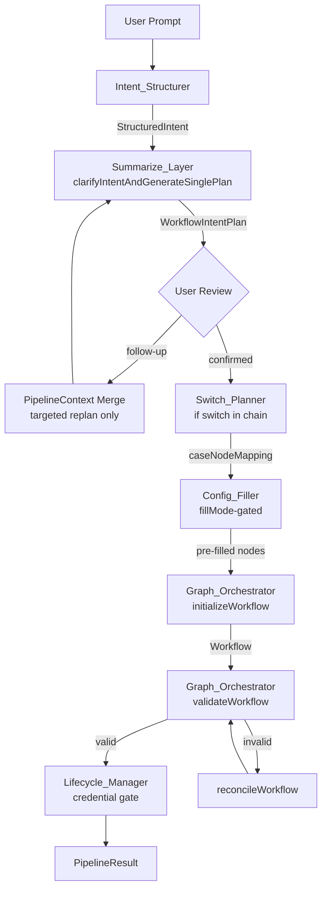

# Design Document: AI Workflow Generation Engine

## Overview

The AI Workflow Generation Engine converts a natural language prompt into a fully validated, executable workflow DAG. The system operates across three planes of truth:

- **User content plane**: the raw prompt and follow-up messages
- **Intent plane**: `StructuredIntent` and `WorkflowIntentPlan` — structured representations of what should happen
- **Workflow plane**: the only executable artifact — a DAG of nodes and edges validated against the registry and orchestrator invariants

Every behavior that depends on *what a node is* lives in `unified-node-registry.ts`. Every behavior that depends on *how nodes connect* lives in `unified-graph-orchestrator.ts`. AI steers generation — it does not replace registry truth or edge reconciliation.

The design resolves six architectural gaps identified in the codebase:
1. Competing code paths in `AIIntentClarifier` — consolidated to a single deterministic pipeline
2. `intelligent-config-filler.ts` ignoring `fillMode` — redesigned to be fillMode-gated
3. Missing `caseNodeMapping` in `WorkflowIntentPlan` — added to carry switch wiring through the pipeline
4. Credential gating not enforced at lifecycle level — `Lifecycle_Manager` now reads `credentialSchema.requirements` and gates on `manual_static` toggle state
5. Field mode toggle state not persisted — stored in `node.data.config._fieldModes`
6. Conversational refinement re-running the full pipeline — replaced with a targeted merge-and-replan pass

---

## Architecture

### Single Pipeline Flow

```
User Prompt
    │
    ▼
[Intent_Structurer]
    │  StructuredIntent
    ▼
[Summarize_Layer / AIIntentClarifier.clarifyIntentAndGenerateSinglePlan()]
    │  WorkflowIntentPlan { structuredSummary, proposedNodeChain, caseNodeMapping? }
    ▼
[User Review / Conversational Refinement]  ◄── follow-up messages merge here
    │  confirmed WorkflowIntentPlan
    ▼
[Switch_Planner]  (if switch node in chain)
    │  SwitchCasePlanResult → merged into WorkflowIntentPlan.caseNodeMapping
    ▼
[Config_Filler]  (fillMode-gated, topological order)
    │  pre-filled buildtime_ai_once fields + _fieldModes metadata
    ▼
[Graph_Orchestrator.initializeWorkflow(nodes)]
    │  Workflow { nodes, edges }
    ▼
[Graph_Orchestrator.validateWorkflow(workflow)]
    │  valid: true  →  save
    │  valid: false →  reconcileWorkflow() → validateWorkflow() → error if still invalid
    ▼
[Lifecycle_Manager: credential gate]
    │  reads credentialSchema.requirements, checks _fieldModes for manual_static
    ▼
[PipelineResult { workflow, pipelineContext, pipelineAnalysis }]
```

### Mermaid Diagram



---

## Components and Interfaces

### Intent_Structurer

Converts raw user prompt into `StructuredIntent`. No changes to the existing interface. The single-plan path in `AIIntentClarifier` calls this first.

### Summarize_Layer — Single-Plan Path

`AIIntentClarifier.clarifyIntentAndGenerateSinglePlan()` becomes the **primary and only** path for workflow generation. `clarifyIntentAndGenerateVariations()` is retained for legacy callers but must not be invoked by `workflow-lifecycle-manager.ts` or `workflow-pipeline-orchestrator.ts`.

The method:
1. Calls `Intent_Structurer` to get `StructuredIntent`
2. Queries `Node_Registry` for `aiSelectionCriteria.keywords`, `tags`, and `aliases` to select candidate node types
3. Resolves all candidate node type strings through `unifiedNormalizeNodeTypeString` before including them in `proposedNodeChain`
4. Omits unresolvable types and records them in `PipelineContext.missing_fields`
5. Produces a `WorkflowIntentPlan` with `structuredSummary` (clean prose, no registry boilerplate) and `proposedNodeChain`
6. If a `switch` node is in the chain, invokes `Switch_Planner` and attaches the result as `caseNodeMapping`

### Pipeline_Orchestrator — Conversational Refinement

Follow-up messages must **not** re-run the full pipeline. Instead:

1. The `PipelineContext` from the prior run is preserved in session state
2. On follow-up, `Pipeline_Orchestrator` calls a new `mergeFollowUpIntoPipelineContext(context, followUpMessage)` function
3. This function produces an updated `StructuredIntent` by merging the follow-up with the prior `structured_intent` — only the fields that the follow-up addresses are updated
4. The updated `StructuredIntent` is passed to `Summarize_Layer` for a targeted replan (re-runs only the summarize step, not the full pipeline)
5. The updated `WorkflowIntentPlan` is returned to the client for review before any graph compilation

```typescript
interface MergeFollowUpResult {
  updatedContext: PipelineContext;
  updatedPlan: WorkflowIntentPlan;
  changedFields: string[]; // which StructuredIntent fields changed
}

async function mergeFollowUpIntoPipelineContext(
  context: PipelineContext,
  followUpMessage: string
): Promise<MergeFollowUpResult>
```

### Config_Filler — fillMode-Gated Redesign

`IntelligentConfigFiller.fillConfigurationsFromPrompt()` is redesigned with a strict gate:

```typescript
// BEFORE (current — fills all fields it can)
for (const fieldName of candidateFields) {
  if (!shouldFillField(fieldName)) continue;
  // ... fills regardless of fillMode
}

// AFTER (redesigned — fillMode-gated)
for (const fieldName of candidateFields) {
  const fieldDef = inputSchema[fieldName];
  const fillMode = fieldDef?.fillMode?.default ?? 'manual_static';
  const ownership = fieldDef?.ownership;

  // Hard skip: manual_static and credential fields are never AI-filled
  if (fillMode === 'manual_static' || ownership === 'credential') continue;

  // Only fill buildtime_ai_once fields
  if (fillMode !== 'buildtime_ai_once') continue;

  if (!shouldFillField(fieldName)) continue;
  // ... AI fill logic
}
```

After filling, the filler writes `_fieldModes` metadata into the node config:

```typescript
filled._fieldModes = Object.fromEntries(
  Object.entries(inputSchema).map(([name, field]) => [
    name,
    field.fillMode?.default ?? 'manual_static'
  ])
);
```

Processing order remains topological so downstream nodes see upstream config.

### Switch_Planner — caseNodeMapping

`planSwitchCasesFromPrompt` already derives cases correctly. The gap is that `WorkflowIntentPlan` does not carry which downstream node each case connects to.

`WorkflowIntentPlan` is extended:

```typescript
export interface CaseNodeMapping {
  [caseValue: string]: string; // caseValue → downstream nodeType
}

export interface WorkflowIntentPlan {
  // ... existing fields ...
  caseNodeMapping?: CaseNodeMapping; // populated when switch is in proposedNodeChain
}
```

The `Summarize_Layer` populates `caseNodeMapping` by:
1. Calling `planSwitchCasesFromPrompt` to get `SwitchCasePlanResult.cases`
2. Matching each case value to the downstream node in `proposedNodeChain` that follows the switch node (in order: case_1 → next node after switch, case_2 → node after that, etc.)
3. If the chain has fewer downstream nodes than cases, the gap is recorded in `PipelineContext.missing_fields`

### Graph_Orchestrator — Switch Edge Wiring

`Graph_Orchestrator.initializeWorkflow(nodes)` is extended to accept an optional `switchContext`:

```typescript
interface SwitchContext {
  switchNodeId: string;
  caseNodeMapping: CaseNodeMapping; // caseValue → downstream nodeType
}

initializeWorkflow(nodes: WorkflowNode[], switchContext?: SwitchContext): WorkflowInitResult
```

When `switchContext` is provided:
1. The orchestrator reads `outgoingPorts` from the switch node's registry definition (e.g., `['case_1', 'case_2', 'case_3']`)
2. For each port `case_n`, it looks up the corresponding downstream node from `caseNodeMapping` using the case value at index n-1
3. It creates one edge per case, labeled `case_n`, connecting the switch node to the correct downstream node
4. `validateWorkflow` then verifies that switch out-degree equals the number of declared cases

### Lifecycle_Manager — Credential Gate

`workflow-lifecycle-manager.ts` reads `credentialSchema.requirements` from the registry for each node in the confirmed `proposedNodeChain`. A credential is added to `requiredCredentials` **only when**:

```typescript
function shouldRequireCredential(
  nodeType: string,
  fieldName: string,
  fieldModes: Record<string, FieldFillMode> // from node.data.config._fieldModes
): boolean {
  const fieldDef = unifiedNodeRegistry.get(nodeType)?.inputSchema[fieldName];
  if (fieldDef?.ownership !== 'credential') return false;

  // Only surface credential if user has explicitly toggled this field to manual_static
  const userMode = fieldModes[fieldName];
  return userMode === 'manual_static';
}
```

Credential values are never written to `node.data.config` as plain text. They are routed through the vault / `attach-credentials` API endpoint.

### Dynamic_Node_Executor — Runtime AI Resolution

`resolveInputsWithAI` in `dynamic-node-executor.ts` already handles `runtime_ai` fields. The design formalizes the contract:

1. For each field with `effectiveFillModes[fieldName] === 'runtime_ai'`, the executor passes:
   - The upstream node's JSON output (from `nodeOutputs`)
   - The workflow's `structuredSummary` (from `(global as any).currentWorkflowIntent`)
   - The field's type constraints from the registry `inputSchema`
2. The resolved value is validated against the field's `validation` function before use
3. If validation fails or Gemini returns empty for a required field, `NodeExecutionResult` is returned with `success: false` and a descriptive `error.code`
4. `{{$json.*}}` template expressions are resolved via `universalTemplateResolver` before the legacy executor receives config
5. No caching of resolved values across execution runs unless upstream output and intent are byte-identical

### Field Mode Toggle — Persistence Contract

Toggle state is stored in `node.data.config._fieldModes`:

```typescript
// Stored in node.data.config
interface NodeFieldModes {
  _fieldModes: Record<string, FieldFillMode>; // fieldName → current toggle state
}
```

The UI reads `_fieldModes` to render the toggle for each field. When a user changes a toggle:
1. The UI sends a `PATCH /api/workflows/:id/nodes/:nodeId/field-mode` request with `{ fieldName, mode }`
2. The backend updates `node.data.config._fieldModes[fieldName]`
3. If the new mode is `manual_static` and `ownership === 'credential'`, the credential gate is re-evaluated

Default toggle state is the registry `fillMode.default` for each field. The `Config_Filler` writes the initial `_fieldModes` map during workflow creation.

---

## Data Models

### WorkflowIntentPlan (extended)

```typescript
export interface CaseNodeMapping {
  [caseValue: string]: string; // e.g. { "sales": "slack", "support": "google_gmail", "general": "log_output" }
}

export interface WorkflowIntentPlan {
  structuredSummary: string;
  proposedNodeChain: string[];
  caseNodeMapping?: CaseNodeMapping;       // NEW: populated when switch is in chain
  nodeInclusionReasons?: Record<string, string>;
  branching?: BranchMetadata;
  branchingOverview?: string;
  originalPrompt: string;
  intentModelDigest?: string;
}
```

### PipelineContext (extended)

```typescript
export interface PipelineContext {
  original_prompt: string;
  selectedStructuredPrompt?: string;
  structured_intent: StructuredIntent;
  expanded_intent?: ExpandedIntent;
  confidence_score: number;
  requires_confirmation: boolean;
  confidence_breakdown?: IntentConfidenceScore;
  clarification_questions?: string[];
  missing_fields?: string[];
  inference_reasoning?: string;
  // NEW: tracks which follow-up messages have been merged
  mergedFollowUps?: string[];
  // NEW: last known WorkflowIntentPlan for error recovery
  lastKnownPlan?: WorkflowIntentPlan;
}
```

### Node Config — Field Mode Storage

```typescript
// node.data.config shape after Config_Filler runs
interface NodeConfig {
  // ... node-specific fields ...
  _fieldModes: Record<string, FieldFillMode>;     // toggle state per field
  _mappingMetadata?: Record<string, MappingMeta>; // upstream key hints for runtime
  _expectedInputKeys?: string[];                  // expected upstream keys
}
```

### PipelineAnalysis (no change to interface, clarified semantics)

```typescript
export interface PipelineAnalysis {
  structuredPrompt: StructuredIntent;
  matchedSampleId?: string;
  origin: 'sample' | 'scratch';
  nodes: WorkflowStructure['nodes'];
  connections: WorkflowStructure['connections'];
  missingNodes: Array<{ type: string; operation: string; reason: string }>;
}
```

`PipelineAnalysis` is a snapshot for UX and debugging. It is always returned alongside `PipelineContext` in `PipelineResult` and is never used as input to graph compilation.

---

## Correctness Properties

*A property is a characteristic or behavior that should hold true across all valid executions of a system — essentially, a formal statement about what the system should do. Properties serve as the bridge between human-readable specifications and machine-verifiable correctness guarantees.*

### Property 1: StructuredIntent always produced from prompt

*For any* non-empty user prompt, `Intent_Structurer` shall produce a `StructuredIntent` with non-null `trigger`, non-empty `actions`, and a `goals` array.

**Validates: Requirements 1.1**

### Property 2: proposedNodeChain contains only canonical registry keys

*For any* `WorkflowIntentPlan` produced by `Summarize_Layer`, every string in `proposedNodeChain` shall satisfy `unifiedNodeRegistry.has(nodeType) === true`.

**Validates: Requirements 1.4, 1.5**

### Property 3: structuredSummary contains no registry boilerplate

*For any* `WorkflowIntentPlan`, the `structuredSummary` shall not match any of the forbidden patterns: `## Configuration contract`, `Semantics (universal):`, `Planner rules:`, `ownership=`, `buildtime_ai_once`, `manual_static`, `runtime_ai`.

**Validates: Requirements 1.3, 1.7**

### Property 4: Unresolvable node types are omitted and recorded

*For any* prompt that causes `Summarize_Layer` to encounter an unresolvable node type string, that string shall be absent from `proposedNodeChain` and present in `PipelineContext.missing_fields`.

**Validates: Requirements 1.6**

### Property 5: Follow-up merge is idempotent on unchanged fields

*For any* `PipelineContext` and follow-up message that does not address a given `StructuredIntent` field, that field shall have the same value in the updated `StructuredIntent` as in the prior one.

**Validates: Requirements 2.1, 2.3**

### Property 6: Contradicting follow-up overrides prior answer

*For any* `PipelineContext` where a follow-up message explicitly contradicts a prior answer, the updated `StructuredIntent` shall reflect the new answer, not the prior one.

**Validates: Requirements 2.6**

### Property 7: All registry fields have a declared fillMode.default

*For all* node types registered in `unifiedNodeRegistry`, every field in `inputSchema` shall have `fillMode.default` set to one of `manual_static`, `buildtime_ai_once`, or `runtime_ai`.

**Validates: Requirements 3.1**

### Property 8: Credential fields are always manual_static

*For all* node types registered in `unifiedNodeRegistry`, every field with `ownership === 'credential'` shall have `fillMode.default === 'manual_static'`.

**Validates: Requirements 3.2, 3.3**

### Property 9: Fill_Contract output is deterministic

*For any* list of node types, calling `buildRegistryStructuralFillContractSection` twice with the same input shall produce byte-identical output.

**Validates: Requirements 3.4, 3.6**

### Property 10: Config_Filler only fills buildtime_ai_once fields and skips manual_static and credential fields

*For any* workflow after `fillConfigurationsFromPrompt`, no field with `fillMode.default === 'manual_static'` or `ownership === 'credential'` shall have a new AI-generated value; and every field with `fillMode.default === 'buildtime_ai_once'` that was empty before filling shall have a non-empty value (or be recorded in `missing_fields` if Gemini failed).

**Validates: Requirements 4.1, 4.3**

### Property 11: Pre-filled values pass field type validation

*For any* field pre-filled by `Config_Filler`, the value shall pass the field's `validation` function defined in the Node_Registry `inputSchema`.

**Validates: Requirements 4.4**

### Property 12: Pre-filled fields are marked with _fieldModes

*For any* node config after `Config_Filler` runs, `node.data.config._fieldModes[fieldName]` shall equal the registry `fillMode.default` for every field in the node's `inputSchema`.

**Validates: Requirements 4.6, 9.7**

### Property 13: Switch_Planner produces at least two cases

*For any* prompt containing switch routing intent, `planSwitchCasesFromPrompt` shall return a `SwitchCasePlanResult` with `cases.length >= 2`.

**Validates: Requirements 5.1, 5.2**

### Property 14: Switch discriminant field exists in upstream outputSchema

*For any* upstream node type registered in `unifiedNodeRegistry`, `getDiscriminantFieldForUpstreamType(upstreamNodeType)` shall return a field name that exists in the upstream node's `outputSchema` or in the declared fallback list.

**Validates: Requirements 5.3**

### Property 15: Switch edges match case count

*For any* compiled workflow containing a switch node with N cases in `caseNodeMapping`, the switch node shall have exactly N outgoing edges labeled `case_1` through `case_n`.

**Validates: Requirements 5.4, 5.5**

### Property 16: Credential gate reads only from registry

*For any* generated workflow, every entry in `requiredCredentials` shall correspond to a field with `ownership === 'credential'` in the Node_Registry `credentialSchema.requirements` for one of the workflow's nodes.

**Validates: Requirements 6.1**

### Property 17: No credential prompt when all credential fields are non-manual_static

*For any* node where all fields with `ownership === 'credential'` have `_fieldModes[fieldName] !== 'manual_static'`, that node shall contribute zero entries to `requiredCredentials`.

**Validates: Requirements 6.2, 6.6**

### Property 18: Credential field toggled to manual_static triggers credential prompt

*For any* node where a field with `ownership === 'credential'` has `_fieldModes[fieldName] === 'manual_static'`, that credential shall appear in `requiredCredentials`.

**Validates: Requirements 6.3**

### Property 19: Credential values never appear in Gemini prompts

*For any* workflow with credential fields, the string passed to any Gemini API call shall not contain the value of any field with `ownership === 'credential'`.

**Validates: Requirements 6.4**

### Property 20: validateWorkflow called after every material graph change

*For any* sequence of `initializeWorkflow`, `injectNode`, `removeNode`, or `reconcileWorkflow` calls, `validateWorkflow` shall be called after each operation, and any `valid: false` result shall block workflow save.

**Validates: Requirements 7.4, 13.1, 13.2**

### Property 21: validateWorkflow enforces all structural invariants

*For any* graph that violates one of the declared invariants (not exactly one trigger, orphan nodes, cycles, wrong in/out-degree, wrong port labels), `validateWorkflow` shall return `valid: false` with a descriptive error naming the offending node ID and violated rule.

**Validates: Requirements 7.6, 13.3, 13.4**

### Property 22: runtime_ai fields resolved from upstream JSON + structuredSummary

*For any* node with `runtime_ai` fields that executes successfully, every such field shall have a non-empty resolved value derived from the upstream node's JSON output or the workflow's `structuredSummary`.

**Validates: Requirements 8.1, 8.2**

### Property 23: Template expressions fully resolved before execution

*For any* node config containing `{{$json.*}}` template expressions, after `universalTemplateResolver` runs, no `{{$json.*}}` pattern shall remain in the resolved config.

**Validates: Requirements 8.3**

### Property 24: runtime_ai resolved values contain no registry boilerplate

*For any* resolved `runtime_ai` field value, the value shall not contain registry fill contract headers, template syntax (`{{`, `}}`), or ownership annotation patterns.

**Validates: Requirements 8.5**

### Property 25: Sanitizer removes registry contract text without altering user content

*For any* input string containing registry fill contract text adjacent to user-supplied content, `sanitizeIntentTextForFormFieldExtraction` shall remove the contract text and leave the user content unchanged.

**Validates: Requirements 10.2, 10.4**

### Property 26: Sanitizer is idempotent on clean input

*For any* input string containing no registry contract text, `sanitizeIntentTextForFormFieldExtraction(x)` shall equal `x`.

**Validates: Requirements 10.5**

### Property 27: PipelineContext always contains confidence score in [0, 1]

*For any* pipeline run, `PipelineContext.confidence_score` shall be a number in the range [0.0, 1.0].

**Validates: Requirements 11.1**

### Property 28: Low confidence blocks graph compilation without confirmation

*For any* prompt producing `PipelineContext.confidence_score < CONFIDENCE_THRESHOLD`, the pipeline shall set `requires_confirmation = true` and shall not return a compiled `Workflow` object without explicit user confirmation.

**Validates: Requirements 11.2**

### Property 29: missing_fields triggers clarification questions

*For any* `PipelineContext` where `missing_fields` is non-empty, `clarification_questions` shall also be non-empty.

**Validates: Requirements 11.3, 11.4**

### Property 30: Node type normalizer is canonical for all spelling variants

*For any* known spelling variant of a node type (e.g., `gmail`, `Google Gmail`, `google-gmail`), `unifiedNormalizeNodeTypeString` shall return the same canonical key.

**Validates: Requirements 12.2**

### Property 31: Edge port names match registry outgoingPorts

*For any* compiled workflow, every edge label shall match a port name declared in the source node's `outgoingPorts` in the Node_Registry.

**Validates: Requirements 12.3**

### Property 32: alwaysTerminal nodes have out-degree 0

*For any* workflow containing a node with `workflowBehavior.alwaysTerminal === true`, that node shall have zero outgoing edges.

**Validates: Requirements 12.5**

### Property 33: Compiled graph equals proposedNodeChain plus alwaysRequired nodes

*For any* confirmed `WorkflowIntentPlan`, the set of node types in the compiled graph shall equal `proposedNodeChain ∪ { types with workflowBehavior.alwaysRequired === true }` — no additional node types shall be silently inserted.

**Validates: Requirements 12.4, 14.1**

### Property 34: PipelineContext produced for every generation run

*For any* pipeline run (successful or failed), the result shall contain a non-null `pipelineContext` with `original_prompt`, `structured_intent`, `confidence_score`, and `requires_confirmation` fields populated.

**Validates: Requirements 15.1**

---

## New Components (Requirements 16–21)

### Rich Structural Prompt Builder (Requirement 16)

The `Summarize_Layer` is extended to produce a per-node description block for every node in `proposedNodeChain`. This replaces the current single-sentence `structuredSummary` with a richer multi-block prose summary while keeping the output human-readable and free of registry boilerplate.

#### NodeDescriptionBlock interface

```typescript
export interface NodeDescriptionBlock {
  nodeType: string;
  nodeIndex: number;          // position in proposedNodeChain (0-based)
  prose: string;              // human-readable description of this node's role
  receivesFrom?: string;      // upstream node type or "user" for trigger
  passesTo?: string;          // downstream node type or "terminal"
  // node-type-specific detail fields (all optional):
  formFields?: Array<{ name: string; type: string; required: boolean }>;
  conditionExpression?: string;
  conditionSourceField?: string;
  trueBranchTarget?: string;
  falseBranchTarget?: string;
  switchCases?: Array<{ value: string; target: string }>;
  switchDiscriminant?: string;
  integrationOperation?: string;   // e.g. "send email", "read rows"
  integrationDataSources?: Record<string, string>; // fieldName → upstream key
}
```

#### Generation logic

`buildNodeDescriptionBlocks(intent: StructuredIntent, chain: string[]): NodeDescriptionBlock[]`

For each node type in `chain`:
1. Fetch `inputSchema` from `Node_Registry` — no hardcoded field lists.
2. Derive node-type-specific detail from `StructuredIntent` (goals, entities, operations).
3. For `form`: map `inputSchema` fields tagged `ownership !== 'credential'` to `formFields`.
4. For `if_else`: extract condition from `intent.conditions[0]`; resolve true/false targets from adjacent chain positions.
5. For `switch`: extract cases from `caseNodeMapping`; resolve discriminant from upstream `outputSchema`.
6. For integration nodes: read `operation` from `intent.operations`; map data sources from upstream `outputSchema` keys.
7. Compose `prose` as a single plain-English sentence per node.

The `structuredSummary` field of `WorkflowIntentPlan` is updated to be the concatenation of all `NodeDescriptionBlock.prose` values, separated by newlines. The full `nodeDescriptionBlocks` array is also stored on `WorkflowIntentPlan` for UI rendering.

```typescript
export interface WorkflowIntentPlan {
  // ... existing fields ...
  nodeDescriptionBlocks?: NodeDescriptionBlock[]; // NEW
}
```

---

### Same-Node-Type Branch Handler (Requirement 17)

When `proposedNodeChain` encodes a branch where both the true and false paths use the same node type, the current pipeline collapses them to a single node. The fix is in two places:

#### 1. proposedNodeChain encoding

The chain is extended to support annotated tokens for branch nodes:

```
if_else → gmail[true] → gmail[false]
```

`formatPlanChainToken` already supports a `branchTag` parameter. The `Summarize_Layer` must emit distinct tokens for same-type branch nodes using the branch direction as the tag.

#### 2. Graph_Orchestrator — multi-instance creation

`initializeWorkflow` is updated to detect annotated tokens and create separate node instances:

```typescript
// When two tokens share the same base type but different branchTags,
// create two WorkflowNode objects with distinct IDs:
//   gmail_true_<uuid>  and  gmail_false_<uuid>
// Each carries a branchTag in node.data.meta.branchTag for Config_Filler context.
```

#### 3. Config_Filler — branch-aware pre-fill

When `Config_Filler` processes a node with `node.data.meta.branchTag`, it appends the branch context to the Gemini prompt:

```
"This node is on the [true/false] branch of an if_else. The branch purpose is: [derived from StructuredIntent]."
```

This ensures the two Gmail nodes receive different subject lines, body content, etc.

#### 4. structuredSummary update

`buildNodeDescriptionBlocks` emits two separate `NodeDescriptionBlock` entries for same-type branch nodes, each with distinct `prose` describing the branch-specific purpose.

---

### PipelineReasoningCoordinator — Senior/Junior AI (Requirement 18)

A new reusable class `PipelineReasoningCoordinator` encapsulates the two-tier reasoning pattern. No pipeline stage implements Senior/Junior logic directly.

#### Class interface

```typescript
export interface StageProposal<T> {
  stageName: string;
  proposal: T;
  rationale: string;
}

export interface ValidationResult<T> {
  approved: boolean;
  correctedValue?: T;
  rejectionReason?: string;
}

export class PipelineReasoningCoordinator {
  constructor(
    private readonly seniorModel: string,   // 'gemini-2.5-pro'
    private readonly juniorModel: string,   // 'gemini-2.5-flash'
    private readonly fullContext: PipelineFullContext
  ) {}

  /**
   * Junior AI executes a stage and submits to Senior AI for approval.
   * If rejected, incorporates correction and re-submits once.
   * Returns the approved value.
   */
  async executeStage<T>(
    stageName: string,
    juniorExecutor: () => Promise<StageProposal<T>>,
    seniorValidator: (proposal: StageProposal<T>, context: PipelineFullContext) => Promise<ValidationResult<T>>
  ): Promise<T>
}
```

#### PipelineFullContext

```typescript
export interface PipelineFullContext {
  originalPrompt: string;
  structuredIntent: StructuredIntent;
  workflowIntentPlan?: WorkflowIntentPlan;
  registryKnowledgeSummary: string;   // compact registry digest for Senior AI
  priorStageOutputs: Record<string, unknown>; // stageName → output
}
```

#### Senior AI validation prompt contract

The Senior AI receives a structured prompt containing:
1. `PipelineFullContext` serialized as JSON
2. The Junior AI's `StageProposal` (stageName + proposal + rationale)
3. A validation checklist specific to the stage (node selection checklist for node selection stage, etc.)

The Senior AI returns a JSON object matching `ValidationResult<T>`.

#### Node selection validation checklist (used by Senior AI for Requirement 18.3)

```
1. All nodeTypes exist in registry: check each against unifiedNodeRegistry.has()
2. Minimum sufficient set: each node has a reason from StructuredIntent
3. No unintended duplicates: same type appears only if intent requires multiple instances
4. Valid DAG shape: chain can be wired without cycles
```

#### Integration with pipeline stages

`Summarize_Layer.clarifyIntentAndGenerateSinglePlan` wraps its node selection call:

```typescript
const approvedChain = await coordinator.executeStage(
  'node-selection',
  () => juniorSelectNodes(intent),
  (proposal, ctx) => seniorValidateNodeSelection(proposal, ctx)
);
```

---

### Self-Healing Gate (Requirement 19)

The `Lifecycle_Manager` pipeline is reordered so that graph validation and repair happen before credential evaluation. The new gate is a single method:

```typescript
async function validateAndHealBeforeCredentials(
  workflow: Workflow,
  plan: WorkflowIntentPlan
): Promise<{ workflow: Workflow; plan: WorkflowIntentPlan; healed: boolean }> {
  const validation = unifiedGraphOrchestrator.validateWorkflow(workflow);
  if (validation.valid) return { workflow, plan, healed: false };

  const repaired = unifiedGraphOrchestrator.reconcileWorkflow(workflow);
  const revalidation = unifiedGraphOrchestrator.validateWorkflow(repaired.workflow);

  if (!revalidation.valid) {
    throw new PipelineContractError('SELF_HEAL_FAILED', revalidation.errors);
  }

  // Update structuredSummary to reflect structural changes
  const updatedSummary = rebuildSummaryAfterHeal(plan, repaired.changes);
  return {
    workflow: repaired.workflow,
    plan: { ...plan, structuredSummary: updatedSummary },
    healed: true,
  };
}
```

#### Lifecycle_Manager pipeline order (updated)

```
[Graph_Orchestrator.initializeWorkflow]
    ↓
[validateAndHealBeforeCredentials]   ← NEW GATE (replaces ad-hoc reconcile calls)
    ↓  valid: true
[Lifecycle_Manager: credential gate]
    ↓
[PipelineResult]
```

The self-healing pass checks all four invariants from Requirement 19.4 via `validateWorkflow`'s existing rule set — no new validation logic is needed.

---

### Legacy Removal Plan (Requirement 20)

Removal is a two-phase operation to avoid breaking the system mid-migration.

#### Phase 1 — Parallel operation (implement new, keep old)

1. Verify `gemini-node-selector.ts` returns non-empty results for all golden-path test prompts.
2. Add a feature flag `USE_GEMINI_FIRST_EXCLUSIVELY` (default: `false`).
3. When flag is `true`, skip `enhanced-keyword-matcher.ts` entirely and use registry-based fallback only.
4. Replace the hardcoded `logic-intent safeguard` array in `summarize-layer.ts` with:

```typescript
const logicNodeTypes = unifiedNodeRegistry.getAllTypes().filter(type => {
  const def = unifiedNodeRegistry.get(type);
  return def?.tags?.includes('logic') || def?.category === 'conditional';
});
```

#### Phase 2 — Removal (after verification)

1. Delete `keywordVariations` map from `enhanced-keyword-matcher.ts`.
2. Update `enhanced-keyword-matcher.ts` to read keywords exclusively from `Node_Registry.aiSelectionCriteria.keywords`, `tags`, and `aliases`.
3. Set `USE_GEMINI_FIRST_EXCLUSIVELY` default to `true`.
4. Run all golden-path tests; assert zero regressions.
5. Remove the feature flag.

#### Registry fields used as replacement

| Legacy source | Registry replacement |
|---|---|
| `keywordVariations['google_sheets']` | `def.aiSelectionCriteria.keywords` + `def.tags` |
| `keywordVariations['gmail']` | `def.aiSelectionCriteria.keywords` + `def.aliases` |
| Hardcoded logic safeguard array | `def.tags.includes('logic')` or `def.category === 'conditional'` |

---

### Node Sufficiency Checker (Requirement 21)

The sufficiency check is part of the Senior AI validation step for node selection (see `PipelineReasoningCoordinator` above). It is also materialized as a standalone utility for logging and testing.

#### NodeSelectionRationale

```typescript
export interface NodeSelectionRationale {
  nodeType: string;
  instanceIndex: number;   // 0 for first instance, 1 for second, etc.
  reason: string;          // derived from StructuredIntent
  intentSource: string;    // which StructuredIntent field provided the reason
}
```

`PipelineContext` is extended:

```typescript
export interface PipelineContext {
  // ... existing fields ...
  nodeSelectionRationale?: NodeSelectionRationale[]; // NEW: one entry per node instance
}
```

#### Sufficiency check algorithm

```typescript
function checkNodeSufficiency(
  proposedChain: string[],
  intent: StructuredIntent
): { sufficient: boolean; nodesToRemove: string[]; rationale: NodeSelectionRationale[] }
```

For each node type in `proposedChain`:
1. Check if the node type maps to a goal, entity, trigger, or operation in `intent`.
2. Check if the node has `workflowBehavior.alwaysRequired === true` in the registry.
3. If neither: mark for removal; record reason `"no intent mapping found"`.
4. Special rule: `log_output` is only kept if `intent.goals` contains observability/logging keywords OR `workflowBehavior.alwaysTerminal === true`.

The Senior AI receives the sufficiency check output as part of its validation prompt and may override individual removal decisions with a structured justification.

---

## Correctness Properties (continued)

### Property 35: structuredSummary contains per-node description for every chain node

*For any* `WorkflowIntentPlan` produced after Requirement 16 is implemented, `nodeDescriptionBlocks.length` shall equal `proposedNodeChain.length`, and each block's `nodeType` shall match the corresponding chain entry.

**Validates: Requirements 16.1**

### Property 36: form node description lists all non-credential inputSchema fields

*For any* `WorkflowIntentPlan` where `proposedNodeChain` contains a `form` node, the corresponding `NodeDescriptionBlock.formFields` shall contain every field from the `form` node's `inputSchema` where `ownership !== 'credential'`.

**Validates: Requirements 16.2, 16.8**

### Property 37: if_else description states condition, source field, and both branch targets

*For any* `WorkflowIntentPlan` where `proposedNodeChain` contains an `if_else` node, the corresponding `NodeDescriptionBlock` shall have non-empty `conditionExpression`, `conditionSourceField`, `trueBranchTarget`, and `falseBranchTarget`.

**Validates: Requirements 16.3**

### Property 38: Same-type branch nodes produce distinct node IDs

*For any* compiled workflow where `proposedNodeChain` contains the same node type on both the true and false paths of an `if_else`, the compiled graph shall contain two node instances of that type with distinct IDs and distinct `node.data.meta.branchTag` values.

**Validates: Requirements 17.1, 17.4**

### Property 39: Same-type branch nodes receive different Config_Filler outputs

*For any* pair of same-type branch nodes (true-path and false-path), the `buildtime_ai_once` fields pre-filled by `Config_Filler` shall not be byte-identical — each instance shall reflect its branch-specific purpose.

**Validates: Requirements 17.2**

### Property 40: Senior AI approval required before graph compilation

*For any* pipeline run using `PipelineReasoningCoordinator`, the compiled `Workflow` object shall only be produced after `coordinator.executeStage('node-selection', ...)` has returned an approved result — no workflow shall be compiled from an unapproved node selection.

**Validates: Requirements 18.6**

### Property 41: Senior AI uses gemini-2.5-pro; Junior AI uses gemini-2.5-flash

*For any* `PipelineReasoningCoordinator` instance, validation calls shall use model `gemini-2.5-pro` and execution calls shall use model `gemini-2.5-flash` — no other model strings are permitted in coordinator calls.

**Validates: Requirements 18.7**

### Property 42: Senior AI rejection produces corrected value, not empty

*For any* `ValidationResult` where `approved === false`, `correctedValue` shall be non-null and `rejectionReason` shall be a non-empty string.

**Validates: Requirements 18.4**

### Property 43: Credential step unreachable from invalid graph

*For any* pipeline run, the credential evaluation step shall only execute after `Graph_Orchestrator.validateWorkflow` returns `valid: true` — if `validateWorkflow` returns `valid: false` and `reconcileWorkflow` also fails, the pipeline shall return a `PipelineContractError` before reaching credential evaluation.

**Validates: Requirements 19.1, 19.3, 19.6**

### Property 44: Self-healing updates structuredSummary when graph changes

*For any* pipeline run where `reconcileWorkflow` modifies the graph (adds or removes edges), the `structuredSummary` in the returned `WorkflowIntentPlan` shall differ from the pre-heal summary.

**Validates: Requirements 19.5**

### Property 45: No hardcoded keyword maps after legacy removal

*After* Phase 2 of the legacy removal plan, a search for `keywordVariations` in the codebase shall return zero matches, and a search for the literal array `['form', 'javascript', 'if_else', 'function']` in `summarize-layer.ts` shall return zero matches.

**Validates: Requirements 20.1, 20.4**

### Property 46: Gemini-first non-empty result is used exclusively

*For any* pipeline run where `selectNodesFromIntent` returns `nodeTypes.length > 0`, the `proposedNodeChain` shall be derived from that result and shall not contain node types sourced from `enhanced-keyword-matcher.ts`.

**Validates: Requirements 20.2**

### Property 47: Every node in final selection has a rationale entry

*For any* pipeline run, `PipelineContext.nodeSelectionRationale.length` shall equal the number of node instances in `proposedNodeChain`, and every entry shall have a non-empty `reason` string.

**Validates: Requirements 21.1, 21.5**

### Property 48: log_output absent from selection when intent has no observability signal

*For any* prompt that contains no observability/logging keywords and no node with `workflowBehavior.alwaysTerminal === true`, the `proposedNodeChain` shall not contain `log_output`.

**Validates: Requirements 21.3**

### Property 49: Single linear intent produces minimum node count

*For any* prompt that expresses exactly one trigger and one action with no branching, the compiled graph shall contain exactly two node types (trigger + action) plus any `alwaysRequired` registry nodes — no additional nodes.

**Validates: Requirements 21.4**

---

## Error Handling

### Pipeline Stage Failures

| Stage | Failure | Behavior |
|---|---|---|
| Intent_Structurer | Gemini API error | Preserve last valid `PipelineContext`; return structured error with `lastKnownPlan` |
| Summarize_Layer | Unresolvable node type | Omit from chain; record in `missing_fields`; continue |
| Summarize_Layer | Gemini returns no chain | Return error with `requires_confirmation: true`; do not compile |
| Switch_Planner | Fewer than 2 cases derived | Record in `missing_fields`; request clarification before compilation |
| Switch_Planner | Case count ≠ downstream node count | `Graph_Orchestrator.validateWorkflow` fails; surface as pipeline contract error |
| Config_Filler | Gemini returns invalid value | Leave field empty; record in `missing_fields`; do not persist malformed value |
| Graph_Orchestrator | `validateWorkflow` fails on first attempt | Attempt `reconcileWorkflow` once; if still invalid, return structured error |
| Lifecycle_Manager | Credential field missing | Add to `requiredCredentials`; surface attach-credentials flow |
| Dynamic_Node_Executor | Required `runtime_ai` field unresolved | Return `NodeExecutionResult { success: false, error: { code, message } }` |
| PipelineReasoningCoordinator | Senior AI rejects proposal twice | Return `PipelineContractError('SENIOR_REJECTION_LIMIT')` with last `correctedValue` |
| PipelineReasoningCoordinator | Gemini API error during Senior validation | Preserve last approved stage output; surface structured error; do not compile |
| validateAndHealBeforeCredentials | `reconcileWorkflow` cannot repair graph | Return `PipelineContractError('SELF_HEAL_FAILED')`; do not proceed to credential step |
| NodeSufficiencyChecker | All nodes removed by sufficiency check | Return `PipelineContractError('EMPTY_NODE_SELECTION')`; request clarification |

### Validation Failure Contract

When `Graph_Orchestrator.validateWorkflow` returns `valid: false`:
- `Lifecycle_Manager` does not persist the workflow
- The error response includes: offending node ID, violated invariant name, expected vs actual degree or port label
- The last valid `PipelineContext` and `WorkflowIntentPlan` are included in the error response for client-side recovery UI

### Credential Safety

- Credential field values are never written to `node.data.config` as plain text
- Credential values are never included in Gemini API prompts at any verbosity level
- At info log level: only prompt length, confidence score, node chain length, and validation result are logged

---

## Testing Strategy

### Dual Testing Approach

Both unit tests and property-based tests are required. They are complementary:
- **Unit tests** verify specific examples, integration points, edge cases, and error conditions
- **Property tests** verify universal properties across all inputs using randomized generation

### Property-Based Testing

The property-based testing library for this codebase is **fast-check** (TypeScript). Each property test must run a minimum of **100 iterations**.

Each test must be tagged with a comment referencing the design property:
```typescript
// Feature: ai-workflow-generation-engine, Property N: <property_text>
```

Each correctness property above must be implemented by a single property-based test.

**Key generators needed:**
- `fc.string()` filtered to non-empty for prompts
- `fc.constantFrom(...unifiedNodeRegistry.getAllTypes())` for node types
- `fc.record({ ... })` for `StructuredIntent` and `WorkflowIntentPlan`
- `fc.array(fc.string(), { minLength: 2 })` for case lists
- Arbitrary workflow graphs with controlled structural violations for validation tests

### Unit Tests

Unit tests focus on:
- Specific golden-path examples: Flow A (linear) and Flow B (branch) from the requirements
- Error condition examples: Gemini failure mid-pipeline, unresolvable node type, case count mismatch
- Integration points: `Lifecycle_Manager` → `Graph_Orchestrator` → `validateWorkflow` sequence
- Fixture-based sanitizer tests (Requirement 10.6): known registry fill contract fragment input, assert removal without altering adjacent user content

### Golden-Path Integration Tests

**Flow A** (`manual_trigger → google_sheets → ai_chat_model → google_gmail → log_output`):
- Prompt → `StructuredIntent` → `WorkflowIntentPlan` → graph compilation → `validateWorkflow` passes with zero structural errors
- Assert: `proposedNodeChain` equals the five node types; `_fieldModes` populated for all nodes; no credential prompt (all credential fields non-manual_static by default)

**Flow B** (`trigger → if_else → (true) → slack → log_output / (false) → gmail → log_output`):
- Assert: `if_else` node has exactly 2 outgoing edges labeled `true` and `false`; each branch terminates at a `log_output` node; `validateWorkflow` passes

**Flow C** (switch routing: `chat_trigger → ai_chat_model → switch → [slack, gmail, log_output]`):
- Assert: `caseNodeMapping` populated with 3 entries; switch node has exactly 3 outgoing edges; each case edge connects to the correct downstream node

**Flow D** (same-type branching: `form → if_else → gmail[true] → gmail[false]`):
- Assert: two distinct Gmail node instances with different IDs; `Config_Filler` produces different subject/body for each; `if_else` true edge connects to `gmail_true_*` and false edge connects to `gmail_false_*`; `validateWorkflow` passes

**Flow E** (Senior/Junior approval: any prompt through `PipelineReasoningCoordinator`):
- Assert: `PipelineContext.nodeSelectionRationale` populated; every node has a non-empty reason; no workflow compiled before `coordinator.executeStage` returns approved result

**Flow F** (self-healing gate: deliberately broken graph injected before credential step):
- Assert: `validateAndHealBeforeCredentials` repairs the graph; credential step receives `valid: true` graph; `structuredSummary` updated to reflect repair
