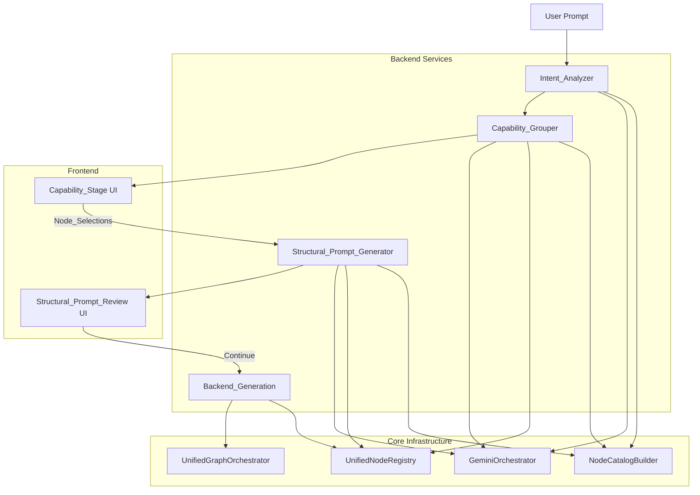

# Design Document: Capability-Based Node Selection Flow

## Overview

The Capability-Based Node Selection Flow replaces the legacy pre-computation path where a structural prompt was built with default nodes before the user had any agency. The new flow inserts a user-driven selection stage between intent analysis and structural prompt generation.

The chain is strictly ordered:

```
User Prompt
  → Intent_Analyzer (LLM: prompt + Node_Catalog → Use_Case_Units)
  → Capability_Grouper (LLM: each Use_Case_Unit + Node_Catalog → Capability_Containers)
  → Capability_Stage UI (user selects one node per container)
  → Structural_Prompt_Generator (LLM: Node_Selections + prompt + Node_Catalog → structural prompt)
  → Structural_Prompt_Review UI (user reviews, clicks Continue)
  → Backend_Generation (credential resolution, graph compilation, execution)
```

No step in this chain may be skipped, reordered, or run in parallel with a prior step. The structural prompt is never computed before all Node_Selections are recorded.

---

## Architecture

### High-Level Component Map



### Pipeline Phases

The flow is split into two HTTP round-trips separated by user interaction:

**Phase 1 — Capability Discovery** (`POST /api/capability-selection/analyze`):
- Runs Intent_Analyzer and Capability_Grouper
- Returns Capability_Containers to the frontend
- No workflow graph is constructed at this point

**Phase 2 — Workflow Generation** (`POST /api/capability-selection/generate`):
- Accepts Node_Selections from the frontend
- Runs Structural_Prompt_Generator
- Constructs and validates the Workflow_Graph via UnifiedGraphOrchestrator
- Returns the structural prompt and workflow for review

**Phase 3 — Backend Generation** (`POST /api/capability-selection/confirm`):
- Triggered only after the user clicks Continue on the review step
- Passes the validated Workflow_Graph to the existing credential resolution and execution pipeline

This split ensures the structural prompt is never computed before user selection (Requirement 7), and backend generation never starts before user review (Requirement 6).

### Core Infrastructure

The capability-based node selection flow relies on several core infrastructure components that ensure workflow correctness and consistency:

**UnifiedNodeRegistry**: Single source of truth for all node definitions, metadata, and capabilities. Provides dynamic node information without hardcoded mappings.

**UnifiedGraphOrchestrator**: Manages all workflow graph construction and validation. Ensures structural correctness through centralized edge management.

**GeminiOrchestrator**: Handles all LLM interactions with consistent retry patterns and model fallback strategies.

**NodeCatalogBuilder**: Dynamically assembles node catalog from registry for LLM consumption.

**Edge Reconciliation Engine**: Core architectural component that ensures workflow graph correctness across all branching scenarios. Includes the critical edge reconciliation fix that preserves case edges from branching nodes to terminal nodes, preventing the incorrect removal of legitimate `switch→log_output` or `if_else→log_output` connections during lineage validation.

---

## Components and Interfaces

### 1. Intent_Analyzer

**Location:** `worker/src/services/ai/stages/capability-intent-analyzer.ts`

**Responsibility:** Parse the user's natural language prompt into an ordered list of Use_Case_Units using the LLM. No keyword pre-filtering, tag-matching, or deterministic scoring is applied before the LLM call.

**Interface:**

```typescript
export interface UseCaseUnit {
  unitId: string;           // stable UUID for this unit
  label: string;            // human-readable label, e.g. "Trigger: new email received"
  semanticRole: 'trigger' | 'data_source' | 'communication' | 'transformation' | 'output' | 'logic';
  description: string;      // natural language description of what this unit must accomplish
  orderIndex: number;       // position in the ordered list (0-based)
}

export interface IntentAnalysisResult {
  ok: true;
  units: UseCaseUnit[];
  promptHash: string;       // SHA-256 of the input prompt (for logging)
  durationMs: number;
  llmCall: LlmCallMeta;
}

export interface IntentAnalysisError {
  ok: false;
  code: 'EMPTY_UNIT_LIST' | 'INVALID_LLM_RESPONSE' | 'LLM_CALL_FAILED';
  message: string;
  durationMs: number;
}

export type IntentAnalysisOutput = IntentAnalysisResult | IntentAnalysisError;

export async function runIntentAnalysis(
  userPrompt: string,
  nodeCatalog: NodeCatalogText,
  correlationId?: string,
): Promise<IntentAnalysisOutput>
```

**Validation rules:**
- Output list must contain 1–20 units; empty list returns `EMPTY_UNIT_LIST` error
- Exactly one unit must have `semanticRole === 'trigger'`; if zero or more than one, the LLM is re-prompted once with the violation context
- Units are not stored in any node config or `workflow.edges`

**LLM prompt strategy:**
- System prompt includes the Node_Catalog and instructs the LLM to output a JSON array of Use_Case_Units
- User message is the raw prompt
- Uses `geminiOrchestrator.processRequest('intent-analysis', ...)` with `model: 'gemini-2.5-flash'`, `temperature: 0.1`
- One retry on parse failure with a schema reminder

**Logging:** Emits a structured log entry with `promptHash`, `unitCount`, and `durationMs` on every call.

---

### 2. Capability_Grouper

**Location:** `worker/src/services/ai/stages/capability-grouper-stage.ts`

**Responsibility:** For each Use_Case_Unit, invoke the LLM with the unit description and the Node_Catalog to produce a Capability_Container. All grouping is driven by semantic equivalence as determined by the LLM — no hardcoded mappings, no `if/switch` on node type strings.

**Interface:**

```typescript
export interface CandidateNode {
  nodeType: string;                    // registry key, e.g. "google_gmail"
  label: string;                       // from unifiedNodeRegistry.get(nodeType).label
  description: string;                 // from unifiedNodeRegistry.get(nodeType).description
  credentialRequirements: string[];    // from unifiedNodeRegistry.getRequiredCredentials(nodeType)
  hasCredentials: boolean;             // derived from credential vault check at request time
}

export interface CapabilityContainer {
  containerId: string;                 // stable UUID
  label: string;                       // human-readable, e.g. "Send Email"
  useCaseUnit: UseCaseUnit;
  candidates: CandidateNode[];         // ordered list; no pre-selection
}

export interface CapabilityGroupingResult {
  ok: true;
  containers: CapabilityContainer[];  // one per Use_Case_Unit, in same order
  durationMs: number;
}

export interface CapabilityGroupingError {
  ok: false;
  code: 'EMPTY_CONTAINER' | 'INVALID_LLM_RESPONSE' | 'LLM_CALL_FAILED';
  failedUnitId: string;
  message: string;
  durationMs: number;
}

export async function runCapabilityGrouping(
  units: UseCaseUnit[],
  nodeCatalog: NodeCatalogText,
  userId: string,
  correlationId?: string,
): Promise<CapabilityGroupingResult | CapabilityGroupingError>
```

**Registry validation:**
- After the LLM returns candidate node type identifiers, each is validated against `unifiedNodeRegistry.has(nodeType)`
- Invalid identifiers are discarded with a warning log; they do not fail the flow
- If all candidates for a container are invalid, the LLM is re-prompted once with the validation failure context
- If the container is still empty after the retry, a `EMPTY_CONTAINER` error is returned

**Metadata hydration:**
- `label`, `description`, and `credentialRequirements` for each candidate are read from `unifiedNodeRegistry.get(nodeType)` at request time — never hardcoded
- `hasCredentials` is derived by calling `credentialVault.exists(...)` for each required credential category

**No pre-selection:** The `candidates` array has no selected flag. Selection is deferred entirely to the frontend.

---

### 3. Capability_Stage UI

**Location:** `ctrl_checks/src/components/workflow/CapabilityStage.tsx`

**Responsibility:** Display all Capability_Containers simultaneously and collect exactly one Node_Selection per container before enabling Continue.

**Props interface:**

```typescript
interface CapabilityStageProps {
  containers: CapabilityContainer[];
  onComplete: (selections: NodeSelectionMap) => void;
  onBack?: () => void;
}

type NodeSelectionMap = Record<string, string>; // containerId → selected nodeType
```

**State:**
- `selections: NodeSelectionMap` — tracks the current selection per container
- `isComplete: boolean` — derived: `Object.keys(selections).length >= 1` (at least one container has a selection; not all containers need to be filled)

**Behavior:**
- All containers are rendered simultaneously in `useCaseUnit.orderIndex` order
- Selecting a node in a container replaces any prior selection in that container (single-select invariant)
- Continue button is disabled until `isComplete === true`
- A visual counter ("X of Y selected") is displayed to show how many containers have been selected without implying all must be filled
- Clicking Continue calls `onComplete(selections)` — this is the only action that triggers downstream processing; the selections passed may be a partial subset of all containers
- Changing a selection after a prior selection does not trigger any backend call
- A "Go Back" button (if `onBack` is provided) returns to the previous step with no state change

**Credential indicator:** Each candidate node renders a credential status badge. The badge state (`connected` / `not connected`) is derived from `CandidateNode.hasCredentials` — read from the backend response, which in turn reads from the registry and vault.

---

### 4. Structural_Prompt_Generator

**Location:** `worker/src/services/ai/stages/capability-structural-prompt-stage.ts`

**Responsibility:** Given the ordered Node_Selections, the original user prompt, and the Node_Catalog, call the LLM to produce a structural prompt. Then hydrate each selected node with registry defaults and construct the Workflow_Graph via UnifiedGraphOrchestrator.

**Interface:**

```typescript
export interface NodeSelection {
  containerId: string;
  useCaseUnit: UseCaseUnit;
  selectedNodeType: string;
}

export interface StructuralPromptGenerationInput {
  userPrompt: string;
  orderedSelections: NodeSelection[];   // in Use_Case_Unit order
  nodeCatalog: NodeCatalogText;
  correlationId?: string;
}

export interface StructuralPromptGenerationResult {
  ok: true;
  structuralPrompt: string;
  workflow: Workflow;                   // validated by UnifiedGraphOrchestrator
  selectedNodeTypes: string[];
  selectedContainerCount: number;       // number of containers that had a selection
  totalContainerCount: number;          // total number of containers presented to the user
  nodeCount: number;
  edgeCount: number;
  durationMs: number;
  llmCall: LlmCallMeta;
}

export interface StructuralPromptGenerationError {
  ok: false;
  code: 'INVALID_LLM_RESPONSE' | 'ORCHESTRATOR_VALIDATION_FAILED' | 'LLM_CALL_FAILED';
  message: string;
  durationMs: number;
}

export async function runCapabilityStructuralPromptStage(
  input: StructuralPromptGenerationInput,
): Promise<StructuralPromptGenerationResult | StructuralPromptGenerationError>
```

**Graph construction sequence (strictly ordered):**

1. LLM outputs `{ type: "nodeName" }[]` — one entry per selection
2. Each entry is hydrated: `const config = unifiedNodeRegistry.getDefaultConfig(nodeType)`
3. `unifiedGraphOrchestrator.initializeWorkflow(hydratedNodes)` constructs the initial graph
4. `unifiedGraphOrchestrator.validateWorkflow(workflow)` is called; any violation is a pipeline contract error
5. The validated workflow and structural prompt are returned together

**Constraints:**
- The LLM prompt explicitly lists only the selected node types (which may be a partial subset of all containers); no default or legacy nodes are included. The LLM is instructed to generate a coherent workflow from the partial selections combined with the original user intent, intelligently omitting or bridging steps for containers the user skipped.
- `workflow.edges` is never written directly; all edge creation goes through `initializeWorkflow`
- Structural prompt generation is never called before `onComplete` fires from the Capability_Stage

**Logging:** Emits a structured log entry with `selectedNodeTypes`, `selectedContainerCount`, `totalContainerCount`, `nodeCount`, `edgeCount`, and `durationMs`.

---

### 5. Structural_Prompt_Review UI

**Location:** `ctrl_checks/src/components/workflow/CapabilityReviewStep.tsx`

**Responsibility:** Display the structural prompt and workflow summary to the user. The Continue button is the sole gate for Backend_Generation.

**Props interface:**

```typescript
interface CapabilityReviewStepProps {
  structuralPrompt: string;
  workflow: Workflow;
  selections: NodeSelectionMap;
  onConfirm: () => void;
  onBack: () => void;
}
```

**Behavior:**
- Displays the structural prompt as a human-readable summary
- Lists selected nodes in execution order with their registry-sourced label and description
- "Continue" calls `onConfirm()` — this is the only action that triggers Backend_Generation
- "Go Back" calls `onBack()` and returns the user to the Capability_Stage with `selections` preserved
- If the user goes back and changes selections, the review step is re-entered with a freshly generated structural prompt on the next Continue

---

### 6. Backend_Generation Integration

**Location:** Existing `AiFirstPipeline` stages (credential discovery, property population, field ownership)

**Entry point:** `POST /api/capability-selection/confirm`

The confirmed Workflow_Graph (already validated by `validateWorkflow`) is passed directly into the existing downstream pipeline stages:
- Credential discovery: reads `unifiedNodeRegistry.getRequiredCredentials(nodeType)` for each node — no hardcoded credential mappings
- Property population: uses the existing `runPropertyPopulationStage`
- Field ownership: uses the existing `runFieldOwnershipStage`
- Any further structural mutations (e.g., safety node injection) go through `unifiedGraphOrchestrator.injectNode(...)` followed by `validateWorkflow`

---

## Data Models

### Use_Case_Unit

```typescript
interface UseCaseUnit {
  unitId: string;
  label: string;
  semanticRole: 'trigger' | 'data_source' | 'communication' | 'transformation' | 'output' | 'logic';
  description: string;
  orderIndex: number;
}
```

### Capability_Container (API response shape)

```typescript
interface CapabilityContainer {
  containerId: string;
  label: string;
  useCaseUnit: UseCaseUnit;
  candidates: Array<{
    nodeType: string;
    label: string;
    description: string;
    credentialRequirements: string[];
    hasCredentials: boolean;
  }>;
}
```

### Node_Selection

```typescript
interface NodeSelection {
  containerId: string;
  useCaseUnit: UseCaseUnit;
  selectedNodeType: string;
}
```

### API Request/Response Contracts

**Phase 1 — Analyze:**

```
POST /api/capability-selection/analyze
Body: { prompt: string; userId: string; correlationId?: string }

Response 200:
{
  correlationId: string;
  containers: CapabilityContainer[];
  promptHash: string;
  durationMs: number;
}

Response 4xx/5xx:
{
  ok: false;
  code: 'EMPTY_UNIT_LIST' | 'EMPTY_CONTAINER' | 'INVALID_LLM_RESPONSE' | 'LLM_CALL_FAILED';
  message: string;
  failedUnitId?: string;
}
```

**Phase 2 — Generate:**

```
POST /api/capability-selection/generate
Body: {
  correlationId: string;
  userPrompt: string;
  selections: NodeSelectionMap;   // containerId → nodeType
  containers: CapabilityContainer[];
}

Response 200:
{
  structuralPrompt: string;
  workflow: Workflow;
  selectedNodeTypes: string[];
  nodeCount: number;
  edgeCount: number;
  durationMs: number;
}

Response 4xx/5xx:
{
  ok: false;
  code: 'INVALID_LLM_RESPONSE' | 'ORCHESTRATOR_VALIDATION_FAILED' | 'LLM_CALL_FAILED';
  message: string;
  selections: NodeSelectionMap;   // preserved for retry without repeating Capability_Stage
}
```

**Phase 3 — Confirm:**

```
POST /api/capability-selection/confirm
Body: {
  correlationId: string;
  workflow: Workflow;
  userPrompt: string;
  userId: string;
}

Response 200: { workflow: Workflow; ... } (existing pipeline output shape)

Response 4xx/5xx:
{
  ok: false;
  code: string;
  message: string;
  selections: NodeSelectionMap;   // preserved so user can retry without repeating Capability_Stage
}
```

### Node_Catalog Assembly

The Node_Catalog is assembled by `buildNodeCatalogText()` from `node-catalog-builder.ts`, which already reads all node definitions from `unifiedNodeRegistry.getAllTypes()` at call time. No changes to the catalog builder are required. The catalog is built once per Phase 1 request and reused across all LLM calls within that request.

The catalog includes for each node: `type`, `label`, `category`, `description`, `inputSummary`, `outputSummary`, `credentials`, `isTrigger`, `isBranching`, and `operations`. This gives the LLM sufficient context to group nodes by semantic equivalence without any hardcoded hints.

---

## Correctness Properties

*A property is a characteristic or behavior that should hold true across all valid executions of a system — essentially, a formal statement about what the system should do. Properties serve as the bridge between human-readable specifications and machine-verifiable correctness guarantees.*

### Property 1: Use_Case_Unit structural completeness

*For any* valid user prompt, every Use_Case_Unit produced by the Intent_Analyzer SHALL have a non-empty `label`, a valid `semanticRole`, and a non-empty `description`.

**Validates: Requirements 1.1, 1.3**

---

### Property 2: Exactly one trigger unit per prompt

*For any* valid user prompt, the list of Use_Case_Units produced by the Intent_Analyzer SHALL contain exactly one unit with `semanticRole === 'trigger'`.

**Validates: Requirements 1.4**

---

### Property 3: Unit count bounds

*For any* LLM response, the Intent_Analyzer SHALL accept the response only if it contains between 1 and 20 Use_Case_Units (inclusive); responses outside this range SHALL produce a structured error rather than a partial result.

**Validates: Requirements 1.5**

---

### Property 4: One Capability_Container per Use_Case_Unit

*For any* ordered list of Use_Case_Units, the Capability_Grouper SHALL produce exactly one Capability_Container per unit, in the same order as the input list.

**Validates: Requirements 2.1, 2.2**

---

### Property 5: Invalid node type identifiers are discarded

*For any* LLM response that includes node type identifiers not present in the Unified_Node_Registry, those identifiers SHALL be absent from the resulting Capability_Container's candidates list, and the remaining valid candidates SHALL be unaffected.

**Validates: Requirements 2.5**

---

### Property 6: No pre-selection in Capability_Containers

*For any* Capability_Container produced by the Capability_Grouper, no candidate node SHALL have a pre-selected or default-selected state; all selection state is initialized to empty.

**Validates: Requirements 2.7, 3.4**

---

### Property 7: Candidate metadata matches registry

*For any* candidate node in any Capability_Container, the `label`, `description`, and `credentialRequirements` fields SHALL exactly match the values returned by `unifiedNodeRegistry.get(nodeType)` and `unifiedNodeRegistry.getRequiredCredentials(nodeType)` at the time of the request.

**Validates: Requirements 2.9, 8.1, 8.6**

---

### Property 8: Continue gate — at least one selection across any container

*For any* set of Capability_Containers, the Continue button on the Capability_Stage SHALL be enabled if and only if at least one container has a selected node type (i.e., `Object.keys(selections).length >= 1`).

**Validates: Requirements 3.4, 3.6**

---

### Property 9: Single-selection invariant per container

*For any* Capability_Container, selecting a node SHALL deselect any previously selected node in that container, such that at most one node is selected at any time.

**Validates: Requirements 3.5**

---

### Property 10: Structural prompt uses only selected node types

*For any* set of Node_Selections, the Structural_Prompt_Generator SHALL produce a workflow containing only the node types present in the selections; no default, legacy, or fallback node types SHALL appear in the resulting workflow graph.

**Validates: Requirements 4.2, 7.1, 7.2**

---

### Property 11: Node hydration uses registry defaults

*For any* selected node type, the hydrated node config SHALL equal `unifiedNodeRegistry.getDefaultConfig(nodeType)`; no hardcoded defaults or legacy config values SHALL be used.

**Validates: Requirements 4.4, 8.5**

---

### Property 12: validateWorkflow is called after initializeWorkflow

*For any* workflow produced by `initializeWorkflow`, `validateWorkflow` SHALL be called before the workflow is returned to the caller; any structural violation SHALL cause the pipeline to return an error rather than a partially valid workflow.

**Validates: Requirements 4.6**

---

### Property 16: Edge reconciliation preserves case edges from branching nodes

*For any* workflow containing branching nodes (switch, if_else) with direct case edges to terminal nodes, the edge reconciliation engine SHALL preserve these case edges as legitimate connections and SHALL NOT remove them as stale edges during lineage validation.

**Validates: Core Architecture - Edge Reconciliation Fix**

---

### Property 13: Node_Selections preserved on backend failure

*For any* backend generation failure that occurs after the user has clicked Continue on the review step, the error response SHALL include the complete set of Node_Selections so the user can retry without repeating the Capability_Stage.

**Validates: Requirements 6.6**

---

### Property 14: Node_Catalog includes all registry nodes

*For any* node type registered in the Unified_Node_Registry, that node type SHALL appear in the Node_Catalog passed to the LLM; adding a new node to the registry SHALL automatically include it in the catalog on the next invocation without code changes.

**Validates: Requirements 8.2**

---

### Property 15: Go-back preserves selections

*For any* set of Node_Selections made on the Capability_Stage, navigating to the Structural_Prompt_Review step and then clicking "Go Back" SHALL return the user to the Capability_Stage with all prior selections intact and unchanged.

**Validates: Requirements 5.5**

---

## Error Handling

### LLM Failure Strategy

All three LLM calls (Intent_Analyzer, Capability_Grouper, Structural_Prompt_Generator) follow the same retry pattern:

1. **First attempt:** Call `geminiOrchestrator.processRequest(...)` with `model: 'gemini-2.5-flash'`
2. **Parse failure:** If the response cannot be parsed as valid JSON matching the expected schema, retry once with a schema reminder appended to the system prompt
3. **Validation failure:** If the parsed response fails domain validation (e.g., empty unit list, all-invalid candidates), retry once with the specific validation failure context
4. **Final failure:** Return a structured error with a specific error code; never fall back to legacy pre-computed defaults

The `GeminiOrchestrator` already handles model-level fallback from `gemini-2.5-pro` to `gemini-2.5-flash` internally. The new stages use `gemini-2.5-flash` directly and do not need to manage model selection.

### Error Propagation

| Stage | Error Code | Frontend Behavior |
|---|---|---|
| Intent_Analyzer | `EMPTY_UNIT_LIST` | Show error message; allow user to rephrase prompt |
| Intent_Analyzer | `INVALID_LLM_RESPONSE` | Show error message; allow retry |
| Capability_Grouper | `EMPTY_CONTAINER` | Show error message identifying the failing use-case unit; allow retry |
| Structural_Prompt_Generator | `ORCHESTRATOR_VALIDATION_FAILED` | Show error message; preserve selections; allow retry from Capability_Stage |
| Backend_Generation | any | Show error message; preserve selections; allow retry from review step |

### Registry Validation Errors

Invalid node type identifiers returned by the LLM are silently discarded with a warning log. This is not surfaced as an error to the user unless it causes a container to become empty (which triggers the re-prompt path).

### Orchestrator Validation Errors

`validateWorkflow` violations (multiple triggers, orphaned nodes, cycles, edge/execution-order mismatches) are treated as pipeline contract errors. They are returned as `ORCHESTRATOR_VALIDATION_FAILED` and surfaced to the user with a message indicating the workflow structure is invalid. The user's Node_Selections are preserved in the error response.

### Edge Reconciliation Architecture Fix

**Critical Fix Implemented:** The edge reconciliation engine has been enhanced to properly handle case edges from branching nodes to terminal nodes (lines 511-534 in `edge-reconciliation-engine.ts`).

**Issue Resolved:** The `hasLineageValidIncoming` function in Step 7 was incorrectly removing legitimate `switch→log_output` or `if_else→log_output` case edges, treating them as stale connections when they were actually valid direct case targets.

**Solution:** Extended the lineage validation logic to recognize case edges (`true`, `false`, `case_*`) from branching nodes (`isBranching === true`) as legitimate predecessors that should be preserved during edge reconciliation.

**Impact:** This fix ensures workflow graph correctness for all branching scenarios, preventing the loss of direct case connections to terminal nodes. The fix is universal and applies to all workflow types automatically through the core orchestration layer.

**Testing:** Comprehensive test coverage in `edge-reconciliation-branching.test.ts` validates 23 edge reconciliation scenarios, confirming the fix works across all branching patterns (if_else, switch, multi-case scenarios).

---

## Testing Strategy

### Unit Tests

Unit tests cover specific examples, edge cases, and error conditions:

- Intent_Analyzer: valid prompt produces correct Use_Case_Unit structure; empty LLM response returns `EMPTY_UNIT_LIST`; LLM parse failure triggers retry
- Capability_Grouper: invalid node type identifiers are discarded; empty container triggers re-prompt; metadata matches registry values
- Structural_Prompt_Generator: hydrated nodes use registry defaults; `initializeWorkflow` is called with correct node list; `validateWorkflow` violations return error
- Capability_Stage: Continue button disabled until all containers have one selection; selection change does not trigger backend call
- Capability_Review: Go Back preserves selections; Continue triggers `onConfirm`

### Property-Based Tests

Property-based tests use a PBT library (e.g., `fast-check` for TypeScript) with a minimum of 100 iterations per property. Each test is tagged with the design property it validates.

**Feature: capability-node-selection-flow, Property 1: Use_Case_Unit structural completeness**
- Generator: arbitrary non-empty string prompts
- Assertion: every unit in the output has non-empty `label`, valid `semanticRole`, non-empty `description`

**Feature: capability-node-selection-flow, Property 2: Exactly one trigger unit per prompt**
- Generator: arbitrary non-empty string prompts
- Assertion: `units.filter(u => u.semanticRole === 'trigger').length === 1`

**Feature: capability-node-selection-flow, Property 3: Unit count bounds**
- Generator: mock LLM responses with 0, 1, 20, 21, and arbitrary N units
- Assertion: 0 → error; 1–20 → success; 21+ → error

**Feature: capability-node-selection-flow, Property 4: One container per unit**
- Generator: arbitrary arrays of 1–20 Use_Case_Units
- Assertion: `containers.length === units.length` and order is preserved

**Feature: capability-node-selection-flow, Property 5: Invalid node types discarded**
- Generator: mock LLM responses with arbitrary strings as node type identifiers (most will not be in the registry)
- Assertion: every candidate in every container passes `unifiedNodeRegistry.has(nodeType)`

**Feature: capability-node-selection-flow, Property 6: No pre-selection**
- Generator: arbitrary Use_Case_Unit lists
- Assertion: no container has any candidate with a pre-selected flag

**Feature: capability-node-selection-flow, Property 7: Candidate metadata matches registry**
- Generator: arbitrary subsets of registered node types
- Assertion: for each candidate, `candidate.label === unifiedNodeRegistry.get(nodeType).label` and credential requirements match

**Feature: capability-node-selection-flow, Property 8: Continue gate**
- Generator: arbitrary sets of containers with arbitrary selection states (0 or 1 selection per container)
- Assertion: `isComplete === (Object.keys(selections).length >= 1)` — enabled as soon as at least one container has a selection

**Feature: capability-node-selection-flow, Property 9: Single-selection invariant**
- Generator: arbitrary sequences of selection events on a container
- Assertion: after each event, at most one candidate is selected

**Feature: capability-node-selection-flow, Property 10: Structural prompt uses only selected node types**
- Generator: arbitrary valid Node_Selection maps (using real registry node types)
- Assertion: every node in the resulting workflow has a type present in the selections

**Feature: capability-node-selection-flow, Property 11: Node hydration uses registry defaults**
- Generator: arbitrary registered node types
- Assertion: `hydratedNode.data.config` deep-equals `unifiedNodeRegistry.getDefaultConfig(nodeType)`

**Feature: capability-node-selection-flow, Property 12: validateWorkflow called after initializeWorkflow**
- Generator: arbitrary valid Node_Selection maps
- Assertion: mock orchestrator records that `validateWorkflow` was called after `initializeWorkflow` on every invocation

**Feature: capability-node-selection-flow, Property 13: Selections preserved on backend failure**
- Generator: arbitrary Node_Selection maps; mock backend to always fail
- Assertion: error response contains `selections` matching the input

**Feature: capability-node-selection-flow, Property 14: Node_Catalog includes all registry nodes**
- Generator: register arbitrary mock node types in the registry
- Assertion: `buildNodeCatalogText()` output contains every registered node type

**Feature: capability-node-selection-flow, Property 15: Go-back preserves selections**
- Generator: arbitrary Node_Selection maps
- Assertion: after navigating to review and back, `selections` state is unchanged

**Feature: capability-node-selection-flow, Property 16: Edge reconciliation preserves case edges**
- Generator: arbitrary workflows with branching nodes connected directly to terminal nodes via case edges
- Assertion: edge reconciliation engine preserves all case edges (`true`, `false`, `case_*`) from branching nodes and does not remove them during lineage validation

### Integration Tests

Integration tests verify the end-to-end flow with real LLM calls (or recorded fixtures):

- Phase 1 (analyze): a real prompt produces a valid set of Capability_Containers with registry-validated candidates
- Phase 2 (generate): a valid set of Node_Selections produces a structurally valid Workflow_Graph (passes `validateWorkflow`)
- Phase 3 (confirm): the confirmed workflow passes through credential discovery and property population without errors

### Legacy Path Isolation

A dedicated test suite verifies that the legacy pre-computation path is not invoked when the Capability_Node_Selection_Flow is active:

- Mock the legacy `runStructuralPromptStage` and verify it is never called during Phase 1 or Phase 2
- Verify `workflow.edges.push` and `workflow.edges = [...]` do not appear in any new source files (static analysis via grep in CI)
