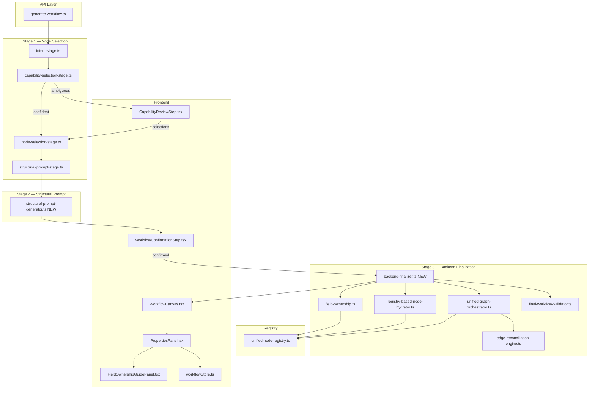

# Design Document: Intelligent Workflow Generation Pipeline

## Overview

This document describes the redesigned four-stage workflow generation pipeline. The system converts a natural language user prompt into a structurally valid, field-ownership-annotated workflow graph delivered to the UI. The redesign addresses four concrete problems in the current system:

1. `summarize-layer.ts` produces repetitive output by templating "The data is then passed to X" per node in `buildStructuralBlueprint()`.
2. The Node Selection UI fires on every prompt instead of only when the AI is genuinely ambiguous.
3. Backend validation runs too late — after the UI has already received a potentially broken graph.
4. The three-button field ownership control (User / AI-built / AI-runtime) has no enforcement boundary; AI can re-classify fields after delivery.

The redesigned pipeline enforces a strict stage gate: each stage has one responsibility, one input contract, and one output contract. No stage reads state from a non-adjacent stage. Failures halt the pipeline and return a structured error with a `stageTrace`.

---

## Architecture

### Four-Stage Pipeline Data Flow

```
UserPrompt
    │
    ▼
┌─────────────────────────────────────────────────────────────────┐
│  Stage 1 — Prompt Analysis & Intelligent Node Selection         │
│                                                                 │
│  runIntentStage()          → StructuredIntent                   │
│  runCapabilitySelectionStage() → CapabilityOptionStep[]         │
│  [Node_Selection_UI if ambiguous]                               │
│  runNodeSelectionStage()   → SelectedNode[]                     │
│  runStructuralPromptStage() → structuralPrompt: string          │
└─────────────────────────────────────────────────────────────────┘
    │
    │  { structuredIntent, selectedNodes, structuralPrompt,
    │    capabilitySelectionsByStep }
    ▼
┌─────────────────────────────────────────────────────────────────┐
│  Stage 2 — Structural Prompt Generation                         │
│                                                                 │
│  StructuralPromptGenerator.generate()                           │
│    → StructuralPrompt { text, steps[], conditions[],            │
│                         triggerDescription, terminalAction }    │
│  Stored in workflow.metadata.structuralBlueprintSummary         │
│  [User reviews and confirms]                                    │
└─────────────────────────────────────────────────────────────────┘
    │
    │  { confirmedStructuralPrompt, selectedNodes }
    ▼
┌─────────────────────────────────────────────────────────────────┐
│  Stage 3 — Backend Workflow Finalization                        │
│                                                                 │
│  BackendFinalizer:                                              │
│  1. initializeWorkflow(nodes)                                   │
│  2. reconcileWorkflow(workflow)                                 │
│  3. hydrateAIBuiltValues(workflow, structuralPrompt)            │
│  4. classifyFieldOwnership() → _fillMode per field              │
│  5. validateWorkflow(workflow)  [hard contract]                 │
│  6. attachBuildManifest()                                       │
│  fieldOwnershipSnapshot FROZEN                                  │
└─────────────────────────────────────────────────────────────────┘
    │
    │  { workflow, buildManifest, fieldOwnershipMap }
    ▼
┌─────────────────────────────────────────────────────────────────┐
│  Stage 4 — UI Display & Field Ownership Control                 │
│                                                                 │
│  WorkflowCanvas renders DAG                                     │
│  PropertiesPanel renders fields with three-button control       │
│  FieldOwnershipGuidePanel provides contextual help              │
│  All ownership changes are EXCLUSIVELY user-initiated           │
└─────────────────────────────────────────────────────────────────┘
```

### System Component Diagram



### Pipeline Orchestrator

The `WorkflowGenerationPipeline` class in `worker/src/services/ai/pipeline/workflow-generation-pipeline.ts` is the single entry point. It sequences the four stages, populates `stageTrace`, and enforces the halt-on-failure contract. `generate-workflow.ts` instantiates this class and delegates all work to it.

---

## Components and Interfaces

### Stage 1: Intelligent Node Selection

#### Intent Stage (`intent-stage.ts`)

**Input:** `userPrompt: string`, `nodeCatalog: NodeCatalogText`, `correlationId: string`

**Output:** `StructuredIntent`

```typescript
interface StructuredIntent {
  intent: string;
  triggerType: 'schedule' | 'webhook' | 'form' | 'chat_trigger' | 'manual_trigger';
  actions: string[];
  dataFlows: Array<{ from: string; to: string; dataDescription: string }>;
  constraints: string[];
}
```

The intent stage calls Gemini with a structured JSON schema. It retries once on parse failure and falls back to partial JSON recovery for truncated responses. On failure it returns `{ ok: false, code: 'INVALID_LLM_RESPONSE' }` which halts the pipeline.

#### Capability Selection Stage (`capability-selection-stage.ts`)

**Input:** `StructuredIntent`, `correlationId`

**Output:** `CapabilityOptionStep[]`

```typescript
interface CapabilityOptionStep {
  stepId: string;
  stepText: string;
  intentClass: CapabilityIntentClass;
  candidateNodeTypes: string[];          // from UnifiedNodeRegistry
  defaultSuggestedNodeType: string | null;
  selectionPolicy: { multiSelectAllowed: boolean; required: boolean };
}
```

This stage is **synchronous** — it uses only `UnifiedNodeRegistry` (no LLM call). For each action in `StructuredIntent.actions`, it scores all registry node types against the action text using label, description, tags, keywords, and `aiSelectionCriteria`. The top-ranked candidate becomes `defaultSuggestedNodeType`.

**Confidence threshold logic:**

- If `candidateNodeTypes.length === 1` for every step → all use cases are unambiguous → skip Node_Selection_UI.
- If any step has `candidateNodeTypes.length > 1` AND the top score is not significantly higher than the second score (gap < 3 points) → that step is ambiguous → include it in `capabilityOptions` → show Node_Selection_UI.
- The Node_Selection_UI is shown **only** when `capabilityOptions` contains at least one ambiguous step.

All alias resolution goes through `UnifiedNodeRegistry.resolveAlias()`. The `ALIAS_MAP` in the registry is the only alias source — no external maps.

#### Node Selection UI (`CapabilityReviewStep.tsx`)

Rendered only when `capabilityOptions.length > 0`. For each `CapabilityOptionStep` it renders:

- The use case description (`stepText`)
- A radio/checkbox group of `candidateNodeTypes`, each showing `UnifiedNodeRegistry.label` and `description`
- The `defaultSuggestedNodeType` pre-selected

User selections are collected as `capabilitySelectionsByStep: Record<stepId, string[]>` and sent back to the pipeline as mandatory constraints.

**Frontend type contract** (`capability-selection.ts`):

```typescript
interface CapabilityContainer {
  containerId: string;          // maps to stepId
  label: string;
  useCaseUnit: UseCaseUnit;
  candidates: CandidateNode[];  // nodeType, label, description, credentialRequirements
}
```

#### Node Selection Stage (`node-selection-stage.ts`)

**Input:** `StructuredIntent`, `nodeCatalog`, `structuralPrompt`, `NodeSelectionConstraints`

```typescript
interface NodeSelectionConstraints {
  selectedNodeConstraintsByStep?: Record<string, string[]>;
  selectedNodeConstraintsFlat?: string[];   // mandatory types from UI selections
  requiredNodeTypes?: string[];
}
```

**Output:** `SelectedNode[]`

```typescript
interface SelectedNode {
  type: string;    // canonical registry type
  role: 'trigger' | 'action' | 'logic' | 'terminal';
  reason: string;
  nodeId: string;  // UUID assigned here
}
```

Post-LLM, `enforceRegistrySelectionContract()` validates every selected type against the registry and discards unknowns. If `selectedNodeConstraintsFlat` is non-empty, only types in that set are allowed. Exactly one trigger is guaranteed; `manual_trigger` is injected as fallback if none is selected.

---

### Stage 2: Structural Prompt Generator

#### Why `summarize-layer.ts` Produces Repetitive Output

`buildStructuralBlueprint()` in `structural-blueprint-builder.ts` iterates over every node and appends `"${label} runs the ${friendlyType} action."` for generic nodes. The `overviewText` is then `nodeNarratives.map(n => n.text).join(' ')` — a mechanical concatenation with no deduplication, no sentence variety, and no awareness of data flow. For a 5-node workflow this produces five nearly identical sentences.

#### New `StructuralPromptGenerator` Class

**File:** `worker/src/services/ai/stages/structural-prompt-generator.ts`

**Input:**

```typescript
interface StructuralPromptInput {
  resolvedNodes: SelectedNode[];
  structuredIntent: StructuredIntent;
  capabilitySelections: Record<string, string[]>;  // stepId → selected types
}
```

**Output:**

```typescript
interface StructuralPrompt {
  text: string;                    // full plain-English description, max 4000 chars
  steps: StructuralStep[];
  conditions: StructuralCondition[];
  triggerDescription: string;
  terminalAction: string;
}

interface StructuralStep {
  stepNumber: number;
  nodeType: string;
  displayName: string;             // from UnifiedNodeRegistry.label — never internal type string
  description: string;             // what this step does in context
}

interface StructuralCondition {
  branchNodeType: string;
  trueOutcome: string;
  falseOutcome: string;
}
```

**Generation rules:**

1. `displayName` is always `UnifiedNodeRegistry.get(nodeType).label` — never the raw type string (e.g. "Gmail" not "google_gmail").
2. Each integration appears at most once per logical step. If the same node type appears twice (e.g. two `log_output` nodes in a branching workflow), they are described as "Branch A logs X" and "Branch B logs Y" — not repeated identically.
3. No generic headings ("Review your workflow", "Automation overview").
4. Numbered steps in execution order.
5. Branching conditions described on separate numbered lines: "3a. If [condition], then [outcome]. 3b. Otherwise, [outcome]."
6. The trigger is described first, the terminal action last.
7. If `text.length > 4000`, truncate at the last sentence boundary before 4000 and append `…`.
8. Word count target: 50–400 words for 2–10 node workflows.

**Storage:** After user confirmation, `text` is stored in `workflow.metadata.structuralBlueprintSummary` and passed unchanged to Stage 3. No modifications after confirmation.

#### `WorkflowConfirmationStep.tsx` Changes

The current component renders `workflowExplanation.steps` as a list of `{ description, tool_used, tool_reasoning }` objects — a legacy shape from `workflow-explanation-service.ts`. The redesigned component accepts the new `StructuralPrompt` shape:

```typescript
interface WorkflowConfirmationStepProps {
  structuralPrompt: StructuralPrompt;
  onConfirm: () => void;
  onChangeTools: () => void;
  onRegenerate: () => void;
}
```

Rendering:
- `triggerDescription` shown as the trigger line.
- `steps[]` rendered as a numbered list using `displayName` (not internal type).
- `conditions[]` rendered as indented sub-items under the branching step.
- `terminalAction` shown as the final step.
- No "Review your workflow" heading — replaced with the workflow's own `triggerDescription` as the section title.

---

### Stage 3: Backend Workflow Finalization

#### Exact Call Sequence (`BackendFinalizer`)

**File:** `worker/src/services/ai/pipeline/backend-finalizer.ts`

```
Input: { selectedNodes: SelectedNode[], confirmedStructuralPrompt: string, correlationId: string }

1. Build WorkflowNode[] from SelectedNode[] via UnifiedNodeRegistry.getDefaultConfig()

2. unifiedGraphOrchestrator.initializeWorkflow(nodes)
   → { workflow, executionOrder, removedNodeTypes }
   → All edges created by edgeReconciliationEngine — never workflow.edges.push()

3. Deduplication: getNodeCapabilityDedupeKey() per node
   → Remove duplicate canonical types from linear paths
   → unifiedGraphOrchestrator.removeNode() for each duplicate

4. unifiedGraphOrchestrator.reconcileWorkflow(workflow)
   → Fix any stale edges after deduplication
   → Returns { workflow, executionOrder, removedNodeTypes }

5. registryBasedNodeHydrator.hydrateAIBuiltValues(workflow, confirmedStructuralPrompt)
   → Fills all fields where fillMode.default === 'buildtime_ai_once'
   → Uses structuralPrompt as context for AI-generated values

6. classifyFieldOwnership() for every field of every node
   → Sets _fillMode map on node.data.config
   → Classification: 'credential' | 'structural' | 'value'
   → Maps to UI ownership: 'User' | 'AI-built' | 'AI-runtime'

7. unifiedGraphOrchestrator.validateWorkflow(workflow)
   → If valid: false → attempt auto-repair (step 8)
   → If valid: true → proceed to step 9

8. [Auto-repair] unifiedGraphOrchestrator.reconcileWorkflow(workflow) once
   → unifiedGraphOrchestrator.validateWorkflow(workflow) again
   → If still invalid: return { error: 'ORCHESTRATOR_VALIDATION_FAILED', violations[], stageTrace[] }
   → Never return a broken workflow to the UI

9. attachBuildManifest(workflow, { correlationId, structuralPrompt, authorizedNodes, fieldOwnershipSnapshot })
   → fieldOwnershipSnapshot is FROZEN — read-only from this point forward

Output: { workflow: Workflow, buildManifest: WorkflowBuildManifestV1, fieldOwnershipMap: FieldOwnershipMap }
```

#### Deduplication Logic

`getNodeCapabilityDedupeKey(nodeType)` returns a string key representing the node's functional capability (e.g. all email-send nodes share the same key). In a linear workflow path, if two nodes share the same deduplication key, the second is removed via `unifiedGraphOrchestrator.removeNode()`. Parallel branches are exempt — the same capability may appear once per branch.

#### Orphan Removal

After reconciliation, any non-trigger node with no incoming edges is an orphan. `unifiedGraphOrchestrator.validateWorkflow()` identifies these. Non-required orphans (those without `workflowBehavior.alwaysRequired`) are removed via `unifiedGraphOrchestrator.removeNode()` before the final validation pass.

#### `buildManifest` Schema

```typescript
interface WorkflowBuildManifestV1 {
  version: 1;
  correlationId: string;
  createdAt: string;
  userPrompt: string;
  intent: ManifestStructuredIntent;
  structuralBlueprint: string;          // confirmed structural prompt text
  authorizedNodes: AuthorizedNodeEntry[];
  branchingSpec: { mode: 'linear' | 'branching' };
  graphSpec: GraphSpecV1;
  hydrationSpec?: HydrationSpecV1;
  credentialDiscovery?: CredentialDiscoverySpecV1;
  fieldOwnershipSnapshot: ManifestFieldOwnershipSnapshot;  // nodeId → fieldName → fillMode
  integrity: { contentHash: string };   // SHA-256 of all fields except integrity
}
```

`fieldOwnershipSnapshot` is `Record<nodeId, Record<fieldName, FieldFillMode>>`. It is written once at the end of Stage 3 and is read-only thereafter. No pipeline stage, background job, or AI call may modify it after the workflow is delivered to the UI.

---

### Stage 4: UI Display & Field Ownership Control

#### Three-Button Control State Machine

Each field that supports more than one ownership mode (determined by `fillMode.supportsRuntimeAI` or `fillMode.supportsBuildtimeAI` in the registry) renders a three-button control. Fields with only one supported mode render no control.

**Per-field state:**

```typescript
interface FieldOwnershipState {
  mode: 'user' | 'ai_built' | 'ai_runtime';
  value: unknown;           // current displayed value
  aiBuiltValue: unknown;    // value from buildManifest.fieldOwnershipSnapshot
}
```

**Button behaviors:**

| Button clicked | Action |
|---|---|
| "User" | Clear `value`, prompt user for input. If `ownership === 'credential'`, open credential connection flow. |
| "AI-runtime" | Set `mode = 'ai_runtime'`, display placeholder "Resolved at runtime". Clear `value`. |
| "AI-built" | Set `mode = 'ai_built'`, restore `value` from `buildManifest.fieldOwnershipSnapshot[nodeId][fieldName]`. |

**Critical invariant:** After Stage 3 delivers the workflow to the UI, the system never automatically changes, normalizes, or overrides any field's ownership mode. There is no background normalization, no AI re-classification, and no reconciliation pass that touches `_fillMode` values. All ownership changes are exclusively user-initiated via the three-button control.

#### `FieldOwnershipGuidePanel.tsx`

The current panel is an AI chat assistant for credential guidance. It remains unchanged in function but gains a new prop:

```typescript
interface FieldOwnershipGuidePanelProps {
  // existing props...
  buildManifestSnapshot: ManifestFieldOwnershipSnapshot;  // read-only reference
  onOwnershipChange: (nodeId: string, fieldName: string, mode: FieldOwnershipState['mode']) => void;
}
```

The `onOwnershipChange` callback is the **only** path through which ownership state changes. It updates `workflowStore` and never touches `buildManifestSnapshot`.

#### `workflowStore.ts` Save Payload

When the user saves the workflow, the save payload includes the current field ownership state:

```typescript
interface WorkflowSavePayload {
  workflow: Workflow;
  fieldOwnershipOverrides: Record<string, Record<string, FieldOwnershipState['mode']>>;
  // nodeId → fieldName → current mode (only fields where user changed from build-time default)
}
```

The backend persists `fieldOwnershipOverrides` alongside the workflow. On reload, the UI restores ownership state from this map, falling back to `buildManifest.fieldOwnershipSnapshot` for fields not in the overrides map.

---

## Data Models

### Pipeline Stage Contracts

```typescript
// Stage 1 output / Stage 2 input
interface Stage1Output {
  structuredIntent: StructuredIntent;
  selectedNodes: SelectedNode[];
  capabilityOptions: CapabilityOptionStep[];
  appliedCapabilitySelectionsByStep: Record<string, string[]>;
  stageTrace: StageTrace[];
}

// Stage 2 output / Stage 3 input
interface Stage2Output {
  structuralPrompt: StructuralPrompt;   // confirmed by user
  selectedNodes: SelectedNode[];
  structuredIntent: StructuredIntent;
  stageTrace: StageTrace[];
}

// Stage 3 output / Stage 4 input
interface Stage3Output {
  workflow: Workflow;                   // structurally valid DAG
  buildManifest: WorkflowBuildManifestV1;
  fieldOwnershipMap: FieldOwnershipMap;
  validationIssues: ValidationIssue[];
  stageTrace: StageTrace[];
}
```

### `StageTrace` (every response)

```typescript
interface StageTrace {
  stage: string;
  startedAt: number;
  completedAt: number;
  durationMs: number;
  inputSummary: string;
  outputSummary: string;
  llmCall?: { model: string; temperature: number; promptTokens: number; completionTokens: number };
  error?: string;
}
```

### `FieldOwnershipMap`

```typescript
type FieldOwnershipMap = Record<
  string,   // nodeId
  Record<
    string, // fieldName
    {
      mode: 'user' | 'ai_built' | 'ai_runtime';
      fillMode: FieldFillMode;
      ownership: FieldOwnershipClass;
    }
  >
>;
```

---

## Correctness Properties

*A property is a characteristic or behavior that should hold true across all valid executions of a system — essentially, a formal statement about what the system should do. Properties serve as the bridge between human-readable specifications and machine-verifiable correctness guarantees.*


### Property 1: Pipeline always produces stageTrace

*For any* non-empty user prompt submitted to the pipeline, the response object always contains a `stageTrace` array with at least one entry, regardless of whether the pipeline succeeds or fails.

**Validates: Requirements 1.4**

---

### Property 2: Stage failure halts pipeline at the failing stage

*For any* stage index (1–4) and any injected failure condition at that stage, the pipeline response must have `ok: false`, the correct error code matching the failing stage, and a `stageTrace` that contains entries only up to and including the failing stage — no subsequent stage entries.

**Validates: Requirements 1.3**

---

### Property 3: Alias resolution is registry-exclusive and total

*For any* alias string present in `UnifiedNodeRegistry.ALIAS_MAP`, calling `resolveAlias(alias)` returns the canonical type, and `unifiedNodeRegistry.get(canonicalType)` returns a defined node definition. No alias resolution occurs outside the registry.

**Validates: Requirements 2.1, 2.8, 6.2**

---

### Property 4: Ambiguous actions produce non-empty capability options

*For any* action text that scores within 3 points of the top-ranked candidate for at least two different node types in the registry, the resulting `CapabilityOptionStep` must have `candidateNodeTypes.length > 1` and a non-null `defaultSuggestedNodeType`.

**Validates: Requirements 2.3**

---

### Property 5: User capability selections are preserved as mandatory constraints

*For any* `capabilitySelectionsByStep` map provided to the pipeline, every user-selected node type must appear in `selectedNodeConstraintsFlat` passed to the node selection stage, and every selected type must appear in the final `selectedNodes` array.

**Validates: Requirements 2.6**

---

### Property 6: Structural prompt contains all resolved node display names

*For any* list of resolved `SelectedNode[]`, the generated `StructuralPrompt.steps[]` must contain one entry per non-duplicate node, and each entry's `displayName` must equal `UnifiedNodeRegistry.get(nodeType).label` — never the raw internal type string.

**Validates: Requirements 3.1, 8.3**

---

### Property 7: Structural prompt has no repeated display names per logical step and respects length bound

*For any* `StructuralPrompt` generated from a linear workflow (no branching), each `displayName` in `steps[]` appears exactly once. For branching workflows, the same `displayName` may appear at most once per branch path. Additionally, `text.length <= 4000` for any input.

**Validates: Requirements 3.3, 3.9, 8.2**

---

### Property 8: Structural prompt is stored unchanged through Stage 3

*For any* confirmed structural prompt text, `workflow.metadata.structuralBlueprintSummary` and `workflow.metadata.buildManifest.structuralBlueprint` must be identical strings after Stage 3 completes. No stage may modify the structural prompt after user confirmation.

**Validates: Requirements 3.8, 4.11**

---

### Property 9: Every finalized workflow passes structural validation

*For any* workflow produced by `BackendFinalizer` with `ok: true`, calling `unifiedGraphOrchestrator.validateWorkflow(workflow)` must return `{ valid: true }`. No structurally invalid workflow is ever returned to the UI.

**Validates: Requirements 4.4, 7.1**

---

### Property 10: Linear workflow paths contain no duplicate capability nodes

*For any* finalized linear workflow (no branching), applying `getNodeCapabilityDedupeKey()` to all nodes must produce a list of all-unique keys — no two nodes in the linear path share the same capability deduplication key.

**Validates: Requirements 4.6**

---

### Property 11: Field ownership is complete and frozen after Stage 3

*For any* finalized workflow, every field in every node's `inputSchema` must have a corresponding entry in `fieldOwnershipMap[nodeId][fieldName]`. Furthermore, calling any post-delivery utility (reconcile, validate, hydrate) must not modify `buildManifest.fieldOwnershipSnapshot` — the snapshot is immutable after sealing.

**Validates: Requirements 4.9, 5.11, 5.12**

---

### Property 12: Build manifest is present and complete on every successful finalization

*For any* workflow returned by `BackendFinalizer` with `ok: true`, `workflow.metadata.buildManifest` must be defined and contain all required fields: `correlationId`, `structuralBlueprint`, `authorizedNodes` (non-empty), `fieldOwnershipSnapshot`, and `integrity.contentHash`.

**Validates: Requirements 4.10**

---

## Error Handling

### Hard Errors (block response, return `ORCHESTRATOR_VALIDATION_FAILED`)

These conditions are detected by `validateWorkflow()` and treated as pipeline contract errors. The pipeline never returns a workflow to the UI when any of these are present:

| Error | Detection | Response |
|---|---|---|
| Multiple trigger nodes | `validateWorkflow()` counts trigger-category nodes | `error: 'ORCHESTRATOR_VALIDATION_FAILED'`, `violations: ['multiple_triggers']` |
| Orphaned non-trigger nodes (required) | Node with `alwaysRequired: true` has no incoming edges | `error: 'ORCHESTRATOR_VALIDATION_FAILED'`, `violations: ['orphaned_required_node: <type>']` |
| Cycles in the DAG | Topological sort fails | `error: 'ORCHESTRATOR_VALIDATION_FAILED'`, `violations: ['cycle_detected']` |
| Edge references non-existent node ID | `edgeReconciliationEngine.validateEdges()` | `error: 'ORCHESTRATOR_VALIDATION_FAILED'`, `violations: ['invalid_edge_reference: <edgeId>']` |
| Switch out-degree ≠ cases.length | `validateWorkflow()` switch invariant check | `error: 'ORCHESTRATOR_VALIDATION_FAILED'`, `violations: ['switch_degree_mismatch: <nodeId>']` |
| Intent stage LLM failure | `runIntentStage()` returns `ok: false` | `error: 'INTENT_FAILED'` |
| No valid nodes after selection | `runNodeSelectionStage()` returns `ok: false` | `error: 'NO_VALID_NODES'` |

### Soft Warnings (non-blocking, logged to stageTrace)

| Warning | Handling |
|---|---|
| Nodes not in execution order | Logged to stageTrace warnings; auto-corrected by reconciliation |
| Non-required orphaned nodes auto-removed | Logged with removed node types |
| Switch branch count mismatch (AI generated fewer branch nodes than cases) | Warning in stageTrace; workflow still delivered |

### Auto-Repair Sequence

When `validateWorkflow()` returns `valid: false` after initial construction:

1. Call `reconcileWorkflow(workflow)` once.
2. Call `validateWorkflow(workflow)` again.
3. If still `valid: false`: return `{ error: 'ORCHESTRATOR_VALIDATION_FAILED', violations[], stageTrace[] }`.
4. Never attempt more than one auto-repair cycle.

### Gemini LLM Failure Fallback

When any LLM call fails (network error, timeout, invalid JSON after retry):

- Intent stage failure → return `{ error: 'INTENT_FAILED' }` immediately.
- Structural prompt stage failure → use `intent.intent` string as the structural prompt (degraded but functional).
- Node selection stage failure → use `buildDeterministicNodeSelection(intent)` to derive nodes from intent actions via registry keyword matching.
- If deterministic recovery also fails → fall back to `manual_trigger → ai_chat_model → log_output` using `UnifiedNodeRegistry` canonical types.

The fallback workflow is always constructed via `unifiedGraphOrchestrator.initializeWorkflow()` — never by direct edge construction.

### Error Response Shape

```typescript
interface PipelineErrorResponse {
  ok: false;
  error: 'ORCHESTRATOR_VALIDATION_FAILED' | 'INTENT_FAILED' | 'NO_VALID_NODES'
       | 'INVALID_LLM_RESPONSE' | 'CAPABILITY_SELECTION_FAILED' | 'STRUCTURAL_PROMPT_FAILED';
  message: string;
  violations?: string[];    // present for ORCHESTRATOR_VALIDATION_FAILED
  stageTrace: StageTrace[];
  correlationId: string;
}
```

---

## Testing Strategy

### Unit Tests

Unit tests cover specific examples, edge cases, and error conditions. They are not exhaustive across all inputs — that is the role of property tests.

**Focus areas:**
- `StructuralPromptGenerator`: specific 2-node, 5-node, and branching workflow examples to verify output format.
- `BackendFinalizer`: specific deduplication scenarios (two Gmail nodes → one removed).
- `classifyFieldOwnership()`: specific field name / helpCategory combinations for each ownership class.
- `resolveAlias()`: specific alias strings from `ALIAS_MAP`.
- Fallback workflow construction when Gemini fails.
- `buildManifest` integrity hash computation.

### Property-Based Tests

Property tests use a PBT library (e.g. `fast-check` for TypeScript) with a minimum of 100 iterations per property. Each test is tagged with the design property it validates.

**Tag format:** `Feature: intelligent-workflow-generation-pipeline, Property {N}: {property_text}`

**Property test implementations:**

| Property | Generator | Assertion |
|---|---|---|
| P1: stageTrace always present | Random prompt strings (1–500 chars) | `response.stageTrace.length >= 1` |
| P2: Stage failure halts pipeline | Random stage index + error injection | `response.ok === false && stageTrace.length === failingStageIndex` |
| P3: Alias resolution is registry-exclusive | Random alias from ALIAS_MAP | `resolveAlias(alias)` returns canonical type in registry |
| P4: Ambiguous actions produce options | Random action texts with multiple registry matches | `step.candidateNodeTypes.length > 1` |
| P5: User selections preserved as constraints | Random capabilitySelectionsByStep maps | All selected types in `selectedNodeConstraintsFlat` |
| P6: Structural prompt contains all display names | Random SelectedNode[] lists | All `registry.label` values appear in `steps[].displayName` |
| P7: No repeated display names + length bound | Random node lists (2–10 nodes) | No duplicate displayNames in linear path; `text.length <= 4000` |
| P8: Structural prompt unchanged through Stage 3 | Random confirmed prompt strings | `metadata.structuralBlueprintSummary === buildManifest.structuralBlueprint` |
| P9: Finalized workflow passes validation | Random valid node type lists | `validateWorkflow(result.workflow).valid === true` |
| P10: No duplicate capability nodes in linear path | Random node type lists | All `getNodeCapabilityDedupeKey()` values unique |
| P11: Field ownership complete and frozen | Random finalized workflows | All fields have ownership entry; snapshot unchanged after post-delivery calls |
| P12: Build manifest complete on success | Random successful pipeline runs | All required manifest fields present |

### Integration Tests

Integration tests verify end-to-end pipeline behavior with real registry data but mocked LLM calls:

- Full pipeline run with a simple 3-node prompt → verify `stageTrace` has all stage names.
- Full pipeline run with an ambiguous prompt → verify `capabilityOptions` is non-empty.
- Full pipeline run with LLM failure injection → verify fallback workflow is returned.
- Full pipeline run with a branching workflow → verify switch edges are wired correctly.

---

## Files to Create / Modify

### New Files

| File | Description |
|---|---|
| `worker/src/services/ai/stages/structural-prompt-generator.ts` | New `StructuralPromptGenerator` class replacing the repetitive `buildStructuralBlueprint()` template logic. Produces `StructuralPrompt` with numbered steps, conditions, display names from registry, and 4000-char limit. |
| `worker/src/services/ai/pipeline/workflow-generation-pipeline.ts` | Four-stage pipeline orchestrator. Single entry point replacing the scattered stage calls in `generate-workflow.ts`. Manages `stageTrace`, enforces halt-on-failure, and sequences Stage 1 → 2 → 3 → 4. |
| `worker/src/core/types/pipeline-contracts.ts` | TypeScript interfaces for all stage input/output contracts: `Stage1Output`, `Stage2Output`, `Stage3Output`, `StructuralPrompt`, `StructuralStep`, `StructuralCondition`, `PipelineErrorResponse`. |
| `worker/src/services/ai/pipeline/backend-finalizer.ts` | Stage 3 finalization logic: `initializeWorkflow` → deduplication → `reconcileWorkflow` → `hydrateAIBuiltValues` → `classifyFieldOwnership` → `validateWorkflow` → `attachBuildManifest`. Single class with one public `finalize()` method. |

### Modified Files

| File | Change |
|---|---|
| `worker/src/api/generate-workflow.ts` | Wire `WorkflowGenerationPipeline` as the single entry point for both `mode: 'analyze'` and `mode: 'refine'`. Remove direct stage calls and legacy code paths. |
| `worker/src/services/ai/summarize-layer.ts` | Replace `buildStructuralBlueprint()` and `overviewText` concatenation with a call to `StructuralPromptGenerator`. Remove the per-node "The data is then passed to X" template pattern. |
| `worker/src/services/ai/workflow-lifecycle-manager.ts` | Replace all direct `workflow.nodes.push()` / `workflow.edges.push()` patterns with `unifiedGraphOrchestrator.injectNode()`. Ensure all node injection goes through the orchestrator. |
| `ctrl_checks/src/components/workflow/WorkflowConfirmationStep.tsx` | Accept `StructuralPrompt` shape instead of legacy `WorkflowExplanation`. Render `steps[]` with `displayName` and `stepNumber`. Render `conditions[]` as indented branch outcomes. Remove "Review your workflow" heading. |
| `ctrl_checks/src/components/workflow/FieldOwnershipGuidePanel.tsx` | Add `buildManifestSnapshot` prop (read-only reference). Add `onOwnershipChange` callback as the exclusive path for ownership state changes. Enforce that no internal logic modifies the snapshot. |
| `ctrl_checks/src/stores/workflowStore.ts` | Add `fieldOwnershipOverrides: Record<string, Record<string, string>>` to store state. Include `fieldOwnershipOverrides` in the save payload. Restore ownership state from overrides map on workflow load, falling back to `buildManifest.fieldOwnershipSnapshot`. |
