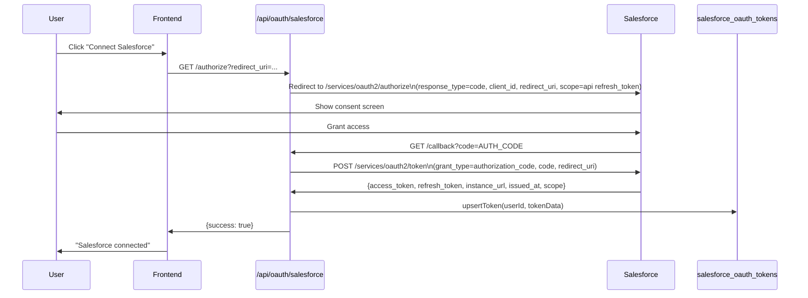
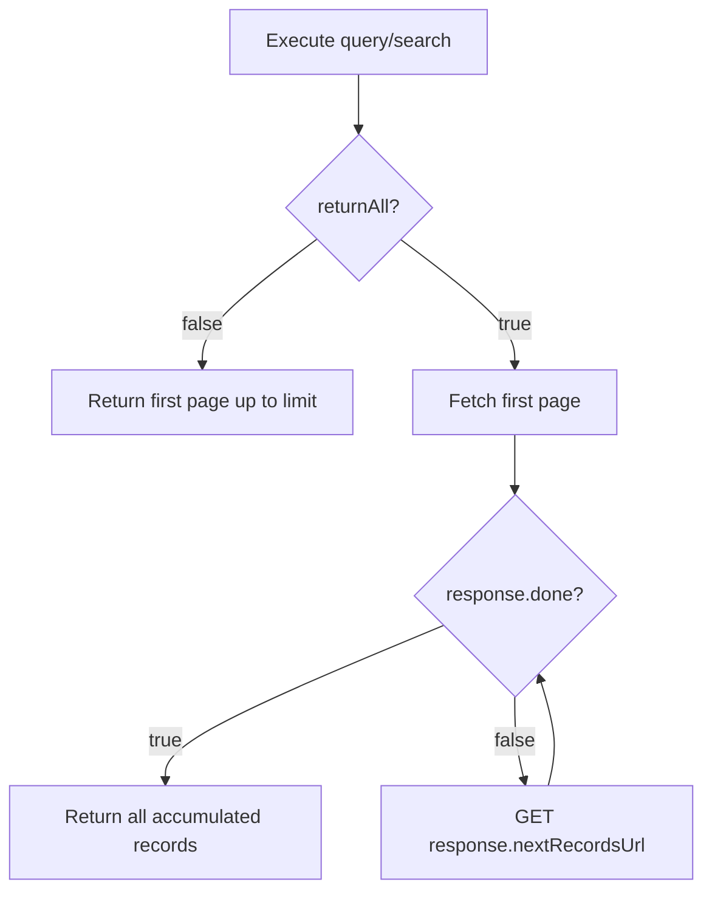

# Design Document: Salesforce Node Integration

## Overview

This document describes the technical design for a fully functional Salesforce node in the Control X AI workflow automation platform. The node enables workflows to interact with all major Salesforce CRM objects (Accounts, Contacts, Leads, Opportunities, Cases, Tasks, Notes, Campaigns, and more) via the Salesforce REST API v59.0, authenticated through Salesforce OAuth 2.0.

The design follows the platform's permanent core architecture rules:
- All node behavior originates from `unified-node-registry.ts` (single source of truth)
- No hardcoded `if/switch` on `node.type` outside the registry
- All execution flows through `dynamic-node-executor.ts`
- Template resolution via `universal-template-resolver.ts`
- Credential lookup via `credential-preflight-check.ts` and the vault
- Edge management via `unified-graph-orchestrator.ts`

---

## Architecture

### How the Salesforce Node Fits Into the Platform

```mermaid
flowchart TD
    UI[Frontend Workflow Builder]
    Registry[unified-node-registry.ts\nSingle Source of Truth]
    Executor[dynamic-node-executor.ts]
    SFNode[salesforce-node.ts\nNodeDefinition]
    SFExec[salesforce-executor.ts\nAPI Logic]
    TokenMgr[salesforce-token-manager.ts]
    OAuthRoutes[/api/oauth/salesforce/*]
    ConnReg[connector-registry.ts]
    Vault[Supabase: salesforce_oauth_tokens]
    SFAPI[Salesforce REST API v59.0]
    Preflight[credential-preflight-check.ts]

    UI -->|node type: salesforce| Registry
    Registry -->|loads definition| SFNode
    SFNode -->|execute delegates to| SFExec
    Executor -->|fetches nodeDef.execute| Registry
    SFExec -->|getToken| TokenMgr
    TokenMgr -->|read/write| Vault
    TokenMgr -->|refresh via| SFAPI
    SFExec -->|REST calls| SFAPI
    OAuthRoutes -->|upsertToken| TokenMgr
    ConnReg -->|connector entry| Registry
    Preflight -->|getRequiredCredentials| Registry
    Preflight -->|lookup vault key| Vault
```

### Request Flow for Workflow Execution

1. `dynamic-node-executor.ts` receives a node of type `salesforce`
2. It calls `unifiedNodeRegistry.get('salesforce')` — no hardcoded branch
3. The registry returns the `UnifiedNodeDefinition` loaded from `salesforce-node.ts`
4. `nodeDef.execute(context)` is called; the execute function resolves config templates via `universal-template-resolver.ts` then delegates to `salesforce-executor.ts`
5. The executor calls `salesforceTokenManager.getToken(userId)` which reads from `salesforce_oauth_tokens`, auto-refreshing if needed
6. The executor makes the appropriate Salesforce REST API call and returns a `NodeExecutionResult`

---

## File Structure

All new files to be created:

```
worker/src/
├── executors/
│   └── salesforce-executor.ts          # All Salesforce REST API logic
├── nodes/definitions/
│   └── salesforce-node.ts              # UnifiedNodeDefinition (inputSchema, outputSchema, credentialSchema, defaultConfig, validateConfig, execute)
├── services/
│   └── salesforce/
│       └── salesforce-token-manager.ts # getToken, refreshToken, upsertToken
└── api/
    └── oauth-salesforce.ts             # /api/oauth/salesforce/authorize + /callback handlers

Database:
└── supabase/migrations/
    └── YYYYMMDD_salesforce_oauth_tokens.sql  # salesforce_oauth_tokens table

Registry updates (existing files, additive changes only):
├── worker/src/nodes/definitions/index.ts           # Add salesforceNodeDefinition import + register
└── worker/src/services/connectors/connector-registry.ts  # Add Salesforce connector entry
```

---

## Components and Interfaces

### salesforce-token-manager.ts

```typescript
interface SalesforceToken {
  userId: string;
  accessToken: string;
  refreshToken: string;
  instanceUrl: string;
  issuedAt: Date;
  expiresAt: Date;
  scope: string;
}

class SalesforceTokenManager {
  // Returns a valid (non-expired) access token, auto-refreshing if within 5 min of expiry.
  // Returns null if no token exists or refresh fails.
  async getToken(userId: string): Promise<SalesforceToken | null>

  // Exchanges a refresh_token for a new access_token via Salesforce token endpoint.
  // Updates the DB record on success. Returns null on failure.
  async refreshToken(userId: string, currentToken: SalesforceToken): Promise<SalesforceToken | null>

  // Inserts or updates the token record for a given userId (ON CONFLICT DO UPDATE).
  async upsertToken(userId: string, tokenData: Omit<SalesforceToken, 'userId'>): Promise<void>
}

export const salesforceTokenManager = new SalesforceTokenManager();
```

### salesforce-executor.ts

```typescript
interface SalesforceExecutorConfig {
  resource: string;        // 'account' | 'contact' | 'lead' | 'opportunity' | 'case' | 'task' | 'note' | 'campaign' | 'event' | 'contract' | 'product' | 'user' | 'custom'
  operation: string;       // 'create' | 'get' | 'update' | 'delete' | 'search' | 'query' | 'sosl' | 'convert'
  recordId?: string;
  soqlQuery?: string;
  soslQuery?: string;
  customObject?: string;
  returnAll?: boolean;
  limit?: number;
  apiVersion?: string;
  additionalFields?: Record<string, any>;
  // Resource-specific fields (lastName, company, subject, etc.)
  [key: string]: any;
}

interface SalesforceExecutorContext {
  userId: string;
  config: SalesforceExecutorConfig;
}

async function executeSalesforceNode(context: SalesforceExecutorContext): Promise<NodeExecutionResult>
```

### oauth-salesforce.ts

```typescript
// GET /api/oauth/salesforce/authorize
// Redirects to Salesforce authorization endpoint
async function salesforceAuthorizeHandler(req: Request, res: Response): Promise<void>

// POST /api/oauth/salesforce/callback
// Exchanges authorization code for tokens, upserts to DB
async function salesforceCallbackHandler(req: Request, res: Response): Promise<void>
```

---

## Data Models

### salesforce_oauth_tokens Table

```sql
CREATE TABLE salesforce_oauth_tokens (
  id            UUID PRIMARY KEY DEFAULT gen_random_uuid(),
  user_id       UUID NOT NULL REFERENCES auth.users(id) ON DELETE CASCADE,
  access_token  TEXT NOT NULL,
  refresh_token TEXT NOT NULL,
  instance_url  TEXT NOT NULL,
  issued_at     TIMESTAMPTZ NOT NULL,
  expires_at    TIMESTAMPTZ NOT NULL,
  scope         TEXT NOT NULL DEFAULT '',
  created_at    TIMESTAMPTZ NOT NULL DEFAULT NOW(),
  updated_at    TIMESTAMPTZ NOT NULL DEFAULT NOW(),
  CONSTRAINT salesforce_oauth_tokens_user_id_unique UNIQUE (user_id)
);

-- RLS: users can only access their own tokens
ALTER TABLE salesforce_oauth_tokens ENABLE ROW LEVEL SECURITY;

CREATE POLICY "Users can manage their own Salesforce tokens"
  ON salesforce_oauth_tokens
  FOR ALL
  USING (auth.uid() = user_id)
  WITH CHECK (auth.uid() = user_id);

-- Index for fast lookup by user_id
CREATE INDEX idx_salesforce_oauth_tokens_user_id ON salesforce_oauth_tokens(user_id);
```

### Token Expiry Logic

Salesforce access tokens expire after a configurable session timeout (default 2 hours). The `expires_at` field is computed as `issued_at + expires_in_seconds`. The token manager refreshes proactively when `expires_at - NOW() < 5 minutes`.

---

## Salesforce OAuth 2.0 Flow Design



**Environment variables required:**
- `SALESFORCE_CLIENT_ID` — Connected App consumer key
- `SALESFORCE_CLIENT_SECRET` — Connected App consumer secret
- `SALESFORCE_REDIRECT_URI` — Callback URL (e.g., `https://app.controlx.ai/api/oauth/salesforce/callback`)

**State parameter:** A base64-encoded `timestamp-random` string is generated per request for CSRF protection. The frontend validates the state on callback.

---

## Node Definition Design (salesforce-node.ts)

The node definition implements `UnifiedNodeDefinition` and is registered via `index.ts`.

### inputSchema (key fields)

```typescript
inputSchema: {
  resource: {
    type: 'string', required: true, default: 'account',
    ui: { options: [
      { label: 'Account', value: 'account' },
      { label: 'Contact', value: 'contact' },
      { label: 'Lead', value: 'lead' },
      { label: 'Opportunity', value: 'opportunity' },
      { label: 'Case', value: 'case' },
      { label: 'Task', value: 'task' },
      { label: 'Note', value: 'note' },
      { label: 'Campaign', value: 'campaign' },
      { label: 'Event', value: 'event' },
      { label: 'Contract', value: 'contract' },
      { label: 'Product', value: 'product' },
      { label: 'User', value: 'user' },
      { label: 'Custom Object', value: 'custom' },
    ]}
  },
  operation: {
    type: 'string', required: true, default: 'get',
    ui: { options: [
      { label: 'Create', value: 'create' },
      { label: 'Get', value: 'get' },
      { label: 'Update', value: 'update' },
      { label: 'Delete', value: 'delete' },
      { label: 'Search', value: 'search' },
      { label: 'Query (SOQL)', value: 'query' },
      { label: 'Search (SOSL)', value: 'sosl' },
      { label: 'Convert (Lead)', value: 'convert' },
    ]}
  },
  recordId: {
    type: 'string', required: false,
    ui: { visibleIf: { field: 'operation', equals: ['get', 'update', 'delete'] },
          requiredIf: { field: 'operation', equals: ['get', 'update', 'delete'] } }
  },
  soqlQuery: {
    type: 'string', required: false,
    ui: { visibleIf: { field: 'operation', equals: 'query' },
          requiredIf: { field: 'operation', equals: 'query' },
          widget: 'textarea' }
  },
  soslQuery: {
    type: 'string', required: false,
    ui: { visibleIf: { field: 'operation', equals: 'sosl' },
          requiredIf: { field: 'operation', equals: 'sosl' },
          widget: 'textarea' }
  },
  customObject: {
    type: 'string', required: false,
    ui: { visibleIf: { field: 'resource', equals: 'custom' },
          requiredIf: { field: 'resource', equals: 'custom' } }
  },
  // Resource-specific fields (lastName, company, subject, name, stageName, closeDate, etc.)
  // Each has ui.visibleIf and ui.requiredIf scoped to the relevant resource+operation
  lastName: {
    type: 'string', required: false,
    ui: { visibleIf: { field: 'resource', equals: ['contact', 'lead'] },
          requiredIf: { field: 'resource', equals: ['contact', 'lead'], operation: 'create' } }
  },
  // ... (all resource-specific fields follow this pattern)
  returnAll: { type: 'boolean', required: false, default: false },
  limit: { type: 'number', required: false, default: 50 },
  apiVersion: { type: 'string', required: false, default: 'v59.0' },
  additionalFields: {
    type: 'json', required: false, default: null,
    ui: { widget: 'json',
          visibleIf: { field: 'operation', equals: ['create', 'update'] } }
  },
}
```

### credentialSchema

```typescript
credentialSchema: {
  requirements: [{
    provider: 'salesforce',
    type: 'oauth',
    category: 'salesforce',
    vaultKey: 'salesforce',
    required: true,
    displayName: 'Salesforce OAuth',
    scopes: ['api', 'refresh_token'],
  }],
  credentialFields: [],  // No credential fields in inputSchema — all from vault
}
```

### defaultConfig

```typescript
defaultConfig: () => ({
  resource: 'account',
  operation: 'get',
  recordId: '',
  soqlQuery: '',
  soslQuery: '',
  customObject: '',
  returnAll: false,
  limit: 50,
  apiVersion: 'v59.0',
  additionalFields: null,
  // resource-specific fields default to ''
})
```

### validateConfig

Validates required fields based on the `resource` + `operation` combination:
- `get`, `update`, `delete`: requires `recordId`
- `contact` create: requires `lastName`
- `lead` create: requires `lastName` + `company`
- `opportunity` create: requires `name` + `stageName` + `closeDate`
- `case` create: requires `subject`
- `note` create: requires `title` + `parentId`
- `campaign` create: requires `name`
- `event` create: requires `subject` + `startDateTime` + `endDateTime`
- `contract` create: requires `accountId` + `contractTerm`
- `product` create: requires `name`
- `custom` any: requires `customObject`
- `query`: requires `soqlQuery`
- `sosl`: requires `soslQuery`

---

## Executor Design (salesforce-executor.ts)

### Resource → sObject API Name Mapping

| resource     | Salesforce sObject |
|-------------|-------------------|
| account     | Account           |
| contact     | Contact           |
| lead        | Lead              |
| opportunity | Opportunity       |
| case        | Case              |
| task        | Task              |
| note        | Note              |
| campaign    | Campaign          |
| event       | Event             |
| contract    | Contract          |
| product     | Product2          |
| user        | User              |
| custom      | `{customObject}`  |

### Operation → HTTP Method + URL Pattern

| operation | HTTP   | URL                                              |
|-----------|--------|--------------------------------------------------|
| create    | POST   | `/services/data/{v}/sobjects/{sObject}`          |
| get       | GET    | `/services/data/{v}/sobjects/{sObject}/{id}`     |
| update    | PATCH  | `/services/data/{v}/sobjects/{sObject}/{id}`     |
| delete    | DELETE | `/services/data/{v}/sobjects/{sObject}/{id}`     |
| search    | GET    | `/services/data/{v}/query?q=SELECT...WHERE...`   |
| query     | GET    | `/services/data/{v}/query?q={soqlQuery}`         |
| sosl      | GET    | `/services/data/{v}/search?q={soslQuery}`        |
| convert   | POST   | `/services/data/{v}/sobjects/Lead/{id}/convert`  |

### Pagination



The executor accumulates records across pages and returns `{ records, totalSize, done: true }` when `returnAll=true`.

### Request Construction

```typescript
// Base URL: token.instanceUrl + '/services/data/' + apiVersion
// Auth header: 'Authorization: Bearer ' + token.accessToken
// Content-Type: 'application/json' for POST/PATCH

// Field assembly for create/update:
// Merge explicit schema fields + additionalFields JSON
const body = {
  ...buildResourceFields(resource, config),
  ...(config.additionalFields ?? {}),
};
```

### Error Handling

```typescript
// Salesforce error response shape:
// [{ message: string, errorCode: string, fields?: string[] }]

if (!response.ok) {
  const errors = await response.json();
  const first = Array.isArray(errors) ? errors[0] : errors;
  throw new SalesforceApiError({
    message: first.message,
    statusCode: response.status,
    errorCode: first.errorCode,
    duplicateId: first.errorCode === 'DUPLICATE_VALUE' ? extractDuplicateId(first.message) : undefined,
  });
}
```

All errors are logged at ERROR level with `{ userId, resource, operation, statusCode }`.

---

## Connector Registry Entry

Added to `registerAllConnectors()` in `connector-registry.ts`:

```typescript
this.register({
  id: 'salesforce',
  provider: 'salesforce',
  service: 'crm',
  capabilities: [
    'crm.read',
    'crm.write',
    'crm.search',
    'salesforce.account',
    'salesforce.contact',
    'salesforce.lead',
    'salesforce.opportunity',
    'salesforce.case',
    'salesforce.soql',
  ],
  keywords: ['salesforce', 'crm', 'sfdc', 'salesforce crm', 'salesforce account', 'salesforce contact', 'salesforce lead'],
  credentialContract: {
    provider: 'salesforce',
    type: 'oauth',
    scopes: ['api', 'refresh_token'],
    vaultKey: 'salesforce',
    displayName: 'Salesforce OAuth',
    required: true,
  },
  nodeTypes: ['salesforce'],
  description: 'Interact with Salesforce CRM — Accounts, Contacts, Leads, Opportunities, Cases, and more via OAuth 2.0',
});
```

---

## Frontend UI Considerations

The frontend renders node configuration fields dynamically from the `inputSchema` metadata. No frontend-specific Salesforce code is needed — the schema drives everything.

### Dynamic Field Rendering

- `resource` and `operation` render as dropdowns (from `ui.options`)
- Fields with `ui.visibleIf` are hidden/shown based on the current `resource`/`operation` selection
- Fields with `ui.requiredIf` show a required indicator when the condition is met
- `additionalFields` renders as a JSON editor widget (`ui.widget: 'json'`)
- `soqlQuery` and `soslQuery` render as textarea widgets (`ui.widget: 'textarea'`)

### visibleIf Multi-Value Support

The `ui.visibleIf` field supports both single values and arrays:
```typescript
// Visible for a single value:
visibleIf: { field: 'operation', equals: 'query' }

// Visible for multiple values:
visibleIf: { field: 'operation', equals: ['get', 'update', 'delete'] }
```

The frontend evaluates `Array.isArray(equals) ? equals.includes(currentValue) : equals === currentValue`.

---

## Correctness Properties

*A property is a characteristic or behavior that should hold true across all valid executions of a system — essentially, a formal statement about what the system should do. Properties serve as the bridge between human-readable specifications and machine-verifiable correctness guarantees.*

### Property Reflection

Before writing properties, reviewing for redundancy:

- Requirements 5–12 all follow the same pattern: resource+operation → correct HTTP method + URL. These can be consolidated into one comprehensive routing property rather than 8 separate properties.
- Requirements 5.7, 6.6, 7.7, 8.6, 9.6, 10.x, 11.6, 12.6 all test "missing required field → validation error". These consolidate into one validation error property.
- Requirements 2.1 and 2.2 are related but distinct: 2.1 tests the trigger condition, 2.2 tests the update behavior. They can be combined into one token refresh round-trip property.
- Requirements 14.1 and 14.3 both test pagination — consolidate into one pagination property.
- Requirement 17 (output schema consistency) is a universal property across all operations.
- Requirement 18.1 (error parsing) is a universal property across all error responses.

After reflection: 6 distinct properties remain.

---

### Property 1: Token upsert persists all required fields

*For any* valid Salesforce token response (with any combination of access_token, refresh_token, instance_url, issued_at, expires_at, and scope values), calling `upsertToken(userId, tokenData)` followed by `getToken(userId)` should return a token record containing all of those exact field values.

**Validates: Requirements 1.3, 2.2**

---

### Property 2: Token isolation by user_id

*For any* two distinct user IDs A and B, a token stored via `upsertToken(A, tokenData)` should never be returned by `getToken(B)`.

**Validates: Requirements 1.6**

---

### Property 3: Token auto-refresh triggers within 5-minute window

*For any* token record where `expires_at - NOW()` is less than or equal to 5 minutes, calling `getToken(userId)` should invoke the Salesforce token refresh endpoint and return the updated token. *For any* token record where `expires_at - NOW()` is greater than 5 minutes, calling `getToken(userId)` should return the existing token without calling the refresh endpoint.

**Validates: Requirements 2.1**

---

### Property 4: Resource+operation routes to correct Salesforce REST endpoint

*For any* valid `resource` value (account, contact, lead, opportunity, case, task, note, campaign, event, contract, product, user, custom) and any valid `operation` value (create, get, update, delete, search, query, sosl), the executor should call the Salesforce REST API using the correct HTTP method and URL pattern as defined in the operation mapping table. For `custom` resource, the `customObject` value should appear verbatim in the URL path.

**Validates: Requirements 5.1–5.6, 6.1–6.5, 7.1–7.6, 8.1–8.5, 9.1–9.5, 10.1–10.5, 11.1–11.5, 12.1–12.5, 13.1–13.6, 15.1–15.4**

---

### Property 5: Missing required fields produce validation errors before any API call

*For any* resource+operation combination that requires a specific field (e.g., `recordId` for get/update/delete, `lastName` for contact/lead create, `soqlQuery` for query), calling `validateConfig` or the executor with that field absent should return a validation error listing the missing field, and no HTTP request to Salesforce should be made.

**Validates: Requirements 5.7, 6.6, 7.7, 8.6, 9.6, 11.6, 12.6, 13.7, 14.4, 14.5**

---

### Property 6: Pagination exhausts all pages when returnAll is true

*For any* paginated Salesforce query response (a sequence of pages each with a `nextRecordsUrl` and `done: false`, followed by a final page with `done: true`), when `returnAll=true` the executor should return the union of all records across all pages. When `returnAll=false`, the executor should return only the first page's records up to `limit`.

**Validates: Requirements 14.1, 14.3**

---

### Property 7: Salesforce API errors are parsed into structured error objects

*For any* Salesforce REST API error response (any 4xx or 5xx HTTP status with any error body shape), the executor should throw an error object containing a non-empty `message`, a numeric `statusCode` matching the HTTP status, and a non-empty `errorCode` string from the Salesforce error body.

**Validates: Requirements 18.1**

---

## Error Handling

### Error Categories

| Scenario | Behavior |
|----------|----------|
| Token not found for userId | Return `null` from `getToken`; executor throws "Salesforce token expired. Please reconnect your Salesforce account." |
| Token refresh fails | Log at ERROR with userId; return `null`; executor throws reconnect error |
| Salesforce 4xx (e.g., NOT_FOUND, INVALID_FIELD) | Parse error body; throw `SalesforceApiError` with message + errorCode + statusCode |
| Salesforce 5xx | Same as 4xx; include statusCode in error |
| DUPLICATE_VALUE error | Extract duplicate record ID from error message; include in thrown error |
| Missing required field | Throw validation error before any API call |
| customObject not provided | Throw validation error: "customObject is required when using the custom resource type" |
| Network timeout | Propagate as execution error with descriptive message |

### SalesforceApiError Shape

```typescript
class SalesforceApiError extends Error {
  statusCode: number;
  errorCode: string;
  duplicateId?: string;
}
```

---

## Testing Strategy

### Unit Tests (example-based)

- `salesforce-token-manager.ts`: test `getToken` returns null when no record exists; test `refreshToken` returns null and logs on HTTP failure; test `upsertToken` performs ON CONFLICT UPDATE
- `salesforce-executor.ts`: test each resource+operation combination with mocked `fetch`; test error parsing for DUPLICATE_VALUE; test validation errors for missing fields
- `oauth-salesforce.ts`: test authorize handler builds correct redirect URL; test callback handler exchanges code and calls upsertToken; test cancellation redirect

### Property-Based Tests

Use [fast-check](https://github.com/dubzzz/fast-check) (TypeScript-native PBT library). Each property test runs a minimum of 100 iterations.

**Tag format:** `// Feature: salesforce-node-integration, Property {N}: {property_text}`

- **Property 1** — Generate arbitrary token field values; verify round-trip through upsert+get
- **Property 2** — Generate pairs of distinct UUIDs; verify token isolation
- **Property 3** — Generate tokens with varying `expires_at` offsets; verify refresh trigger boundary
- **Property 4** — Generate all resource+operation combinations with random field values; verify HTTP method + URL correctness using mocked fetch
- **Property 5** — Generate resource+operation combinations with randomly omitted required fields; verify validation errors are returned and fetch is never called
- **Property 6** — Generate arbitrary multi-page response sequences; verify record accumulation with `returnAll=true` and limit enforcement with `returnAll=false`
- **Property 7** — Generate arbitrary HTTP error status codes (400–599) and error body shapes; verify structured error output

### Integration Tests

- OAuth flow end-to-end with Salesforce sandbox (1 test per environment)
- Token refresh against live Salesforce token endpoint (1 test)
- Connector registry: `connectorRegistry.getConnectorByNodeType('salesforce')` returns correct entry
- Registry smoke: `unifiedNodeRegistry.get('salesforce')` returns complete definition with all required fields

### Smoke Tests

- `unifiedNodeRegistry.get('salesforce')` is defined
- `connectorRegistry.getConnectorByNodeType('salesforce')` returns the Salesforce connector
- `inputSchema` contains `resource` and `operation` with `ui.options`
- `credentialSchema.requirements[0].vaultKey === 'salesforce'`
- No `if (node.type === 'salesforce')` or `switch (node.type)` exists outside `salesforce-executor.ts` and `salesforce-node.ts`
