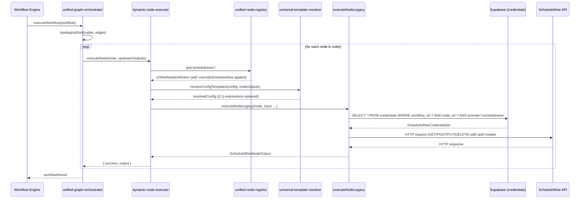
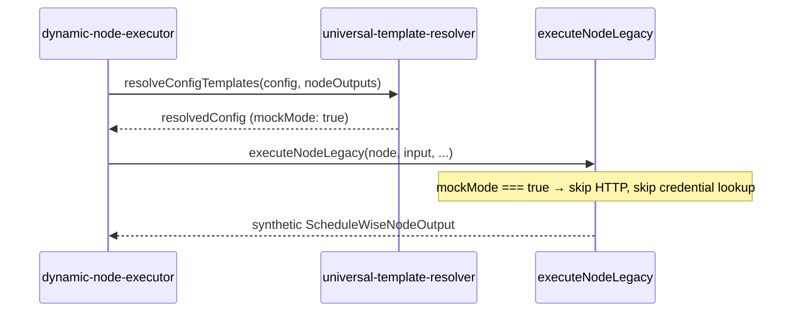
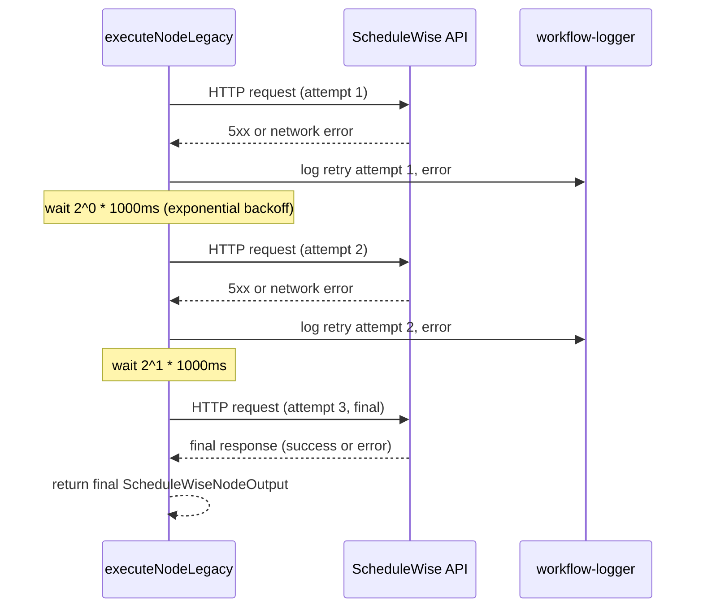

# Design Document: ScheduleWise Node Integration

## Overview

This document describes the technical design for integrating a ScheduleWise node into CtrlChecks. The node connects to the ScheduleWise REST API (`https://api.schedulewise.com/v1/`) and supports four operations: `getSchedules`, `createAppointment`, `updateAppointment`, and `deleteAppointment`.

The integration follows the CtrlChecks single-source-of-truth architecture:
- Schema defined in `node-library.ts` → auto-registered in `unified-node-registry.ts`
- Execution logic in `execute-workflow.ts` as a `case 'schedulewise':` block
- Override in `worker/src/core/registry/overrides/schedulewise.ts` for tags and delegation
- React settings panel in `ctrl_checks/src/components/workflow/ScheduleWiseSettings.tsx`
- PropertiesPanel updated to render the settings panel for `type === 'schedulewise'`

No hardcoded `if (node.type === 'schedulewise')` logic exists outside the registry and override files.

---

## Architecture

### System Flow

```mermaid
flowchart TD
    A[Workflow Canvas] -->|user selects node| B[PropertiesPanel]
    B -->|type === 'schedulewise'| C[ScheduleWiseSettings.tsx]
    C -->|onConfigChange| D[workflowStore.updateNodeConfig]
    D -->|persists to| E[workflow JSON\nnode.data.config]

    E -->|workflow execution| F[unified-graph-orchestrator]
    F -->|topological order| G[dynamic-node-executor]
    G -->|registry lookup| H[unified-node-registry]
    H -->|overrideScheduleWise| I[schedulewise override]
    I -->|executeViaLegacyExecutor| J[universal-template-resolver\nresolves {{ }} expressions]
    J -->|resolved config| K[executeNodeLegacy\ncase 'schedulewise']
    K -->|credential lookup| L[Supabase credentials store]
    K -->|HTTP request| M[ScheduleWise REST API]
    M -->|response| N[structured output\n{ success, operation, data, executionTimeMs }]
    N -->|downstream nodes| O[{{$json.*}} template access]
```

### Key Architectural Constraints

1. `unified-node-registry.ts` is the single source of truth — all metadata (input schema, output schema, tags, credential requirements) flows from the schema defined in `node-library.ts`.
2. All edges are managed exclusively by `unified-graph-orchestrator`. The ScheduleWise node is a standard non-branching node (in-degree 1, out-degree 1) and requires no special edge handling.
3. Template resolution (`{{ }}` expressions) happens in `universal-template-resolver` before the executor receives the config — the executor always receives resolved values.
4. Credential secrets are never stored in `node.data.config`; only a `credentialId` reference is stored.

---

## Components and Interfaces

### Backend Components

| Component | File | Role |
|-----------|------|------|
| Schema definition | `worker/src/services/nodes/node-library.ts` | Defines `createScheduleWiseNodeSchema()`, registered in `initializeSchemas()` |
| Executor | `worker/src/api/execute-workflow.ts` | `case 'schedulewise':` block in `executeNodeLegacy()` |
| Override | `worker/src/core/registry/overrides/schedulewise.ts` | Sets tags, delegates to `executeViaLegacyExecutor` |
| Override registration | `worker/src/core/registry/unified-node-registry-overrides.ts` | Adds `schedulewise: overrideScheduleWise` to the override map |

### Frontend Components

| Component | File | Role |
|-----------|------|------|
| Settings panel | `ctrl_checks/src/components/workflow/ScheduleWiseSettings.tsx` | React form with operation-driven field visibility, credential selector, expression autocomplete, advanced section |
| PropertiesPanel integration | `ctrl_checks/src/components/workflow/PropertiesPanel.tsx` | Adds `selectedNode.data.type === 'schedulewise'` branch to render `ScheduleWiseSettings` |
| Mock badge | `ctrl_checks/src/components/workflow/WorkflowNode.tsx` | Renders a "Mock" badge when `data.config.mockMode === true` |

---

## Data Models

### TypeScript Interface: `ScheduleWiseNodeParams`

Exported from the executor file for compile-time safety:

```typescript
export interface ScheduleWiseNodeParams {
  // Required
  operation: 'getSchedules' | 'createAppointment' | 'updateAppointment' | 'deleteAppointment';

  // Credential reference (never the secret itself)
  credentialId?: string;

  // getSchedules fields
  dateFrom?: string;        // ISO 8601 date string, e.g. "2024-01-01"
  dateTo?: string;          // ISO 8601 date string
  patientId?: string;       // Supports {{ }} expressions
  staffId?: string;         // Supports {{ }} expressions
  limit?: number;           // Max results to return

  // createAppointment fields
  startDateTime?: string;   // ISO 8601 datetime, supports {{ }} expressions
  endDateTime?: string;     // ISO 8601 datetime, supports {{ }} expressions
  serviceType?: string;
  notes?: string;

  // updateAppointment fields
  appointmentId?: string;   // Supports {{ }} expressions
  status?: string;          // e.g. "confirmed", "cancelled"

  // deleteAppointment fields
  hardDelete?: boolean;     // Append ?hardDelete=true to DELETE request

  // Advanced / shared
  timeoutSec?: number;      // Default: 30
  retries?: number;         // Default: 0; retry on 5xx/network error
  outputFormat?: 'json' | 'raw';
  mockMode?: boolean;       // Return synthetic data, skip HTTP call
}
```

### Output Type: `ScheduleWiseNodeOutput`

```typescript
export interface ScheduleWiseNodeOutput {
  success: boolean;
  operation: string;
  data?: Record<string, unknown>;       // Present on success
  executionTimeMs: number;              // Always present
  error?: {
    code: string;                       // e.g. 'TIMEOUT', 'NO_CREDENTIALS', 'INVALID_OPERATION', 'PARSE_ERROR'
    message: string;
    httpStatus: number;
  };
}
```

### Credential Set Shape

Stored in the Supabase `credentials` table, never in `node.data.config`:

```typescript
interface ScheduleWiseCredentialSet {
  workflow_id: string;
  node_id: string;
  provider: 'schedulewise';
  api_key?: string;         // Used as X-Api-Key header
  access_token?: string;    // Preferred; used as Authorization: Bearer header
  api_url?: string;         // Defaults to 'https://api.schedulewise.com/v1'
}
```

### Workflow JSON Node Shape

```json
{
  "id": "node_schedulewise_1",
  "type": "schedulewise",
  "data": {
    "type": "schedulewise",
    "label": "ScheduleWise",
    "category": "integration",
    "icon": "Calendar",
    "config": {
      "operation": "getSchedules",
      "credentialId": "cred_abc123",
      "dateFrom": "{{$json.startDate}}",
      "dateTo": "{{$json.endDate}}",
      "limit": 50,
      "mockMode": false
    }
  }
}
```

---

## Sequence Diagrams

### Execution Flow (Live Mode)



### Mock Mode Flow



### Retry Flow



---

## File Structure

### Files to Create

```
worker/src/core/registry/overrides/schedulewise.ts
ctrl_checks/src/components/workflow/ScheduleWiseSettings.tsx
```

### Files to Modify

```
worker/src/services/nodes/node-library.ts
  → Add createScheduleWiseNodeSchema() private method
  → Call this.addSchema(this.createScheduleWiseNodeSchema()) in initializeSchemas()

worker/src/api/execute-workflow.ts
  → Add case 'schedulewise': block in executeNodeLegacy()
  → Export ScheduleWiseNodeParams and ScheduleWiseNodeOutput interfaces

worker/src/core/registry/unified-node-registry-overrides.ts
  → Import overrideScheduleWise from './overrides/schedulewise'
  → Add schedulewise: overrideScheduleWise to overridesByType map

ctrl_checks/src/components/workflow/PropertiesPanel.tsx
  → Import ScheduleWiseSettings
  → Add selectedNode.data.type === 'schedulewise' branch in the settings rendering section

ctrl_checks/src/components/workflow/WorkflowNode.tsx
  → Add Mock badge rendering when data.config?.mockMode === true
```

---

## Integration Points

### unified-graph-orchestrator

The ScheduleWise node is a standard non-branching action node. No special orchestrator configuration is needed:
- `isBranching: false` (default)
- `outgoingPorts: ['output']` (default single port)
- The orchestrator wires it into the DAG automatically based on its position in the node list

The override does **not** set `outgoingPorts` or `isBranching`, so the orchestrator treats it as a normal linear node.

### universal-template-resolver

Template resolution is automatic for all nodes via `executeViaLegacyExecutor`. The following ScheduleWise fields commonly contain `{{ }}` expressions and will be resolved before the executor receives them:

- `patientId`, `staffId`, `appointmentId`
- `startDateTime`, `endDateTime`
- `dateFrom`, `dateTo`
- `notes`, `status`, `serviceType`

The executor always receives resolved string/number values — it never needs to call the template resolver itself.

### execute-workflow.ts

The `case 'schedulewise':` block follows the credential-based execution pattern used by Stripe, HubSpot, and other integration nodes:

```typescript
case 'schedulewise': {
  const startTime = Date.now();
  const params = config as ScheduleWiseNodeParams;

  // 1. Validate operation
  const validOps = ['getSchedules', 'createAppointment', 'updateAppointment', 'deleteAppointment'];
  if (!params.operation || !validOps.includes(params.operation)) {
    return {
      success: false,
      operation: params.operation || 'unknown',
      executionTimeMs: Date.now() - startTime,
      error: { code: 'INVALID_OPERATION', message: 'Unknown operation', httpStatus: 400 },
    };
  }

  // 2. Mock mode short-circuit
  if (params.mockMode) {
    return buildScheduleWiseMockResponse(params, startTime);
  }

  // 3. Credential lookup
  const { data: credential } = await supabase
    .from('credentials')
    .select('*')
    .eq('workflow_id', workflowId)
    .eq('node_id', node.id)
    .eq('provider', 'schedulewise')
    .single();

  if (!credential) {
    return {
      success: false,
      operation: params.operation,
      executionTimeMs: Date.now() - startTime,
      error: { code: 'NO_CREDENTIALS', message: 'ScheduleWise credentials not configured', httpStatus: 401 },
    };
  }

  // 4. Build and execute HTTP request with retry logic
  return await executeScheduleWiseRequest(params, credential, node.id, startTime);
}
```

The helper functions `buildScheduleWiseMockResponse` and `executeScheduleWiseRequest` are defined as module-level functions in `execute-workflow.ts` (or extracted to `worker/src/shared/schedulewise-executor.ts` if the file grows too large).

---

## Correctness Properties

*A property is a characteristic or behavior that should hold true across all valid executions of a system — essentially, a formal statement about what the system should do. Properties serve as the bridge between human-readable specifications and machine-verifiable correctness guarantees.*

### Property 1: Optional config fields are all present in schema

*For any* field name in the set `{credentialId, dateFrom, dateTo, patientId, staffId, appointmentId, startDateTime, endDateTime, serviceType, notes, status, limit, hardDelete, timeoutSec, retries, outputFormat, mockMode}`, that field SHALL exist as a key in `schema.configSchema.optional`.

**Validates: Requirements 1.4**

---

### Property 2: Operation validation rejects all non-valid operation strings

*For any* string value that is not one of `{getSchedules, createAppointment, updateAppointment, deleteAppointment}` (including empty string, null, undefined, and arbitrary random strings), the executor SHALL return `{ success: false, error: { code: 'INVALID_OPERATION' } }` without making any HTTP call.

**Validates: Requirements 2.13**

---

### Property 3: HTTP method and URL correctness per operation

*For any* valid config with a given operation, the executor SHALL send the correct HTTP method to the correct URL path:
- `getSchedules` → `GET {apiUrl}/appointments`
- `createAppointment` → `POST {apiUrl}/appointments`
- `updateAppointment` → `PUT {apiUrl}/appointments/{appointmentId}`
- `deleteAppointment` → `DELETE {apiUrl}/appointments/{appointmentId}`

**Validates: Requirements 2.1, 2.2, 2.3, 2.4**

---

### Property 4: Auth header selection from credential

*For any* credential set, the executor SHALL set the auth header as follows:
- If `access_token` is present → `Authorization: Bearer {access_token}` (even if `api_key` is also present)
- If only `api_key` is present → `X-Api-Key: {api_key}`

**Validates: Requirements 2.5, 4.2, 4.3**

---

### Property 5: 2xx responses produce success output with required fields

*For any* HTTP 2xx response from the ScheduleWise API, the executor SHALL return an output object containing `{ success: true, operation, data, executionTimeMs }` where `executionTimeMs` is a non-negative number.

**Validates: Requirements 2.6, 2.11, 7.5**

---

### Property 6: Non-2xx responses produce structured error output

*For any* HTTP non-2xx response (4xx or 5xx), the executor SHALL return `{ success: false, operation, error: { code, message, httpStatus }, executionTimeMs }` where `error.httpStatus` matches the HTTP response status code and `executionTimeMs` is a non-negative number.

**Validates: Requirements 2.7, 2.11, 7.1, 7.5**

---

### Property 7: Retry count matches configuration

*For any* `retries` value N > 0 and any 5xx or network error response, the executor SHALL make exactly N+1 total HTTP attempts (1 initial + N retries) before returning the final error.

**Validates: Requirements 2.9**

---

### Property 8: Mock mode returns schema-conformant output without HTTP calls

*For any* operation with `mockMode: true`, the executor SHALL:
1. Make zero HTTP calls to the ScheduleWise API
2. Return an output object with the same top-level fields as a live response (`success`, `operation`, `data`, `executionTimeMs`)

**Validates: Requirements 2.10, 8.1, 8.2, 8.3, 8.4, 8.5**

---

### Property 9: Template expressions are resolved before executor receives config

*For any* config field containing a `{{ }}` expression (e.g., `{{$json.patientId}}`), the value received by the executor's `case 'schedulewise':` block SHALL be the resolved value (a plain string or number), not the template string.

**Validates: Requirements 3.6**

---

### Property 10: Credential secrets are never stored in node.data.config

*For any* saved workflow node of type `schedulewise`, the `data.config` object SHALL NOT contain the keys `api_key`, `access_token`, or `apiKey` — only `credentialId` (a reference) is permitted.

**Validates: Requirements 6.3**

---

### Property 11: Operation-specific fields are rendered exclusively per operation

*For any* operation value selected in the settings panel, only the fields defined for that operation SHALL be visible, and fields belonging to other operations SHALL NOT be rendered.

**Validates: Requirements 5.2, 5.3, 5.4, 5.5**

---

### Property 12: Mock badge visibility matches mockMode config

*For any* ScheduleWise node in the workflow canvas, the "Mock" badge SHALL be visible if and only if `data.config.mockMode === true`.

**Validates: Requirements 5.10**

---

### Property 13: apiUrl from credential is used as base URL

*For any* credential set containing an `api_url` field, all HTTP requests SHALL use that value as the base URL prefix. When `api_url` is absent, the default `https://api.schedulewise.com/v1` SHALL be used.

**Validates: Requirements 4.4, 4.5**

---

### Property 14: AI selection keywords are all present in schema

*For any* keyword in the set `{schedulewise, appointment, schedule, booking, patient, calendar}`, that keyword SHALL appear in `schema.aiSelectionCriteria.keywords`.

**Validates: Requirements 1.7**

---

## Error Handling

### Error Code Reference

| Code | Trigger | httpStatus |
|------|---------|-----------|
| `INVALID_OPERATION` | `operation` is missing or not one of the four valid values | 400 |
| `NO_CREDENTIALS` | Credential set not found in Supabase for this node | 401 |
| `TIMEOUT` | HTTP request exceeds `timeoutSec` (default 30s) | 408 |
| `PARSE_ERROR` | API response body is not valid JSON | 502 |
| `HTTP_ERROR` | API returned a non-2xx status | actual HTTP status |
| `NETWORK_ERROR` | Network-level failure (DNS, connection refused) | 503 |

### Error Response Shape

All errors follow the same shape so downstream nodes can handle them uniformly:

```typescript
{
  success: false,
  operation: string,
  executionTimeMs: number,   // always present, even on error
  error: {
    code: string,
    message: string,
    httpStatus: number,
  }
}
```

### Retry Strategy

Retries apply only to 5xx responses and network errors (not 4xx). Backoff formula: `delay = 2^(attempt - 1) * 1000ms`. With `retries: 3`, the delays are 1s, 2s, 4s before the final attempt.

Each retry attempt is logged via `workflow-logger` with `{ nodeId, attempt, error }`.

---

## Testing Strategy

### Unit Tests

Unit tests cover specific examples and edge cases:

- Schema structure: `getSchema('schedulewise')` returns correct type, category, providers, required fields
- Registry registration: `unifiedNodeRegistry.has('schedulewise')` returns true
- Override tags: registry definition has `['integration', 'scheduling', 'healthcare', 'api']`
- Credential preference: when both `api_key` and `access_token` are present, `Authorization: Bearer` is used
- Default API URL: when `api_url` is absent from credential, default URL is used
- `NO_CREDENTIALS` error: executor returns correct error when credential lookup returns null
- `PARSE_ERROR`: executor returns correct error when API returns non-JSON body
- `TIMEOUT`: executor returns correct error when request exceeds `timeoutSec`
- Settings panel: credential selector renders first, operation dropdown has four options, Advanced section contains all four fields

### Property-Based Tests

Property-based tests use a PBT library (e.g., [fast-check](https://github.com/dubzzz/fast-check) for TypeScript) with a minimum of 100 iterations per property.

Each test is tagged with: `Feature: schedulewise-node-integration, Property {N}: {property_text}`

**Property tests to implement:**

- **Property 1** — Generate random field names from the required set, assert each exists in `schema.configSchema.optional`
- **Property 2** — Generate arbitrary strings (including empty, whitespace, random), assert all non-valid operation strings return `INVALID_OPERATION`
- **Property 3** — Generate random valid configs per operation, mock `fetch`, assert correct HTTP method and URL path
- **Property 4** — Generate random credential objects with varying presence of `api_key`/`access_token`, assert correct auth header
- **Property 5** — Generate random 2xx status codes (200–299) and response bodies, assert output shape
- **Property 6** — Generate random non-2xx status codes (400–599), assert error shape and `httpStatus` match
- **Property 7** — Generate random `retries` values (1–5) with always-failing mock, assert call count = retries + 1
- **Property 8** — Generate random operation configs with `mockMode: true`, assert zero HTTP calls and correct output shape
- **Property 9** — Generate random template strings in config fields, assert executor receives resolved values
- **Property 10** — Generate random node configs, assert `api_key`/`access_token` never appear in `data.config`
- **Property 11** — Generate random operation values, render `ScheduleWiseSettings`, assert only correct fields are visible
- **Property 12** — Generate random `mockMode` boolean values, render `WorkflowNode`, assert badge visibility matches
- **Property 13** — Generate random `api_url` values in credential, assert HTTP calls use that URL as base
- **Property 14** — Generate random keyword from required set, assert it exists in `aiSelectionCriteria.keywords`

### Integration Tests

Integration tests verify end-to-end behavior with a real (or staging) ScheduleWise API:

- Full workflow execution with a ScheduleWise node returns correct output accessible via `{{$json.*}}`
- Downstream node receives resolved ScheduleWise output via template expressions
- Credential lookup works correctly with a real Supabase credentials row
