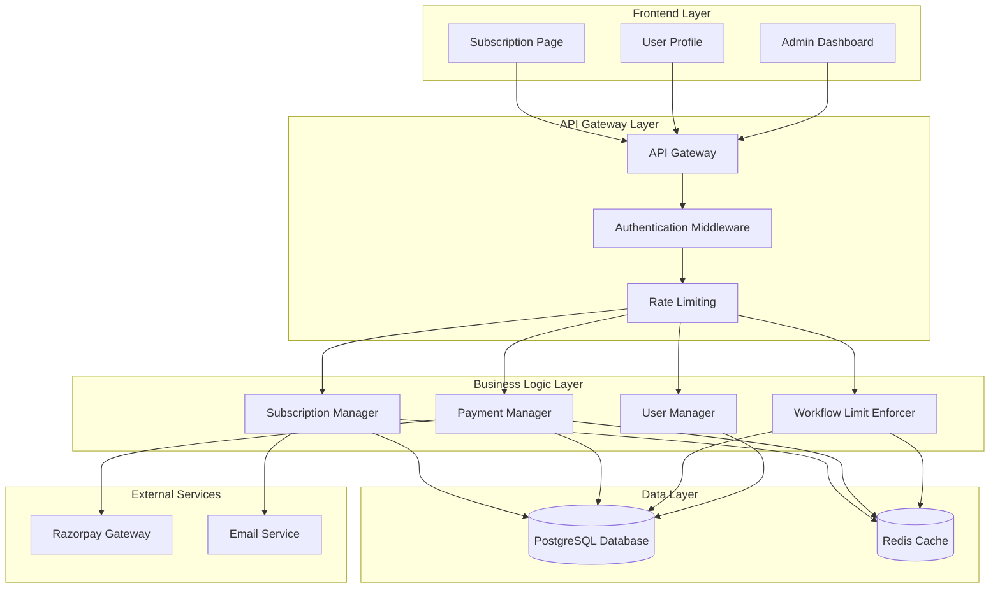
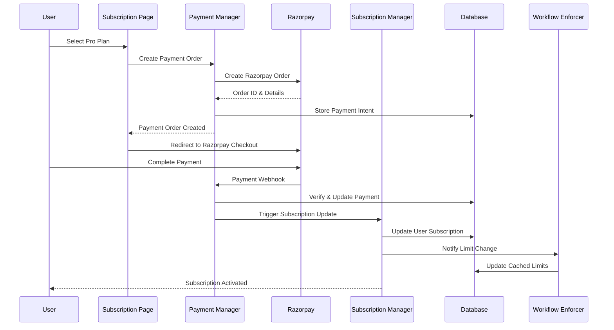
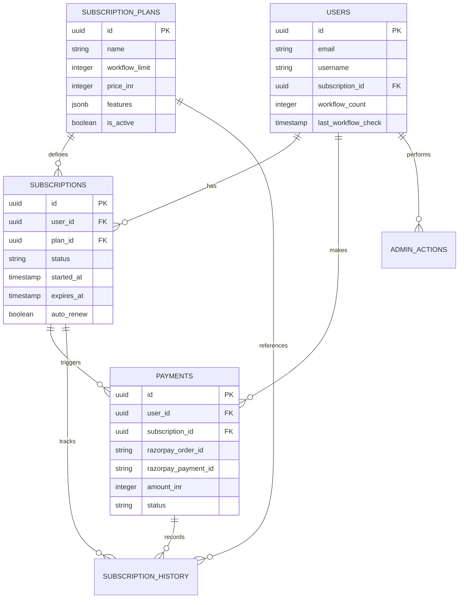
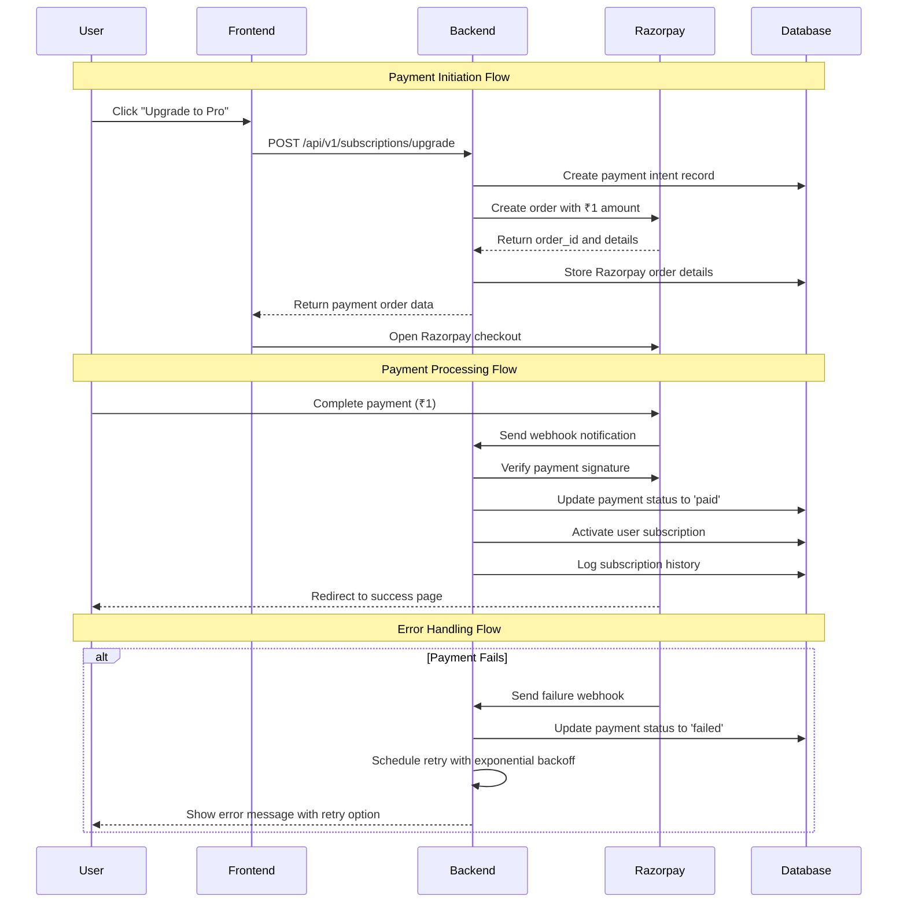
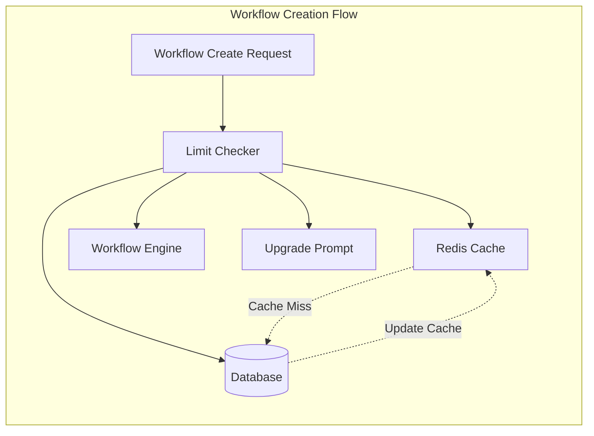

# Design Document: Subscription Management System

## Overview

The Subscription Management System is a comprehensive solution for managing user subscriptions in a workflow automation platform. The system provides a three-tier subscription model (Free, Pro, Enterprise) with integrated payment processing through Razorpay, real-time subscription status tracking, and workflow limit enforcement.

### Key Design Principles

- **Separation of Concerns**: Clear boundaries between payment processing, subscription management, and workflow enforcement
- **Security First**: All payment data handled securely with proper encryption and validation
- **Scalability**: Database schema and API design support high-volume operations
- **Reliability**: Robust error handling and retry mechanisms for payment processing
- **Auditability**: Comprehensive logging and history tracking for all subscription operations

### System Boundaries

The system encompasses:
- Subscription plan management and display
- Razorpay payment gateway integration
- User profile subscription status integration
- Workflow limit enforcement engine
- Administrative dashboard for user management
- REST API services for all subscription operations

External dependencies:
- Razorpay payment gateway for payment processing
- Existing user authentication system
- Existing workflow management system

## Architecture

### High-Level Architecture



### Component Architecture

#### 1. Subscription Manager
- **Responsibility**: Core subscription lifecycle management
- **Key Functions**:
  - Plan transitions and upgrades/downgrades
  - Subscription status tracking
  - Expiration handling and auto-renewals
  - Subscription history maintenance

#### 2. Payment Manager
- **Responsibility**: Payment processing and transaction management
- **Key Functions**:
  - Razorpay integration and order creation
  - Payment verification and callback handling
  - Transaction logging and reconciliation
  - Retry logic for failed payments

#### 3. Workflow Limit Enforcer
- **Responsibility**: Enforcing subscription-based workflow limits
- **Key Functions**:
  - Real-time limit checking
  - Workflow count tracking
  - Limit enforcement with upgrade prompts
  - Cache-based performance optimization

#### 4. User Manager
- **Responsibility**: User subscription data management
- **Key Functions**:
  - User subscription status queries
  - Profile integration data
  - Admin user management operations
  - Bulk subscription operations

### Data Flow Architecture



## Components and Interfaces

### 1. Frontend Components

#### Subscription Page Component
```typescript
interface SubscriptionPageProps {
  currentUser: User;
  currentPlan: SubscriptionPlan;
}

interface SubscriptionPlan {
  id: string;
  name: 'Free' | 'Pro' | 'Enterprise';
  workflowLimit: number;
  price: number;
  features: string[];
  isActive: boolean;
}
```

#### User Profile Integration
```typescript
interface UserProfileSubscriptionData {
  planName: string;
  workflowsUsed: number;
  workflowLimit: number;
  subscriptionStatus: 'active' | 'expired' | 'cancelled';
  nextBillingDate?: Date;
  subscriptionPageUrl: string;
}
```

#### Admin Dashboard Component
```typescript
interface AdminDashboardProps {
  users: UserSubscriptionSummary[];
  analytics: SubscriptionAnalytics;
}

interface UserSubscriptionSummary {
  userId: string;
  username: string;
  email: string;
  currentPlan: string;
  subscriptionStart: Date;
  subscriptionEnd?: Date;
  workflowsUsed: number;
  totalRevenue: number;
}
```

### 2. Backend Service Interfaces

#### Subscription Service
```typescript
interface ISubscriptionService {
  getAvailablePlans(): Promise<SubscriptionPlan[]>;
  getUserSubscription(userId: string): Promise<UserSubscription>;
  upgradeSubscription(userId: string, planId: string): Promise<SubscriptionResult>;
  downgradeSubscription(userId: string, planId: string): Promise<SubscriptionResult>;
  cancelSubscription(userId: string): Promise<SubscriptionResult>;
  handleExpiration(userId: string): Promise<void>;
}
```

#### Payment Service
```typescript
interface IPaymentService {
  createPaymentOrder(userId: string, planId: string): Promise<PaymentOrder>;
  verifyPayment(paymentId: string, signature: string): Promise<PaymentVerification>;
  handleWebhook(webhookData: RazorpayWebhook): Promise<void>;
  retryFailedPayment(paymentId: string): Promise<PaymentResult>;
}
```

#### Workflow Limit Service
```typescript
interface IWorkflowLimitService {
  checkLimit(userId: string): Promise<LimitCheckResult>;
  enforceLimit(userId: string): Promise<EnforcementResult>;
  updateLimits(userId: string, newPlan: SubscriptionPlan): Promise<void>;
  getUsageStats(userId: string): Promise<UsageStats>;
}
```

### 3. External Service Interfaces

#### Razorpay Integration
```typescript
interface RazorpayOrder {
  id: string;
  amount: number;
  currency: string;
  receipt: string;
  status: 'created' | 'attempted' | 'paid';
}

interface RazorpayWebhook {
  event: string;
  payload: {
    payment: {
      entity: PaymentEntity;
    };
    order: {
      entity: OrderEntity;
    };
  };
}
```

## Data Models

### Database Schema

#### Users Table (Existing - Extended)
```sql
-- Extending existing users table
ALTER TABLE users ADD COLUMN IF NOT EXISTS subscription_id UUID REFERENCES subscriptions(id);
ALTER TABLE users ADD COLUMN IF NOT EXISTS workflow_count INTEGER DEFAULT 0;
ALTER TABLE users ADD COLUMN IF NOT EXISTS last_workflow_check TIMESTAMP DEFAULT NOW();
```

#### Subscription Plans Table
```sql
CREATE TABLE subscription_plans (
    id UUID PRIMARY KEY DEFAULT gen_random_uuid(),
    name VARCHAR(50) NOT NULL UNIQUE, -- 'Free', 'Pro', 'Enterprise'
    workflow_limit INTEGER NOT NULL,
    price_inr INTEGER NOT NULL, -- Price in paise (₹1 = 100 paise)
    features JSONB NOT NULL DEFAULT '[]',
    is_active BOOLEAN DEFAULT true,
    created_at TIMESTAMP DEFAULT NOW(),
    updated_at TIMESTAMP DEFAULT NOW()
);

-- Insert default plans
INSERT INTO subscription_plans (name, workflow_limit, price_inr, features) VALUES
('Free', 2, 0, '["Basic workflow creation", "Community support"]'),
('Pro', 20, 100, '["Advanced workflows", "Priority support", "Analytics"]'), -- ₹1 for testing
('Enterprise', 999, 100, '["Unlimited workflows", "Dedicated support", "Custom integrations"]'); -- ₹1 for testing
```

#### Subscriptions Table
```sql
CREATE TABLE subscriptions (
    id UUID PRIMARY KEY DEFAULT gen_random_uuid(),
    user_id UUID NOT NULL REFERENCES users(id) ON DELETE CASCADE,
    plan_id UUID NOT NULL REFERENCES subscription_plans(id),
    status VARCHAR(20) NOT NULL DEFAULT 'active', -- 'active', 'expired', 'cancelled', 'pending'
    started_at TIMESTAMP NOT NULL DEFAULT NOW(),
    expires_at TIMESTAMP,
    cancelled_at TIMESTAMP,
    auto_renew BOOLEAN DEFAULT true,
    created_at TIMESTAMP DEFAULT NOW(),
    updated_at TIMESTAMP DEFAULT NOW(),
    
    CONSTRAINT valid_status CHECK (status IN ('active', 'expired', 'cancelled', 'pending')),
    CONSTRAINT valid_dates CHECK (expires_at IS NULL OR expires_at > started_at)
);

CREATE INDEX idx_subscriptions_user_id ON subscriptions(user_id);
CREATE INDEX idx_subscriptions_status ON subscriptions(status);
CREATE INDEX idx_subscriptions_expires_at ON subscriptions(expires_at);
```

#### Payments Table
```sql
CREATE TABLE payments (
    id UUID PRIMARY KEY DEFAULT gen_random_uuid(),
    user_id UUID NOT NULL REFERENCES users(id),
    subscription_id UUID REFERENCES subscriptions(id),
    razorpay_order_id VARCHAR(100) NOT NULL,
    razorpay_payment_id VARCHAR(100),
    razorpay_signature VARCHAR(500),
    amount_inr INTEGER NOT NULL, -- Amount in paise
    currency VARCHAR(3) DEFAULT 'INR',
    status VARCHAR(20) NOT NULL DEFAULT 'created', -- 'created', 'attempted', 'paid', 'failed', 'refunded'
    payment_method VARCHAR(50),
    failure_reason TEXT,
    webhook_received_at TIMESTAMP,
    verified_at TIMESTAMP,
    created_at TIMESTAMP DEFAULT NOW(),
    updated_at TIMESTAMP DEFAULT NOW(),
    
    CONSTRAINT valid_payment_status CHECK (status IN ('created', 'attempted', 'paid', 'failed', 'refunded'))
);

CREATE INDEX idx_payments_user_id ON payments(user_id);
CREATE INDEX idx_payments_razorpay_order_id ON payments(razorpay_order_id);
CREATE INDEX idx_payments_status ON payments(status);
```

#### Subscription History Table
```sql
CREATE TABLE subscription_history (
    id UUID PRIMARY KEY DEFAULT gen_random_uuid(),
    user_id UUID NOT NULL REFERENCES users(id),
    subscription_id UUID NOT NULL REFERENCES subscriptions(id),
    action VARCHAR(50) NOT NULL, -- 'created', 'upgraded', 'downgraded', 'cancelled', 'expired', 'renewed'
    from_plan_id UUID REFERENCES subscription_plans(id),
    to_plan_id UUID REFERENCES subscription_plans(id),
    payment_id UUID REFERENCES payments(id),
    admin_user_id UUID REFERENCES users(id), -- For admin actions
    notes TEXT,
    created_at TIMESTAMP DEFAULT NOW()
);

CREATE INDEX idx_subscription_history_user_id ON subscription_history(user_id);
CREATE INDEX idx_subscription_history_subscription_id ON subscription_history(subscription_id);
CREATE INDEX idx_subscription_history_action ON subscription_history(action);
```

#### Admin Actions Log Table
```sql
CREATE TABLE admin_actions (
    id UUID PRIMARY KEY DEFAULT gen_random_uuid(),
    admin_user_id UUID NOT NULL REFERENCES users(id),
    target_user_id UUID REFERENCES users(id),
    action VARCHAR(100) NOT NULL,
    details JSONB,
    ip_address INET,
    user_agent TEXT,
    created_at TIMESTAMP DEFAULT NOW()
);

CREATE INDEX idx_admin_actions_admin_user_id ON admin_actions(admin_user_id);
CREATE INDEX idx_admin_actions_target_user_id ON admin_actions(target_user_id);
CREATE INDEX idx_admin_actions_created_at ON admin_actions(created_at);
```

### Data Relationships



## API Design

### REST API Endpoints

#### Subscription Management Endpoints

```typescript
// Get available subscription plans
GET /api/v1/subscriptions/plans
Response: {
  plans: SubscriptionPlan[];
}

// Get current user subscription
GET /api/v1/subscriptions/current
Headers: Authorization: Bearer <token>
Response: {
  subscription: UserSubscription;
  usage: UsageStats;
}

// Create payment order for plan upgrade
POST /api/v1/subscriptions/upgrade
Headers: Authorization: Bearer <token>
Body: {
  planId: string;
}
Response: {
  paymentOrder: PaymentOrder;
  redirectUrl: string;
}

// Verify payment and activate subscription
POST /api/v1/subscriptions/verify-payment
Headers: Authorization: Bearer <token>
Body: {
  razorpayPaymentId: string;
  razorpayOrderId: string;
  razorpaySignature: string;
}
Response: {
  success: boolean;
  subscription: UserSubscription;
}

// Cancel subscription
POST /api/v1/subscriptions/cancel
Headers: Authorization: Bearer <token>
Response: {
  success: boolean;
  subscription: UserSubscription;
}
```

#### Workflow Limit Endpoints

```typescript
// Check workflow creation limit
GET /api/v1/workflows/limit-check
Headers: Authorization: Bearer <token>
Response: {
  canCreate: boolean;
  currentCount: number;
  limit: number;
  upgradeRequired: boolean;
}

// Enforce limit during workflow creation
POST /api/v1/workflows/create
Headers: Authorization: Bearer <token>
Body: {
  workflowData: WorkflowDefinition;
}
Response: {
  success: boolean;
  workflowId?: string;
  limitExceeded?: boolean;
  upgradePrompt?: UpgradePrompt;
}
```

#### Admin Management Endpoints

```typescript
// Get all users with subscription details
GET /api/v1/admin/users
Headers: Authorization: Bearer <admin-token>
Query: {
  page?: number;
  limit?: number;
  search?: string;
  planFilter?: string;
  statusFilter?: string;
}
Response: {
  users: UserSubscriptionSummary[];
  pagination: PaginationInfo;
  analytics: SubscriptionAnalytics;
}

// Manually update user subscription
PUT /api/v1/admin/users/:userId/subscription
Headers: Authorization: Bearer <admin-token>
Body: {
  planId: string;
  reason: string;
}
Response: {
  success: boolean;
  subscription: UserSubscription;
}

// Export subscription data
GET /api/v1/admin/export
Headers: Authorization: Bearer <admin-token>
Query: {
  format: 'csv' | 'json';
  dateRange?: string;
}
Response: File download or JSON data
```

#### Payment Webhook Endpoint

```typescript
// Razorpay webhook handler
POST /api/v1/payments/webhook
Headers: X-Razorpay-Signature: <signature>
Body: RazorpayWebhookPayload
Response: {
  success: boolean;
}
```

### API Security Design

#### Authentication Strategy
- **JWT Bearer Tokens**: For user authentication
- **Role-Based Access Control**: Admin endpoints require admin role
- **API Rate Limiting**: Prevent abuse and ensure fair usage
- **Request Validation**: All inputs validated against schemas

#### Security Headers
```typescript
const securityHeaders = {
  'Content-Security-Policy': "default-src 'self'",
  'X-Frame-Options': 'DENY',
  'X-Content-Type-Options': 'nosniff',
  'Referrer-Policy': 'strict-origin-when-cross-origin',
  'Permissions-Policy': 'payment=self'
};
```

## Payment Flow Architecture

### Razorpay Integration Design



### Payment Security Implementation

#### Signature Verification
```typescript
const verifyRazorpaySignature = (
  orderId: string,
  paymentId: string,
  signature: string,
  secret: string
): boolean => {
  const body = orderId + "|" + paymentId;
  const expectedSignature = crypto
    .createHmac('sha256', secret)
    .update(body.toString())
    .digest('hex');
  
  return expectedSignature === signature;
};
```

#### Webhook Security
```typescript
const verifyWebhookSignature = (
  payload: string,
  signature: string,
  secret: string
): boolean => {
  const expectedSignature = crypto
    .createHmac('sha256', secret)
    .update(payload)
    .digest('hex');
  
  return `sha256=${expectedSignature}` === signature;
};
```

### Development vs Production Configuration

```typescript
interface PaymentConfig {
  razorpayKeyId: string;
  razorpayKeySecret: string;
  webhookSecret: string;
  isDevelopment: boolean;
  testAmount: number; // ₹1 in paise = 100
}

const getPaymentAmount = (planPrice: number, isDevelopment: boolean): number => {
  return isDevelopment ? 100 : planPrice; // ₹1 for testing, actual price for production
};
```

## Security Design

### Authentication and Authorization

#### JWT Token Structure
```typescript
interface JWTPayload {
  userId: string;
  email: string;
  role: 'user' | 'admin';
  subscriptionPlan: string;
  workflowLimit: number;
  iat: number;
  exp: number;
}
```

#### Role-Based Access Control
```typescript
const permissions = {
  user: [
    'subscription:read',
    'subscription:upgrade',
    'subscription:cancel',
    'workflow:create',
    'workflow:read'
  ],
  admin: [
    'admin:users:read',
    'admin:users:update',
    'admin:subscriptions:manage',
    'admin:analytics:read',
    'admin:export:data'
  ]
};
```

### Data Protection

#### Sensitive Data Handling
- **Payment Credentials**: Never stored locally, only Razorpay order IDs and payment IDs
- **Personal Information**: Encrypted at rest using AES-256
- **API Keys**: Stored in environment variables, rotated regularly
- **Database**: SSL connections required, connection pooling with encryption

#### Input Validation and Sanitization
```typescript
const subscriptionValidation = {
  planId: z.string().uuid(),
  userId: z.string().uuid(),
  amount: z.number().positive().max(999999), // Max ₹9999.99
  email: z.string().email().max(255),
  username: z.string().min(3).max(50).regex(/^[a-zA-Z0-9_-]+$/)
};
```

### Security Monitoring

#### Audit Logging
```typescript
interface SecurityEvent {
  eventType: 'auth_failure' | 'payment_fraud' | 'admin_action' | 'data_access';
  userId?: string;
  ipAddress: string;
  userAgent: string;
  details: Record<string, any>;
  severity: 'low' | 'medium' | 'high' | 'critical';
  timestamp: Date;
}
```

## Admin Interface Design

### Dashboard Overview

#### Key Metrics Display
```typescript
interface SubscriptionAnalytics {
  totalUsers: number;
  activeSubscriptions: number;
  monthlyRevenue: number;
  conversionRate: number;
  churnRate: number;
  planDistribution: {
    free: number;
    pro: number;
    enterprise: number;
  };
  revenueGrowth: {
    month: string;
    revenue: number;
  }[];
}
```

#### User Management Interface
```typescript
interface AdminUserManagement {
  searchUsers(query: string, filters: UserFilters): Promise<UserResult[]>;
  updateUserSubscription(userId: string, planId: string, reason: string): Promise<void>;
  bulkUpdateSubscriptions(userIds: string[], planId: string): Promise<BulkResult>;
  exportUserData(format: 'csv' | 'json', filters: ExportFilters): Promise<string>;
  viewUserHistory(userId: string): Promise<SubscriptionHistory[]>;
}
```

### Admin Operations

#### Subscription Management
- **Manual Upgrades/Downgrades**: Override user subscriptions with audit trail
- **Bulk Operations**: Update multiple users simultaneously
- **Refund Processing**: Handle refunds with subscription adjustments
- **Subscription Extensions**: Extend subscriptions for customer service

#### Analytics and Reporting
- **Revenue Analytics**: Monthly/yearly revenue tracking
- **User Growth Metrics**: Subscription conversion and churn analysis
- **Usage Statistics**: Workflow creation patterns by plan
- **Export Capabilities**: CSV/JSON export for external analysis

## Workflow Enforcement Design

### Limit Checking Architecture



### Real-Time Limit Enforcement

#### Cache-First Strategy
```typescript
class WorkflowLimitEnforcer {
  async checkLimit(userId: string): Promise<LimitCheckResult> {
    // 1. Check Redis cache first
    const cachedLimit = await this.redis.hgetall(`user:${userId}:limits`);
    
    if (cachedLimit.workflowCount !== undefined) {
      return this.evaluateLimit(cachedLimit);
    }
    
    // 2. Fallback to database
    const dbLimit = await this.database.getUserLimits(userId);
    
    // 3. Update cache
    await this.redis.hset(`user:${userId}:limits`, dbLimit);
    await this.redis.expire(`user:${userId}:limits`, 300); // 5 minutes
    
    return this.evaluateLimit(dbLimit);
  }
  
  async enforceLimit(userId: string): Promise<EnforcementResult> {
    const limitCheck = await this.checkLimit(userId);
    
    if (!limitCheck.canCreate) {
      return {
        allowed: false,
        reason: 'LIMIT_EXCEEDED',
        upgradePrompt: this.generateUpgradePrompt(limitCheck.currentPlan)
      };
    }
    
    // Increment workflow count atomically
    await this.incrementWorkflowCount(userId);
    
    return { allowed: true };
  }
}
```

#### Atomic Counter Updates
```typescript
const incrementWorkflowCount = async (userId: string): Promise<void> => {
  await this.database.transaction(async (trx) => {
    // Increment in database
    await trx('users')
      .where('id', userId)
      .increment('workflow_count', 1)
      .update('last_workflow_check', new Date());
    
    // Update cache
    await this.redis.hincrby(`user:${userId}:limits`, 'workflowCount', 1);
  });
};
```

### Performance Optimization

#### Caching Strategy
- **User Limits**: Cached for 5 minutes with automatic refresh
- **Plan Details**: Cached for 1 hour with manual invalidation
- **Subscription Status**: Cached for 10 minutes with webhook invalidation

#### Database Optimization
- **Indexed Queries**: All limit checks use indexed columns
- **Connection Pooling**: Optimized pool size for concurrent requests
- **Read Replicas**: Separate read/write operations for scalability

## Correctness Properties

*A property is a characteristic or behavior that should hold true across all valid executions of a system-essentially, a formal statement about what the system should do. Properties serve as the bridge between human-readable specifications and machine-verifiable correctness guarantees.*

### Property Reflection

After analyzing all acceptance criteria in the prework, I identified several properties that can be consolidated to eliminate redundancy:

**Consolidation Decisions:**
- Payment success and subscription update properties (2.3, 5.1) can be combined into a single atomic transaction property
- Workflow limit enforcement properties (4.1, 4.2, 4.3) can be combined into a comprehensive limit enforcement property
- Error handling properties (2.4, 11.1, 11.3) can be combined into a unified error handling property
- Admin operations properties (10.4, 10.7, 10.8) can be combined into a comprehensive admin action property

### Property 1: Payment Success Triggers Atomic Subscription Update

*For any* valid payment completion event, the system SHALL atomically update the user's subscription status and maintain transaction integrity such that either both the payment is recorded as successful and the subscription is activated, or neither operation occurs.

**Validates: Requirements 2.3, 5.1**

### Property 2: Workflow Limit Enforcement Consistency

*For any* user with a given subscription plan and current workflow count, the workflow limit enforcer SHALL consistently allow creation when under the limit, prevent creation when at or over the limit, and immediately apply new limits when subscription changes occur.

**Validates: Requirements 4.1, 4.2, 4.3, 4.4**

### Property 3: Workflow Count Accuracy

*For any* user account, the system SHALL count only active workflows toward subscription limits, ensuring that deleted, archived, or inactive workflows do not contribute to the limit calculation.

**Validates: Requirements 4.5**

### Property 4: Subscription State Transition Integrity

*For any* subscription state change (upgrade, downgrade, expiration, cancellation), the system SHALL maintain complete audit history, notify all relevant components, and ensure the transition follows valid state rules without data loss.

**Validates: Requirements 5.2, 5.3, 5.4, 5.5**

### Property 5: User Profile Capacity Calculation

*For any* user with a subscription plan and current workflow usage, the user profile SHALL correctly calculate and display remaining workflow capacity as (plan limit - active workflows), updating within the specified time bounds when subscription changes occur.

**Validates: Requirements 3.2, 3.5**

### Property 6: Payment Error Handling and Recovery

*For any* payment failure scenario, the system SHALL provide clear error messages, maintain the user's current subscription state unchanged, and implement proper retry mechanisms with exponential backoff for transient failures.

**Validates: Requirements 2.4, 11.1, 11.3**

### Property 7: API Authentication and Authorization Enforcement

*For any* API request to subscription endpoints, the system SHALL validate user authentication, enforce role-based access control, return appropriate HTTP status codes for different scenarios, and log all activities for audit purposes.

**Validates: Requirements 6.4, 6.5, 6.6**

### Property 8: Input Validation and Security

*For any* user input to the subscription system, the system SHALL validate all inputs to prevent injection attacks, ensure proper authentication for all operations, and handle malicious input scenarios gracefully without compromising system security.

**Validates: Requirements 9.2, 9.4**

### Property 9: Admin Dashboard Search and Filter Functionality

*For any* search query or filter criteria applied in the admin dashboard, the system SHALL return accurate results that match the specified criteria, maintain consistent ordering, and handle edge cases like empty results or invalid queries appropriately.

**Validates: Requirements 10.3**

### Property 10: Admin Subscription Management Operations

*For any* administrative action to modify user subscriptions, the system SHALL require proper admin authentication, execute the operation atomically, maintain complete audit logs, and ensure the changes are reflected across all system components.

**Validates: Requirements 10.4, 10.7, 10.8**

### Property 11: Subscription Analytics and Export Accuracy

*For any* subscription dataset, the admin dashboard SHALL calculate analytics metrics accurately, provide consistent export functionality across different formats, and ensure bulk operations maintain data integrity across all affected records.

**Validates: Requirements 10.5, 10.6, 10.10**

### Property 12: Configuration Mode Consistency

*For any* system configuration mode switch (development/production), the system SHALL validate configuration integrity, apply mode-specific settings consistently across all components, and ensure pricing and credential usage matches the selected mode.

**Validates: Requirements 8.5**

### Property 13: Error Logging and State Management

*For any* error condition in the subscription system, the system SHALL log all errors appropriately for debugging, maintain local state during network failures, provide graceful degradation when verification fails, and ensure system resilience.

**Validates: Requirements 11.2, 11.4, 11.5**

### Property 14: User Interface Error Display

*For any* error scenario encountered in the subscription interface, the system SHALL display user-friendly error messages that provide clear guidance without exposing sensitive system information.

**Validates: Requirements 7.5**

## Error Handling

### Error Categories and Strategies

#### 1. Payment Processing Errors
- **Network Timeouts**: Implement exponential backoff retry with maximum 3 attempts
- **Invalid Payment Data**: Validate all payment parameters before Razorpay API calls
- **Webhook Failures**: Queue webhook processing with dead letter queue for failed events
- **Signature Verification Failures**: Log security events and reject invalid webhooks

#### 2. Subscription Management Errors
- **Concurrent Modifications**: Use database transactions with optimistic locking
- **Invalid State Transitions**: Validate state changes against business rules
- **Expired Subscriptions**: Implement graceful degradation to Free plan
- **Data Consistency Issues**: Use database constraints and validation triggers

#### 3. Workflow Limit Enforcement Errors
- **Cache Failures**: Fallback to database queries with performance logging
- **Race Conditions**: Use atomic operations for workflow count updates
- **Limit Calculation Errors**: Implement validation checks and error recovery
- **Performance Degradation**: Circuit breaker pattern for external dependencies

#### 4. API and Authentication Errors
- **Invalid Tokens**: Return 401 with clear error messages
- **Insufficient Permissions**: Return 403 with role requirements
- **Rate Limiting**: Return 429 with retry-after headers
- **Malformed Requests**: Return 400 with validation error details

### Error Recovery Mechanisms

#### Automatic Recovery
```typescript
interface ErrorRecoveryStrategy {
  retryableErrors: string[];
  maxRetries: number;
  backoffStrategy: 'exponential' | 'linear' | 'fixed';
  fallbackAction?: () => Promise<void>;
}

const paymentErrorRecovery: ErrorRecoveryStrategy = {
  retryableErrors: ['NETWORK_ERROR', 'TIMEOUT', 'RATE_LIMITED'],
  maxRetries: 3,
  backoffStrategy: 'exponential',
  fallbackAction: async () => {
    await notifyAdminOfPaymentFailure();
    await scheduleManualReview();
  }
};
```

#### Circuit Breaker Implementation
```typescript
class SubscriptionCircuitBreaker {
  private failureCount = 0;
  private lastFailureTime = 0;
  private state: 'CLOSED' | 'OPEN' | 'HALF_OPEN' = 'CLOSED';
  
  async execute<T>(operation: () => Promise<T>): Promise<T> {
    if (this.state === 'OPEN') {
      if (Date.now() - this.lastFailureTime > this.timeout) {
        this.state = 'HALF_OPEN';
      } else {
        throw new Error('Circuit breaker is OPEN');
      }
    }
    
    try {
      const result = await operation();
      this.onSuccess();
      return result;
    } catch (error) {
      this.onFailure();
      throw error;
    }
  }
}
```

## Testing Strategy

### Dual Testing Approach

The subscription management system requires both unit tests for specific scenarios and property-based tests for universal behaviors:

#### Unit Testing Focus Areas
- **UI Component Rendering**: Verify subscription page displays correct plans and pricing
- **API Endpoint Integration**: Test REST endpoints with mock data and error scenarios
- **Configuration Management**: Verify development/production mode switching
- **External Service Integration**: Test Razorpay integration with test credentials
- **Admin Dashboard Functionality**: Test specific admin operations and UI components

#### Property-Based Testing Implementation

**Testing Library**: Fast-check (JavaScript/TypeScript property-based testing library)

**Test Configuration**: Minimum 100 iterations per property test to ensure comprehensive input coverage

**Property Test Examples**:

```typescript
// Property 1: Payment Success Triggers Atomic Subscription Update
describe('Payment Success Atomic Updates', () => {
  it('should atomically update subscription on payment success', 
    async () => {
      await fc.assert(fc.asyncProperty(
        fc.record({
          userId: fc.uuid(),
          planId: fc.uuid(),
          paymentAmount: fc.integer(100, 999999),
          paymentId: fc.string(10, 50)
        }),
        async (paymentData) => {
          // Feature: subscription-management-system, Property 1: Payment Success Triggers Atomic Subscription Update
          const initialSubscription = await getSubscription(paymentData.userId);
          const paymentResult = await processPayment(paymentData);
          
          if (paymentResult.success) {
            const updatedSubscription = await getSubscription(paymentData.userId);
            const paymentRecord = await getPayment(paymentData.paymentId);
            
            // Both operations should succeed or both should fail
            expect(paymentRecord.status).toBe('paid');
            expect(updatedSubscription.status).toBe('active');
            expect(updatedSubscription.planId).toBe(paymentData.planId);
          }
        }
      ), { numRuns: 100 });
    }
  );
});

// Property 2: Workflow Limit Enforcement Consistency
describe('Workflow Limit Enforcement', () => {
  it('should consistently enforce workflow limits', 
    async () => {
      await fc.assert(fc.asyncProperty(
        fc.record({
          userId: fc.uuid(),
          planType: fc.constantFrom('Free', 'Pro', 'Enterprise'),
          currentWorkflows: fc.integer(0, 1000),
          newWorkflowRequest: fc.boolean()
        }),
        async (testData) => {
          // Feature: subscription-management-system, Property 2: Workflow Limit Enforcement Consistency
          const planLimits = { Free: 2, Pro: 20, Enterprise: 999 };
          const limit = planLimits[testData.planType];
          
          await setUserSubscription(testData.userId, testData.planType);
          await setWorkflowCount(testData.userId, testData.currentWorkflows);
          
          const canCreate = await checkWorkflowLimit(testData.userId);
          const expectedCanCreate = testData.currentWorkflows < limit;
          
          expect(canCreate).toBe(expectedCanCreate);
          
          if (testData.newWorkflowRequest) {
            const result = await attemptWorkflowCreation(testData.userId);
            expect(result.success).toBe(expectedCanCreate);
          }
        }
      ), { numRuns: 100 });
    }
  );
});
```

#### Integration Testing Strategy
- **Payment Flow Integration**: End-to-end testing with Razorpay test environment
- **Database Transaction Testing**: Verify ACID properties under concurrent load
- **Cache Consistency Testing**: Verify Redis cache synchronization with database
- **Webhook Processing Testing**: Test webhook handling with various payload scenarios
- **Security Testing**: Penetration testing for authentication and authorization

#### Performance Testing
- **Load Testing**: Simulate high concurrent subscription operations
- **Stress Testing**: Test system behavior under resource constraints
- **Scalability Testing**: Verify performance with large user datasets
- **Cache Performance**: Measure cache hit rates and response times

### Test Data Management

#### Property Test Generators
```typescript
const subscriptionGenerators = {
  validUser: fc.record({
    id: fc.uuid(),
    email: fc.emailAddress(),
    username: fc.string(3, 50).filter(s => /^[a-zA-Z0-9_-]+$/.test(s))
  }),
  
  validPlan: fc.constantFrom(
    { id: 'free-plan', name: 'Free', limit: 2, price: 0 },
    { id: 'pro-plan', name: 'Pro', limit: 20, price: 100 },
    { id: 'enterprise-plan', name: 'Enterprise', limit: 999, price: 100 }
  ),
  
  paymentScenario: fc.record({
    amount: fc.integer(100, 999999),
    currency: fc.constant('INR'),
    status: fc.constantFrom('created', 'paid', 'failed'),
    method: fc.constantFrom('card', 'upi', 'netbanking', 'wallet')
  })
};
```

This comprehensive testing strategy ensures both specific functionality validation through unit tests and universal behavior verification through property-based testing, providing robust coverage for the subscription management system.