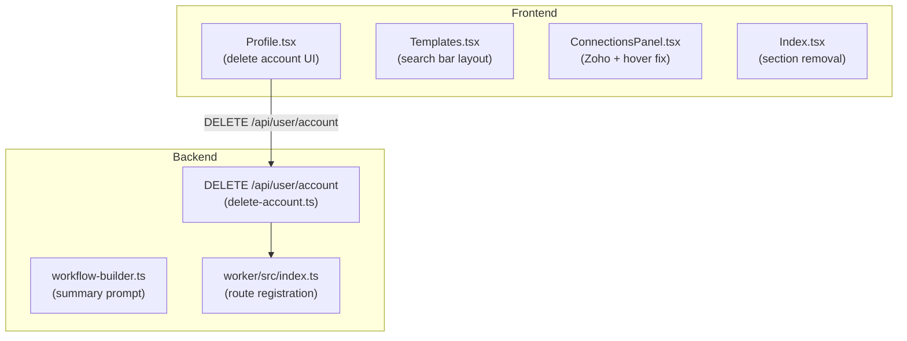

# Design Document: UI/UX and Auth Improvements

## Overview

This document covers the technical design for six targeted improvements spanning the React frontend and Node.js/Express backend. The changes are largely independent of each other and can be implemented in parallel. They address: user account self-deletion, template page layout polish, Zoho connector button consistency, connector card hover isolation, homepage section removal, and AI workflow title quality.

---

## Architecture

The changes touch two distinct layers:

**Frontend (ctrl_checks — React/TypeScript/Vite)**
- `Profile.tsx` — new delete-account UI flow
- `Templates.tsx` — header layout refactor
- `ConnectionsPanel.tsx` — Zoho card and hover CSS fix
- `Index.tsx` — section removal

**Backend (worker — Node.js/Express/TypeScript)**
- New `DELETE /api/user/account` handler in `worker/src/api/delete-account.ts`
- Route registration in `worker/src/index.ts`
- `workflow-builder.ts` — Gemini prompt and fallback summary improvements



---

## Components and Interfaces

### 1. Delete Account — Backend (`worker/src/api/delete-account.ts`)

A new Express handler, separate from `admin-users.ts`, that authenticates the caller via their own JWT and deletes only their own account.

```typescript
// DELETE /api/user/account
export default async function deleteAccountHandler(req: Request, res: Response)
```

**Auth flow:**
1. Extract `Authorization: Bearer <token>` header.
2. Call `supabase.auth.getUser(token)` to resolve the caller's `user.id`.
3. Call `supabase.auth.admin.deleteUser(user.id)` — this cascades to profile data via Supabase RLS/triggers.
4. Return `{ success: true }` on success or a structured error object on failure.

**Route registration in `index.ts`:**
```typescript
import deleteAccountRoute from './api/delete-account';
app.delete('/api/user/account', asyncHandler(deleteAccountRoute));
```

### 2. Delete Account — Frontend (`Profile.tsx`)

Additions to the existing Account card:
- Import `Trash2` icon from lucide-react and `AlertDialog` family from `@/components/ui/alert-dialog`.
- Add `deleting` boolean state.
- Add `handleDeleteAccount` async function: calls `DELETE /api/user/account` with the session JWT, then calls `signOut()` and `navigate('/')`.
- Render a `<AlertDialog>` triggered by a destructive `<Button variant="destructive">` labeled "Delete Account".
- The dialog body warns the action is permanent and requires clicking a "Delete Account" confirm button to proceed.

### 3. Templates Search Bar Repositioning (`Templates.tsx`)

Replace the current two-block layout (heading block, then standalone `<Input>`) with a single flex row:

```tsx
<div className="flex flex-col gap-3 md:flex-row md:items-center md:justify-between">
  <div>
    <h1 className="text-3xl font-bold">Workflow Templates</h1>
    <p className="text-muted-foreground mt-1">...</p>
  </div>
  <Input
    placeholder="Search templates..."
    value={searchQuery}
    onChange={(e) => setSearchQuery(e.target.value)}
    className="max-w-md md:w-72"
  />
</div>
```

The `filteredTemplates` logic is unchanged.

### 4. Zoho Connector Button Fix (`ConnectionsPanel.tsx` + `ZohoConnectionStatus.tsx`)

**Problem:** The Zoho card delegates its button rendering to `<ZohoConnectionStatus compact={false} />`, which renders a ghost red button when disconnected — inconsistent with all other cards.

**Solution:** The Zoho card in `ConnectionsPanel.tsx` takes ownership of the connect/disconnect button rendering, matching the pattern of every other card. `ZohoConnectionStatus` is used only to manage the credentials dialog state, exposed via a `ref` or by lifting the dialog open state.

Concretely:
- In `ConnectionsPanel.tsx`, the Zoho card's action area renders the same `variant="default"` Connect / `variant="outline"` Disconnect buttons as other cards.
- Clicking Connect opens the `ZohoConnectionStatus` dialog. This is achieved by rendering `<ZohoConnectionStatus compact={true} />` (which renders nothing visible) alongside a `Dialog` trigger that calls `setIsZohoDialogOpen(true)`, or by passing an `open`/`onOpenChange` prop to a refactored `ZohoConnectionStatus`.
- The simplest approach: add an `open` and `onOpenChange` prop to `ZohoConnectionStatus` so `ConnectionsPanel` can control dialog visibility externally, while keeping all credential form logic inside `ZohoConnectionStatus`.

### 5. Connector Card Hover Effect Fix (`ConnectionsPanel.tsx`)

**Problem:** The current hover CSS (if any scale is applied) may inadvertently affect child elements including credentials sections.

**Solution:** Apply `transition-transform hover:scale-[1.02]` only to the outermost card `<div>` container. Ensure no child element has `group-hover:` classes that change visibility, opacity, or background. The credentials section (inside `ZohoConnectionStatus` dialog) is not rendered inline in the card, so it is unaffected by hover. For all cards, the pattern is:

```tsx
<div className="flex items-center justify-between rounded-lg border p-3 transition-transform hover:scale-[1.02]">
  {/* icon + name + status — no hover-dependent visibility */}
  {/* action buttons — no hover-dependent visibility */}
</div>
```

No `group` class on the container; no `group-hover:` on any child.

### 6. Homepage Section Removal (`Index.tsx`)

Remove two JSX elements and their corresponding import lines:

```diff
- import { BusinessValueSection } from "@/components/landing/BusinessValueSection";
- import { TrustSection } from "@/components/landing/TrustSection";
...
- <BusinessValueSection />
- <TrustSection />
```

All other sections remain in their current order.

### 6. Homepage Section Spacing Reduction

All remaining landing page `<section>` elements currently use `py-24 sm:py-32` (96px top+bottom / 128px on sm+). This is replaced with `py-12 sm:py-16` (48px / 64px) — a 50% reduction that keeps sections visually separated without forcing excessive scrolling.

Files to update (one-line change per file):

| File | Current class | New class |
|---|---|---|
| `HowItWorks.tsx` | `py-24 sm:py-32` | `py-12 sm:py-16` |
| `WorkflowDemoSection.tsx` | `py-24 sm:py-32` | `py-12 sm:py-16` |
| `OpenCoreSection.tsx` | `py-24 sm:py-32` | `py-12 sm:py-16` |
| `PluginsApiSection.tsx` | `py-24 sm:py-32` | `py-12 sm:py-16` |
| `IndustryVerticalsSection.tsx` | `py-24 sm:py-32` | `py-12 sm:py-16` |
| `WhyCtrlChecksSection.tsx` | `py-24 sm:py-32` | `py-12 sm:py-16` |
| `Features.tsx` | `py-24 sm:py-32` | `py-12 sm:py-16` |
| `Pricing.tsx` | `py-24 sm:py-32` | `py-12 sm:py-16` |
| `SubscriptionSection.tsx` | `py-24 sm:py-32` | `py-12 sm:py-16` |
| `FaqSection.tsx` | `py-24 sm:py-32` | `py-12 sm:py-16` |
| `CTA.tsx` | `py-24 sm:py-32` | `py-12 sm:py-16` |
| `IntegrationsMarqueeSection.tsx` | `py-16 sm:py-20` | `py-8 sm:py-10` |

`IntegrationsMarqueeSection` already uses smaller values so it gets a proportional reduction.

### 7. AI Workflow Titles (`workflow-builder.ts`)

**Gemini prompt change (`planWorkflowWithGemini`):**

The `systemPrompt` built by `systemPromptBuilder.build()` must include an explicit instruction for the `summary` field. The instruction should be added to the system prompt stage:

```
The "summary" field MUST be a specific, descriptive title for this exact workflow.
Rules:
- 5 to 15 words
- Title-Case every word
- Include the primary integration names (e.g. Gmail, Slack, Google Sheets)
- Include the core action verb (e.g. Sync, Notify, Summarize, Send)
- Do NOT use generic labels like "Workflow", "Automation", or "Process"
Example: "Sync Gmail Attachments to Google Sheets Daily"
```

**Fallback summary generation:**

Both `generateMinimalFallbackWorkflow` and `generateConditionalBranchingFallbackWorkflow` currently set a static template string. Replace with a `deriveSummaryFromPrompt(userPrompt: string): string` helper:

```typescript
private deriveSummaryFromPrompt(userPrompt: string): string {
  // Extract up to 10 words from the prompt, title-case them, trim to 5-15 words
  const words = userPrompt.trim().split(/\s+/).slice(0, 12);
  const titled = words.map(w => w.charAt(0).toUpperCase() + w.slice(1).toLowerCase());
  // Ensure at least 5 words by padding with context if needed
  return titled.join(' ');
}
```

This ensures the fallback summary is derived from the actual prompt rather than a static template.

---

## Data Models

### Delete Account Request/Response

```typescript
// Request: DELETE /api/user/account
// Headers: Authorization: Bearer <jwt>
// Body: none

// Success response
{ success: true }

// Error response
{ error: string }
```

### PlannedWorkflow (existing, summary field constraint)

```typescript
interface PlannedWorkflow {
  summary: string;  // 5–15 words, title-case, prompt-specific
  steps: PlannedStep[];
}
```

No schema changes — the constraint is enforced via the Gemini prompt instruction and the fallback helper.

---

## Correctness Properties

*A property is a characteristic or behavior that should hold true across all valid executions of a system — essentially, a formal statement about what the system should do. Properties serve as the bridge between human-readable specifications and machine-verifiable correctness guarantees.*

### Property 1: Delete endpoint only deletes the authenticated user's own account

*For any* authenticated user token, calling `DELETE /api/user/account` with that token SHALL only delete the account whose `user_id` matches the token's subject — never any other user's account.

**Validates: Requirements 1.4**

---

### Property 2: Delete endpoint removes both auth record and profile data

*For any* valid authenticated user, after a successful call to `DELETE /api/user/account`, both the Supabase Auth record and the associated profile row for that user SHALL be absent.

**Validates: Requirements 1.5**

---

### Property 3: Template search filtering is preserved after layout change

*For any* search string, the set of templates displayed on the Templates page SHALL be exactly those whose `name` or `description` contains the search string (case-insensitive) — identical behavior before and after the layout repositioning.

**Validates: Requirements 2.5**

---

### Property 4: All connector cards share a uniform layout structure

*For any* connector card rendered in `ConnectionsPanel` (Google, LinkedIn, GitHub, Facebook, Notion, Twitter, Zoho), the rendered DOM SHALL contain an icon element, a name label, a status text element, and an action button — all within the same structural hierarchy.

**Validates: Requirements 3.5**

---

### Property 5: Hover does not affect credentials visibility for any connector card

*For any* connector card in `ConnectionsPanel`, simulating a hover event on the card container SHALL NOT change the visibility, opacity, background color, or highlight state of any credentials or sensitive field elements within that card.

**Validates: Requirements 4.2**

---

### Property 6: Hover scale is applied uniformly to all connector cards

*For any* connector card in `ConnectionsPanel`, simulating a hover event SHALL apply the same scale transform CSS class to the card's outermost container element.

**Validates: Requirements 4.3**

---

### Property 6: All remaining landing sections use reduced vertical padding

*For every* `<section>` element in the remaining landing page components (HowItWorks, WorkflowDemoSection, OpenCoreSection, PluginsApiSection, IndustryVerticalsSection, WhyCtrlChecksSection, Features, Pricing, SubscriptionSection, FaqSection, CTA), the section's `className` SHALL contain `py-12` and SHALL NOT contain `py-24` or `py-32`.

**Validates: Requirements 6.1, 6.2**

---

### Property 7: Generated workflow summary contains prompt-relevant terms

*For any* user prompt that contains identifiable integration names (e.g. "Gmail", "Slack", "Google Sheets") or action verbs (e.g. "sync", "notify", "summarize"), the `metadata.summary` of the generated workflow SHALL contain at least one of those terms.

**Validates: Requirements 6.1, 6.2**

---

### Property 8: Fallback summaries are derived from the prompt, not static templates

*For any* user prompt, the `metadata.summary` produced by `generateMinimalFallbackWorkflow` and `generateConditionalBranchingFallbackWorkflow` SHALL NOT equal the static strings `"Minimal fallback workflow for: {prompt}"` or `"Conditional fallback workflow for: {prompt}"`, and SHALL contain words derived from the user's prompt.

**Validates: Requirements 6.3, 6.4**

---

### Property 9: All generated workflow summaries satisfy length and title-case invariants

*For any* generated workflow (via Gemini planner or either fallback path), the `metadata.summary` SHALL contain between 5 and 15 words (inclusive), and every word SHALL begin with an uppercase letter (title-case).

**Validates: Requirements 6.5**

---

### Property 10: Semantically different prompts produce different summaries

*For any* two user prompts that are semantically distinct (describe different integrations or actions), the `metadata.summary` values generated for each SHALL not be identical strings.

**Validates: Requirements 6.6**

---

## Error Handling

### Delete Account Endpoint

| Scenario | HTTP Status | Response |
|---|---|---|
| Missing Authorization header | 401 | `{ error: "Unauthorized" }` |
| Invalid or expired JWT | 401 | `{ error: "Unauthorized" }` |
| Supabase admin delete fails | 500 | `{ error: "<message from Supabase>" }` |

### Delete Account Frontend

| Scenario | Behavior |
|---|---|
| Endpoint returns error | Show destructive toast with error message; session remains active |
| Network failure | Show generic error toast; session remains active |
| Success | Call `signOut()`, navigate to `/` |

### Workflow Summary Generation

| Scenario | Behavior |
|---|---|
| Gemini returns summary outside 5–15 words | Truncate or pad in `hydratePlannedWorkflow` before attaching to metadata |
| Gemini returns non-title-case summary | Apply title-case transform in `hydratePlannedWorkflow` |
| `deriveSummaryFromPrompt` receives empty string | Return a safe default like "Custom Workflow" |

---

## Testing Strategy

This feature spans UI changes, a new backend endpoint, and a prompt engineering change. PBT applies to the backend endpoint logic and the workflow summary generation logic. UI changes are best covered by example-based component tests.

### Unit / Example Tests

- **Profile.tsx**: Render tests asserting Delete Account button presence, dialog appearance on click, signOut + navigate called on success, error toast on failure.
- **Templates.tsx**: Render test asserting heading and input share a flex-row container; responsive class assertions.
- **ConnectionsPanel.tsx**: Render tests for Zoho card showing `variant="default"` Connect button when disconnected; Disconnect button when connected; hover class on container only.
- **Index.tsx**: Render test asserting `BusinessValueSection` and `TrustSection` are absent; all other sections present.

### Property-Based Tests

Use a property-based testing library appropriate for the target language:
- **Backend (TypeScript)**: `fast-check`
- **Frontend (TypeScript/React)**: `fast-check` with React Testing Library

Each property test runs a minimum of **100 iterations**.

**Tag format:** `Feature: ui-ux-and-auth-improvements, Property {N}: {property_text}`

| Property | Test approach |
|---|---|
| P1 — Delete only own account | Generate random user IDs; mock Supabase; assert `deleteUser` called with token's own ID only |
| P2 — Full data removal | Generate random users; mock Supabase; assert both auth and profile records absent after call |
| P3 — Search filtering preserved | Generate random template lists and search strings; assert filtered output matches name/description contains check |
| P4 — Uniform card layout | Parameterize over all 7 connector types; assert DOM structure invariant |
| P5 — Hover no credentials change | Parameterize over all 7 connector types; simulate hover; assert no visibility/opacity change on credentials |
| P6 — Uniform hover scale | Parameterize over all 7 connector types; simulate hover; assert same scale class on container |
| P7 — Summary contains prompt terms | Generate prompts with known integration names; assert summary contains at least one |
| P8 — Fallback summaries not static | Generate random prompts; assert fallback summary ≠ static template string |
| P9 — Summary length and title-case | Generate random prompts; assert word count in [5,15] and title-case for all generation paths |
| P10 — Different prompts → different summaries | Generate pairs of distinct prompts; assert summaries differ |
