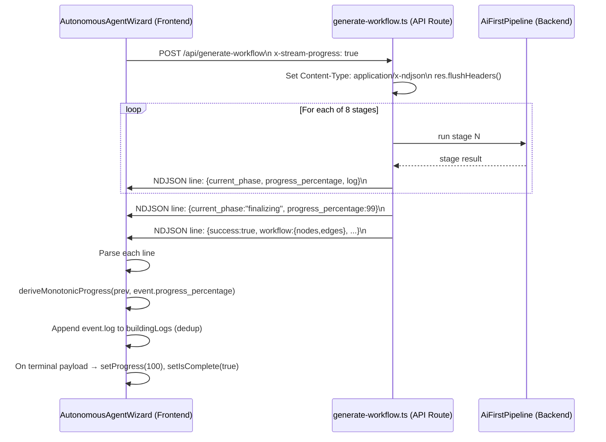

# Design Document: Workflow Generation Progress Bar Stages

## Overview

The workflow generation UI currently shows a progress bar that jumps from 5% to 100% with no intermediate feedback. The backend `AiFirstPipeline` runs 8 sequential stages but never surfaces them to the frontend. This feature closes that gap by:

1. Defining a shared `STAGE_PROGRESS_MAP` that both sides agree on.
2. Having the backend emit NDJSON stage events into the HTTP response stream after each stage completes (opt-in via `x-stream-progress: true` header).
3. Having the frontend parse those events and drive the progress bar and System Logs panel incrementally.

The design is fully backward-compatible: requests without the streaming header continue to receive a single JSON response as before.

---

## Architecture



The key architectural decision is to keep the pipeline logic unchanged and add a thin streaming wrapper in the API route. The pipeline's `run()` method is not modified; instead, the route passes an optional `onStageComplete` callback that the pipeline invokes after each stage.

---

## Components and Interfaces

### 1. Shared Stage Progress Map

**Location:** `worker/src/services/ai/stage-progress-map.ts` (new file, imported by both the API route and optionally the frontend via a shared package or duplicated constant).

Because the worker and frontend are separate packages, the map is defined once in the worker and the frontend holds a matching copy (or imports from a shared types package if one exists). The canonical source of truth is the worker definition.

```typescript
export const STAGE_PROGRESS_MAP: Record<string, number> = {
  intent:               10,
  structural_prompt:    20,
  node_selection:       35,
  edge_reasoning:       50,
  validation:           62,
  property_population:  74,
  credential_discovery: 85,
  field_ownership:      93,
};

export const STAGE_LOG_LABELS: Record<string, string> = {
  intent:               'Extracting intent...',
  structural_prompt:    'Building structural blueprint...',
  node_selection:       'Selecting workflow nodes...',
  edge_reasoning:       'Reasoning about edges...',
  validation:           'Validating graph structure...',
  property_population:  'Populating node properties...',
  credential_discovery: 'Discovering credentials...',
  field_ownership:      'Assigning field ownership...',
};

/** Returns the progress percentage for a stage, with a non-zero fallback for unknown stages. */
export function getStageProgress(stageName: string): number {
  return STAGE_PROGRESS_MAP[stageName] ?? 5;
}
```

Design rationale: percentages are spaced to reflect approximate relative cost of each stage (intent and structural_prompt are fast LLM calls; node_selection, edge_reasoning, and validation are heavier). The final value is 93, leaving room for the `finalizing` sentinel at 99 and the terminal payload at 100.

### 2. Backend: AiFirstPipeline — onStageComplete Callback

**Location:** `worker/src/services/ai/ai-first-pipeline.ts`

Add an optional `onStageComplete` callback to `AiPipelineInput`:

```typescript
interface AiPipelineInput {
  // ... existing fields ...
  onStageComplete?: (stageName: string, progress: number, log: string) => void;
}
```

After each `stageTrace.push(...)` call in `run()`, invoke the callback if present:

```typescript
if (input.onStageComplete) {
  input.onStageComplete(
    'intent',
    getStageProgress('intent'),
    STAGE_LOG_LABELS['intent']
  );
}
```

This keeps the pipeline pure and testable — the callback is injected by the API route, not hardcoded.

### 3. Backend: generate-workflow.ts — Streaming Mode

**Location:** `worker/src/api/generate-workflow.ts`

When `req.headers['x-stream-progress'] === 'true'` and mode is `refine` (or no mode):

```typescript
// Set streaming headers before any stage runs
res.setHeader('Content-Type', 'application/x-ndjson');
res.setHeader('Transfer-Encoding', 'chunked');
res.flushHeaders();

const writeEvent = (event: object) => {
  res.write(JSON.stringify(event) + '\n');
};

const result = await pipeline.run({
  ...pipelineInput,
  onStageComplete: (stageName, progress, log) => {
    writeEvent({ current_phase: stageName, progress_percentage: progress, log });
  },
});

// Write finalizing sentinel before terminal payload
writeEvent({ current_phase: 'finalizing', progress_percentage: 99, log: 'Finalizing workflow...' });

// Write terminal payload
writeEvent({ success: true, phase: 'ready', workflow: result.workflow, /* ...rest of fields */ });

res.end();
```

When the header is absent, the route behaves exactly as today (single `res.json(...)` call).

### 4. Frontend: AutonomousAgentWizard — Stream Parsing

**Location:** `ctrl_checks/src/components/workflow/AutonomousAgentWizard.tsx`

The frontend already sends `x-stream-progress: true` and already has a `reader`/`decoder`/`buffer` loop. The changes are:

- **Stop fallback interval on first `current_phase` event** (already partially done; make it unconditional).
- **Use `event.log` directly** instead of calling `getPhaseDescription(event.current_phase)`, so the label comes from the backend's `STAGE_LOG_LABELS`.
- **Guard progress < 100** until the terminal payload arrives (already enforced by `deriveMonotonicProgress` + capping at 99 on stage events).
- **Deduplication** of `buildingLogs` entries (already done via `prev.includes(phaseDesc)` check; keep this pattern).

The existing stream-reading loop already handles `current_phase` and `progress_percentage`. The main change is that the backend now actually emits these fields for each of the 8 stages, so the frontend loop processes them without structural changes.

---

## Data Models

### StageEvent (NDJSON line)

```typescript
interface StageEvent {
  current_phase: string;        // stage name or "finalizing"
  progress_percentage: number;  // 0–99 (never 100 from stage events)
  log: string;                  // human-readable label
}
```

### TerminalPayload (NDJSON line — last line)

```typescript
interface TerminalPayload {
  success: true;
  phase: 'ready';
  workflow: { nodes: any[]; edges: any[] };
  // ... all existing fields from the current res.json() response ...
}
```

### AiPipelineInput (extended)

```typescript
interface AiPipelineInput {
  userPrompt: string;
  userId?: string;
  correlationId?: string;
  existingWorkflow?: any;
  mandatoryNodeTypes?: string[];
  onStageComplete?: (stageName: string, progress: number, log: string) => void; // NEW
}
```

---

## Correctness Properties

*A property is a characteristic or behavior that should hold true across all valid executions of a system — essentially, a formal statement about what the system should do. Properties serve as the bridge between human-readable specifications and machine-verifiable correctness guarantees.*

### Property 1: Stage Progress Map Monotonicity

*For any* two consecutive stages in pipeline execution order, the later stage's mapped percentage is strictly greater than the earlier stage's mapped percentage, and all values are strictly between 0 and 100.

**Validates: Requirements 1.2, 1.4, 1.5**

### Property 2: Unknown Stage Fallback is Non-Zero

*For any* string that is not a known stage name, `getStageProgress` returns a value strictly greater than 0 and strictly less than 100.

**Validates: Requirements 1.3**

### Property 3: Stage Events Are Valid NDJSON

*For any* pipeline run with streaming enabled, every line written to the response stream before the terminal payload is a valid JSON object containing `current_phase` (string), `progress_percentage` (number in 0–99), and `log` (non-empty string).

**Validates: Requirements 2.2, 2.3, 2.4, 2.5**

### Property 4: Stage Event Count Matches Completed Stages

*For any* successful pipeline run with streaming enabled, the number of stage events emitted (excluding the `finalizing` sentinel and terminal payload) equals the number of stages that completed.

**Validates: Requirements 2.1**

### Property 5: Progress Bar Monotonicity

*For any* sequence of `(previous, next)` progress values passed to `deriveMonotonicProgress`, the result is always `>= previous` and `<= 100`.

**Validates: Requirements 4.1, 4.2**

### Property 6: Progress Never Reaches 100 from Stage Events Alone

*For any* sequence of stage events (without a terminal payload containing `nodes` and `edges`), the progress state in the frontend never reaches 100.

**Validates: Requirements 3.3**

### Property 7: BuildingLogs Deduplication

*For any* sequence of stage events (including repeated events with the same `log` value), the `buildingLogs` array contains each unique log string at most once.

**Validates: Requirements 3.2, 5.1, 5.2**

### Property 8: Final Progress Equals Maximum Seen

*For any* sequence of stage events received in any order, the final displayed progress equals the maximum `progress_percentage` value seen across all events.

**Validates: Requirements 4.4**

---

## Error Handling

| Scenario | Backend Behavior | Frontend Behavior |
|---|---|---|
| Stage fails mid-pipeline | Pipeline returns `ok: false`; route writes `{ status: 'error', error: code, message }` as final NDJSON line, then `res.end()` | Existing `update.status === 'error'` branch throws, caught by outer try/catch, shows toast |
| Network drop mid-stream | `reader.read()` resolves `done: true` with no terminal payload | `finalData` remains null; existing post-loop check handles missing data |
| Malformed NDJSON line | — | `JSON.parse` throws; existing `catch` logs warning and continues |
| `x-stream-progress` absent | Route uses existing `res.json(...)` path unchanged | Frontend falls back to existing single-response handling |
| `onStageComplete` throws | Wrapped in try/catch inside the route's callback; pipeline continues | Stage event may be missing; fallback progress interval covers the gap |

---

## Testing Strategy

### Unit Tests

- `STAGE_PROGRESS_MAP` has all 8 keys with values in (0, 100).
- `getStageProgress` returns a non-zero fallback for unknown stage names.
- `STAGE_LOG_LABELS` has a non-empty string for each of the 8 stage names.
- The `writeEvent` helper serializes to a single line with a trailing `\n`.
- The `finalizing` sentinel is written with `progress_percentage: 99`.
- Without the `x-stream-progress` header, the route calls `res.json()` and does not call `res.write()`.
- With the header, `res.setHeader('Content-Type', 'application/x-ndjson')` and `res.flushHeaders()` are called before any stage runs.

### Property-Based Tests

Using **fast-check** (already used in the codebase) with a minimum of 100 iterations per property.

**Property 1 — Stage Progress Map Monotonicity**
```
// Feature: workflow-generation-progress-bar-stages, Property 1: Stage Progress Map Monotonicity
fc.assert(fc.property(
  fc.integer({ min: 0, max: PIPELINE_STAGE_ORDER.length - 2 }),
  (i) => {
    const a = getStageProgress(PIPELINE_STAGE_ORDER[i]);
    const b = getStageProgress(PIPELINE_STAGE_ORDER[i + 1]);
    return a > 0 && b > 0 && a < 100 && b < 100 && b > a;
  }
), { numRuns: 100 });
```

**Property 2 — Unknown Stage Fallback**
```
// Feature: workflow-generation-progress-bar-stages, Property 2: Unknown Stage Fallback is Non-Zero
fc.assert(fc.property(
  fc.string().filter(s => !(s in STAGE_PROGRESS_MAP)),
  (unknownStage) => {
    const p = getStageProgress(unknownStage);
    return p > 0 && p < 100;
  }
), { numRuns: 100 });
```

**Property 5 — deriveMonotonicProgress Bounds**
```
// Feature: workflow-generation-progress-bar-stages, Property 5: Progress Bar Monotonicity
fc.assert(fc.property(
  fc.float({ min: 0, max: 100 }),
  fc.float({ min: 0, max: 150 }),
  (prev, next) => {
    const result = deriveMonotonicProgress(prev, next);
    return result >= Math.min(prev, 100) && result <= 100;
  }
), { numRuns: 200 });
```

**Property 6 — Progress Never 100 from Stage Events**
```
// Feature: workflow-generation-progress-bar-stages, Property 6: Progress Never Reaches 100 from Stage Events Alone
fc.assert(fc.property(
  fc.array(fc.record({
    current_phase: fc.constantFrom(...PIPELINE_STAGE_ORDER, 'finalizing'),
    progress_percentage: fc.integer({ min: 0, max: 99 }),
    log: fc.string({ minLength: 1 }),
  }), { minLength: 1, maxLength: 20 }),
  (events) => {
    let progress = 0;
    for (const e of events) {
      progress = deriveMonotonicProgress(progress, e.progress_percentage);
    }
    return progress < 100;
  }
), { numRuns: 100 });
```

**Property 7 — BuildingLogs Deduplication**
```
// Feature: workflow-generation-progress-bar-stages, Property 7: BuildingLogs Deduplication
fc.assert(fc.property(
  fc.array(fc.string({ minLength: 1 }), { minLength: 1, maxLength: 30 }),
  (logLines) => {
    let logs: string[] = [];
    for (const line of logLines) {
      if (!logs.includes(line)) logs = [...logs, line];
    }
    return new Set(logs).size === logs.length;
  }
), { numRuns: 100 });
```

**Property 8 — Final Progress Equals Maximum Seen**
```
// Feature: workflow-generation-progress-bar-stages, Property 8: Final Progress Equals Maximum Seen
fc.assert(fc.property(
  fc.array(fc.integer({ min: 0, max: 99 }), { minLength: 1, maxLength: 20 }),
  (percentages) => {
    let progress = 0;
    for (const p of percentages) {
      progress = deriveMonotonicProgress(progress, p);
    }
    return progress === Math.min(99, Math.max(...percentages));
  }
), { numRuns: 100 });
```

### Integration Tests

- End-to-end: POST to `/api/generate-workflow` with `x-stream-progress: true` against a mocked pipeline; assert the response body is valid NDJSON with one line per stage plus a finalizing line plus a terminal payload line.
- Backward compatibility: POST without the header; assert a single JSON response with no NDJSON structure.
