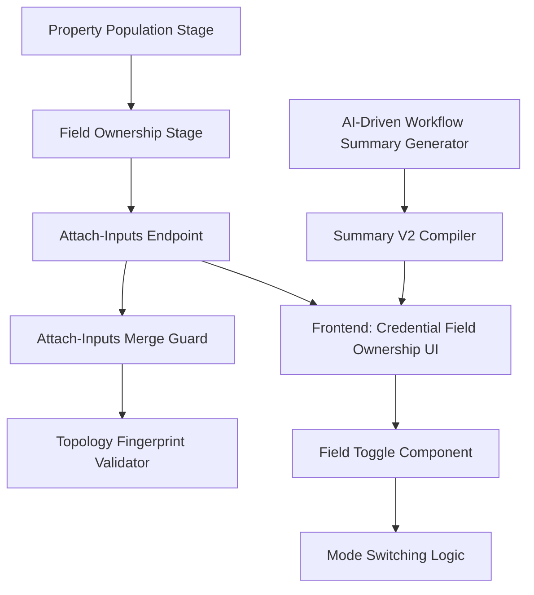

# Design Document: Workflow Summary AI-Built Values

## Overview

This design addresses two critical issues in the workflow generation pipeline:

1. **Workflow Summary Generation**: The AI-driven workflow summary generator must correctly explain conditional workflows with branches, edges, and data flow paths
2. **AI-Built Field Values**: Field values automatically populated by AI during workflow generation must be properly stored, persisted through the attach-inputs pipeline, and displayed in the credential field ownership UI with toggle functionality

The system follows a multi-stage pipeline where workflow summaries are generated from validated workflow graphs, AI populates field values based on user intent, and these values are protected through topology fingerprinting and merge guards during the attach-inputs operation.

## Architecture

### High-Level Data Flow

```
User Prompt
    ↓
Capability Selection
    ↓
Node Selection
    ↓
Edge Reasoning
    ↓
Validation
    ↓
Property Population Stage ← AI populates field values with _fillMode: 'buildtime_ai_once'
    ↓
Field Ownership Stage ← Syncs _fillMode metadata from registry
    ↓
Workflow Summary Compilation ← Generates WorkflowSummaryV2 from validated graph
    ↓
Frontend: Unified Configuration Modal
    ↓
Attach-Inputs Endpoint ← Merge guard preserves AI-built values
    ↓
Attach-Credentials Endpoint
    ↓
Workflow Execution
```

### Component Architecture



## Components and Interfaces

### 1. AI-Driven Workflow Summary Generator

**Location**: `worker/src/services/ai/ai-driven-workflow-summary-generator.ts`

**Current Issues**:
- Does not analyze conditional workflow structure (branches, edges)
- Generates generic summaries without explaining branching logic
- OBJECTIVE and DETAILED_FLOW sections contain similar content
- No edge connection information in CONNECTIONS section

**Proposed Changes**:

```typescript
export interface AIWorkflowSummaryInput {
  userPrompt: string;
  nodeChain: string[];
  useCases?: string[];
  requirements?: string[];
  branchingLogic?: string;
  
  // NEW: Add workflow graph structure
  workflow?: Workflow;
  edges?: WorkflowEdge[];
}

export class AIDrivenWorkflowSummaryGenerator {
  /**
   * Generate AI-driven workflow summary with branch analysis
   */
  async generateSummary(input: AIWorkflowSummaryInput): Promise<AIWorkflowSummaryOutput> {
    // 1. Analyze workflow structure for branching
    const branchingAnalysis = this.analyzeBranchingStructure(input.workflow, input.edges);
    
    // 2. Build enhanced node context with branching metadata
    const nodeContext = this.buildNodeContextWithBranching(input.nodeChain, branchingAnalysis);
    
    // 3. Create AI prompt with branch-aware instructions
    const aiPrompt = this.createBranchAwareAIPrompt(input, nodeContext, branchingAnalysis);
    
    // 4. Call AI for generation
    const aiResponse = await this.callAI(aiPrompt);
    
    // 5. Format response with branch explanations
    const summary = this.formatAIResponseWithBranches(aiResponse, branchingAnalysis);
    
    return { summary, confidence: 0.95 };
  }

  /**
   * Analyze workflow structure to identify branches, edges, and merge points
   */
  private analyzeBranchingStructure(
    workflow?: Workflow,
    edges?: WorkflowEdge[]
  ): BranchingAnalysis {
    if (!workflow || !edges) {
      return { hasBranching: false, branches: [], mergePoints: [] };
    }

    const branches: BranchInfo[] = [];
    const mergePoints: string[] = [];
    
    // Identify branching nodes (if_else, switch)
    for (const node of workflow.nodes) {
      const nodeType = node.data?.type || node.type;
      const nodeDef = unifiedNodeRegistry.get(nodeType);
      
      if (nodeDef?.isBranching) {
        const outgoingEdges = edges.filter(e => e.source === node.id);
        branches.push({
          nodeId: node.id,
          nodeType,
          branchType: nodeType === 'if_else' ? 'binary' : 'multi-case',
          cases: outgoingEdges.map(e => ({
            caseKey: e.branchName || e.sourceHandle || 'default',
            targetNodeId: e.target,
            edgeType: e.type
          }))
        });
      }
    }
    
    // Identify merge points (nodes with multiple incoming edges)
    const incomingCount = new Map<string, number>();
    for (const edge of edges) {
      incomingCount.set(edge.target, (incomingCount.get(edge.target) || 0) + 1);
    }
    for (const [nodeId, count] of incomingCount.entries()) {
      if (count > 1) {
        mergePoints.push(nodeId);
      }
    }
    
    return {
      hasBranching: branches.length > 0,
      branches,
      mergePoints
    };
  }

  /**
   * Create branch-aware AI prompt with explicit instructions for explaining branches
   */
  private createBranchAwareAIPrompt(
    input: AIWorkflowSummaryInput,
    nodeContext: string,
    branchingAnalysis: BranchingAnalysis
  ): string {
    const branchingInstructions = branchingAnalysis.hasBranching
      ? `
BRANCHING LOGIC DETECTED:
${branchingAnalysis.branches.map(b => `
- ${b.nodeType} node (${b.nodeId}):
  ${b.cases.map(c => `  • ${c.caseKey} → ${c.targetNodeId}`).join('\n')}
`).join('\n')}

MERGE POINTS:
${branchingAnalysis.mergePoints.map(m => `- ${m}`).join('\n')}

CRITICAL REQUIREMENTS FOR BRANCHING WORKFLOWS:
- In DETAILED_FLOW, explain EACH branch path separately
- For if_else: explain both the TRUE branch and FALSE branch execution paths
- For switch: explain ALL case branches and their routing logic
- Explain how data flows through each branch
- Explain merge points where branches reconverge
- Show which nodes execute in each branch path
`
      : '';

    return `You are an expert workflow architect. Analyze this workflow and generate a comprehensive summary.

USER INTENT:
${input.userPrompt}

SELECTED NODES (execution order):
${nodeContext}

${branchingInstructions}

TASK: Generate a detailed workflow analysis with these EXACT sections:

1. OBJECTIVE: High-level business goal and purpose of this workflow
   - Focus on WHAT the workflow achieves (business outcome)
   - Keep this section high-level and strategic
   - Do NOT include technical execution details here

2. TRIGGER_DESCRIPTION: How the workflow starts and what initiates it
   - Explain the trigger mechanism
   - Describe what event or action starts the workflow

3. DETAILED_FLOW: Complete step-by-step technical execution
   - This section MUST be completely different from OBJECTIVE
   - Include each node's purpose and role
   - Explain input data and processing for each step
   - For branching workflows: explain EACH branch path separately
   - Show decision points and routing logic
   - Explain all possible execution paths
   - Show data flow between nodes
   - Describe final outcomes and results

4. CONNECTIONS: How nodes connect, route data, and work together
   - Explain edge connections between nodes
   - Show how data flows from node to node
   - For branching: explain how edges route to different branches
   - Explain merge points where branches reconverge

CRITICAL REQUIREMENTS:
- Make OBJECTIVE and DETAILED_FLOW completely different content
- OBJECTIVE = high-level business purpose (WHAT and WHY)
- DETAILED_FLOW = technical step-by-step execution (HOW)
- Be specific about the actual nodes selected and their roles
- Explain branching logic based on the node sequence
- Focus on the user's specific scenario and requirements

Generate comprehensive, intelligent analysis based on the user intent and selected nodes.`;
  }
}
```

### 2. Summary V2 Compiler

**Location**: `worker/src/services/ai/summary-v2-compiler.ts`

**Current Implementation**: Already correctly compiles WorkflowSummaryV2 from validated workflow graphs

**No Changes Required**: The compiler already:
- Identifies trigger and terminal nodes
- Builds execution backbone
- Extracts branching information
- Computes path outcomes
- Uses unified node registry for metadata

**Integration Point**: The AI-driven summary generator should use the compiled WorkflowSummaryV2 as input context for generating human-readable summaries.

### 3. Property Population Stage

**Location**: `worker/src/services/ai/stages/property-population-stage.ts`

**Current Implementation**: Already correctly populates AI-built values

**Current Behavior**:
- Filters fields with `fillMode.default === 'buildtime_ai_once'`
- Calls LLM to generate field values
- Stamps `_fillMode[fieldName] = 'buildtime_ai_once'` for non-empty values
- Merges over defaultConfig and existing config

**Issue Identified**: The stage correctly stamps `_fillMode` for AI-populated fields, but the stamp only occurs for non-empty values. This is correct behavior.

**No Changes Required**: The property population stage is working as designed.

### 4. Field Ownership Stage

**Location**: `worker/src/services/ai/stages/field-ownership-stage.ts`

**Current Implementation**: Already correctly syncs `_fillMode` metadata

**Current Behavior**:
- Reads `fillMode.default` from unified node registry for each field
- Writes `_fillMode` metadata into `node.data.config._fillMode`
- Preserves existing `_fillMode` entries from prior stages (property-population-stage)

**No Changes Required**: The field ownership stage is working as designed.

### 5. Attach-Inputs Merge Guard

**Location**: `worker/src/core/utils/attach-inputs-merge-guard.ts`

**Current Implementation**: Already correctly preserves AI-built values

**Current Behavior**:
```typescript
export function shouldPreserveExistingBuildtimeValue(
  fieldName: string,
  inputSchema: NodeInputSchema | undefined,
  config: Record<string, unknown>,
  existingValue: unknown,
  incomingValue: unknown
): { preserve: boolean; reason?: string } {
  // 1. Skip config meta keys
  if (isConfigMetaKey(fieldName)) {
    return { preserve: false };
  }

  // 2. Allow switch branch fields (cases/rules) to be reduced
  if (STRUCTURAL_BRANCH_FIELDS.has(fieldName)) {
    return { preserve: false };
  }

  // 3. Check if field is buildtime_ai_once
  const mode = resolveEffectiveFieldFillMode(fieldName, inputSchema, config);
  if (mode !== 'buildtime_ai_once') {
    return { preserve: false };
  }

  // 4. Preserve if existing is non-empty and incoming is empty
  const existingIsNonEmpty = !isEmptyIncomingValue(existingValue);
  if (existingIsNonEmpty && isEmptyIncomingValue(incomingValue)) {
    return {
      preserve: true,
      reason: 'buildtime_empty_incoming_blocked',
    };
  }

  // 5. Prevent array shrinking
  if (Array.isArray(existingValue) && Array.isArray(incomingValue)) {
    if (existingValue.length > 0 && incomingValue.length < existingValue.length) {
      return {
        preserve: true,
        reason: 'buildtime_array_shrink_blocked',
      };
    }
  }

  // 6. Prevent object shrinking
  if (
    existingValue &&
    typeof existingValue === 'object' &&
    !Array.isArray(existingValue) &&
    incomingValue &&
    typeof incomingValue === 'object' &&
    !Array.isArray(incomingValue)
  ) {
    const ek = Object.keys(existingValue as object).length;
    const ik = Object.keys(incomingValue as object).length;
    if (ek >= 3 && ik > 0 && ik < ek / 2) {
      return {
        preserve: true,
        reason: 'buildtime_object_shrink_blocked',
      };
    }
  }

  return { preserve: false };
}
```

**No Changes Required**: The merge guard is working as designed.

### 6. Attach-Inputs Endpoint

**Location**: `worker/src/api/attach-inputs.ts`

**Current Implementation**: Already correctly applies merge guard and handles field ownership

**Current Behavior**:
- Computes topology fingerprint for structural validation
- Applies merge guard via `shouldPreserveExistingBuildtimeValue()`
- Processes `mode_<nodeId>_<fieldName>` keys to update `_fillMode`
- Processes `unlock_<nodeId>_<fieldName>` keys to update `_ownershipUnlock`
- Exports fill mode metadata via `collectEffectiveFillModesForWizard()`
- Exports ownership unlock flags via `collectOwnershipUnlockFlagsForWizard()`
- Implements idempotent operations via payload hashing

**No Changes Required**: The attach-inputs endpoint is working as designed.

### 7. Topology Fingerprint Validator

**Location**: `worker/src/core/utils/workflow-topology-fingerprint.ts`

**Current Implementation**: Already correctly validates topology

**Current Behavior**:
- Computes stable fingerprint from nodes and edges
- Excludes credential-owned fields from protected config fingerprint
- Detects structural changes via fingerprint comparison
- Allows config changes in frozen state while blocking structural mutations

**No Changes Required**: The topology fingerprint validator is working as designed.

## Data Models

### WorkflowSummaryV2

```typescript
export interface WorkflowSummaryV2 {
  graphOverview: {
    triggerNodeIds: string[];
    terminalNodeIds: string[];
    totalNodes: number;
    totalEdges: number;
    hasBranching: boolean;
  };
  executionBackbone: Array<{
    order: number;
    nodeId: string;
    nodeType: string;
    label: string;
    responsibility: string;
  }>;
  branches: Array<{
    branchNodeId: string;
    branchNodeType: string;
    cases: Array<{
      caseKey: string;
      targetNodeId: string;
      targetNodeType: string;
      pathNodeIds: string[];
      terminalBehavior: string;
    }>;
  }>;
  nodes: Array<{
    nodeId: string;
    nodeType: string;
    label: string;
    purpose: string;
    inputEffect: string;
    outputEffect: string;
  }>;
  pathOutcomes: Array<{
    pathId: string;
    condition: string;
    nodePath: string[];
    terminalNodeId: string;
    outcome: string;
  }>;
  validationFindings: Array<{
    code: string;
    severity: string;
    message: string;
  }>;
}
```

### BranchingAnalysis

```typescript
export interface BranchingAnalysis {
  hasBranching: boolean;
  branches: BranchInfo[];
  mergePoints: string[];
}

export interface BranchInfo {
  nodeId: string;
  nodeType: string;
  branchType: 'binary' | 'multi-case';
  cases: Array<{
    caseKey: string;
    targetNodeId: string;
    edgeType?: string;
  }>;
}
```

### Field Fill Mode Metadata

```typescript
// Stored in node.data.config._fillMode
type FieldFillModeMap = Record<string, FieldFillMode>;

type FieldFillMode = 'manual_static' | 'buildtime_ai_once' | 'runtime_ai';

// Stored in node.data.config._ownershipUnlock
type OwnershipUnlockMap = Record<string, boolean>;
```

## Error Handling

### Workflow Summary Generation Errors

**Scenario**: AI fails to generate summary

**Handling**:
```typescript
try {
  const aiResponse = await this.callAI(aiPrompt);
  return this.formatAIResponse(aiResponse);
} catch (error) {
  console.error('[AI Summary Generator] Error:', error);
  return {
    summary: await this.generateMinimalAIFallback(input),
    confidence: 0.3,
  };
}
```

**Fallback**: Generate minimal summary from node chain

### Property Population Errors

**Scenario**: LLM fails to populate field values for a node

**Handling**:
```typescript
try {
  const rawResponse = await geminiOrchestrator.processRequest(...);
  const parsed = tryParseJson(rawResponse);
  // Apply values
} catch (err) {
  logger.warn({
    event: 'ai_pipeline_stage_warn',
    stage: 'property_population',
    nodeId,
    reason: `LLM call failed — using defaultConfig: ${err.message}`,
  });
  node.data.config = { ...nodeDef.defaultConfig(), ...prior };
  // Continue to next node
}
```

**Fallback**: Use registry defaultConfig for the node

### Attach-Inputs Merge Conflicts

**Scenario**: Incoming value conflicts with AI-built value

**Handling**:
```typescript
const { preserve, reason } = shouldPreserveExistingBuildtimeValue(
  fieldName,
  inputSchema,
  config,
  existingValue,
  incomingValue
);

if (preserve) {
  console.log(`[AttachInputs] Preserved AI-built value for ${nodeId}.${fieldName}: ${reason}`);
  // Skip incoming value, keep existing
} else {
  // Apply incoming value
  config[fieldName] = incomingValue;
}
```

**Resolution**: Preserve existing AI-built value when incoming is empty/smaller

### Topology Fingerprint Mismatch

**Scenario**: Workflow structure changed unexpectedly

**Handling**:
```typescript
const currentFingerprint = fingerprintWorkflowTopology(workflow.nodes, workflow.edges);
const baselineFingerprint = workflow.metadata?.lastAttachInputs?.topologyFingerprint;

if (currentFingerprint.fingerprint !== baselineFingerprint) {
  const diff = diffWorkflowTopology(baselineFingerprint, currentFingerprint);
  return res.status(409).json({
    error: 'Topology mutation detected',
    code: 'TOPOLOGY_MISMATCH',
    diff,
  });
}
```

**Resolution**: Return 409 error with topology diff details

## Testing Strategy

### Unit Tests

**Workflow Summary Generation**:
- Test branch analysis for if_else nodes
- Test branch analysis for switch nodes with N cases
- Test merge point detection
- Test AI prompt construction with branching instructions
- Test fallback summary generation

**Property Population**:
- Test field filtering (buildtime_ai_once only)
- Test LLM call and JSON parsing
- Test _fillMode stamping for non-empty values
- Test fallback to defaultConfig on LLM failure
- Test per-node error handling

**Attach-Inputs Merge Guard**:
- Test preservation of AI-built values when incoming is empty
- Test array shrink prevention
- Test object shrink prevention
- Test switch branch fields exemption (cases/rules)
- Test config meta keys exemption (_fillMode, _ownershipUnlock)

**Topology Fingerprint**:
- Test fingerprint computation from nodes and edges
- Test fingerprint stability (same input → same fingerprint)
- Test fingerprint change detection
- Test protected config fingerprint (excludes credential fields)

### Integration Tests

**End-to-End Workflow Generation**:
```typescript
test('E2E: Generate conditional workflow with AI-built values', async () => {
  // 1. Generate workflow with if_else node
  const workflow = await generateWorkflow({
    userPrompt: 'If age > 18, send approval email, else send rejection email',
  });

  // 2. Verify branching structure
  expect(workflow.nodes).toContainNodeType('if_else');
  expect(workflow.edges).toHaveLength(greaterThan(workflow.nodes.length));

  // 3. Verify AI-built values
  const ifElseNode = workflow.nodes.find(n => n.data.type === 'if_else');
  expect(ifElseNode.data.config.conditions).toBeDefined();
  expect(ifElseNode.data.config._fillMode.conditions).toBe('buildtime_ai_once');

  // 4. Verify workflow summary
  const summary = workflow.metadata.summaryV2;
  expect(summary.branches).toHaveLength(1);
  expect(summary.branches[0].cases).toHaveLength(2); // true and false
});
```

**Attach-Inputs Preservation**:
```typescript
test('E2E: Attach-inputs preserves AI-built values', async () => {
  // 1. Generate workflow with AI-built values
  const workflow = await generateWorkflow({
    userPrompt: 'Send email with subject "Welcome"',
  });

  const emailNode = workflow.nodes.find(n => n.data.type === 'google_gmail');
  const aiBuiltSubject = emailNode.data.config.subject;
  expect(aiBuiltSubject).toBe('Welcome');
  expect(emailNode.data.config._fillMode.subject).toBe('buildtime_ai_once');

  // 2. Call attach-inputs with empty subject
  const response = await attachInputs({
    workflowId: workflow.id,
    inputs: {
      [`input_${emailNode.id}_subject`]: '', // Empty incoming value
    },
  });

  // 3. Verify AI-built value preserved
  const updatedWorkflow = await getWorkflow(workflow.id);
  const updatedEmailNode = updatedWorkflow.nodes.find(n => n.id === emailNode.id);
  expect(updatedEmailNode.data.config.subject).toBe('Welcome'); // Preserved
});
```

**Field Ownership UI Round-Trip**:
```typescript
test('E2E: Field ownership UI round-trip', async () => {
  // 1. Generate workflow with AI-built values
  const workflow = await generateWorkflow({
    userPrompt: 'Send email notification',
  });

  // 2. Export fill mode metadata for UI
  const fillModes = collectEffectiveFillModesForWizard(workflow.nodes);
  expect(fillModes[`mode_${emailNode.id}_subject`]).toBe('buildtime_ai_once');

  // 3. User switches to manual_static in UI
  await attachInputs({
    workflowId: workflow.id,
    inputs: {
      [`mode_${emailNode.id}_subject`]: 'manual_static',
      [`input_${emailNode.id}_subject`]: 'Custom Subject',
    },
  });

  // 4. Verify mode updated
  const updatedWorkflow = await getWorkflow(workflow.id);
  const updatedEmailNode = updatedWorkflow.nodes.find(n => n.id === emailNode.id);
  expect(updatedEmailNode.data.config._fillMode.subject).toBe('manual_static');
  expect(updatedEmailNode.data.config.subject).toBe('Custom Subject');
});
```

## Implementation Approach

### Phase 1: Workflow Summary Generation Enhancement

**Tasks**:
1. Add `analyzeBranchingStructure()` method to AI-driven summary generator
2. Add `buildNodeContextWithBranching()` method to include branch metadata
3. Update `createAIPrompt()` to include branching instructions
4. Update `formatAIResponse()` to extract branch explanations
5. Add unit tests for branch analysis
6. Add integration tests for conditional workflow summaries

**Files to Modify**:
- `worker/src/services/ai/ai-driven-workflow-summary-generator.ts`

**Estimated Effort**: 2-3 days

### Phase 2: System Prompt Enhancement

**Tasks**:
1. Update system prompt builder to include branch-aware instructions
2. Add branching context to capability selection prompt
3. Add branching context to node selection prompt
4. Add branching context to edge reasoning prompt
5. Add unit tests for prompt generation with branching

**Files to Modify**:
- `worker/src/services/ai/system-prompt-builder.ts`

**Estimated Effort**: 1-2 days

### Phase 3: Frontend Field Ownership UI

**Tasks**:
1. Create field ownership toggle component
2. Implement mode switching logic (AI-built, You, AI Runtime)
3. Add value restoration when switching back to AI-built
4. Handle credential-owned fields with unlock functionality
5. Add unit tests for toggle component
6. Add integration tests for mode switching

**Files to Create/Modify**:
- `ctrl_checks/src/components/FieldOwnershipToggle.tsx` (new)
- `ctrl_checks/src/components/PropertiesPanel.tsx` (modify)
- `ctrl_checks/src/hooks/useFieldOwnership.ts` (new)

**Estimated Effort**: 3-4 days

### Phase 4: Integration and Testing

**Tasks**:
1. End-to-end testing of workflow generation with branching
2. End-to-end testing of AI-built value preservation
3. End-to-end testing of field ownership UI round-trip
4. Performance testing of attach-inputs with large workflows
5. Load testing of AI summary generation

**Estimated Effort**: 2-3 days

## Root Cause Analysis

### Issue 1: Workflow Summary Does Not Explain Branches

**Root Cause**: The AI-driven summary generator does not analyze the workflow graph structure. It only receives a flat list of node types without edge information or branching metadata.

**Evidence**:
```typescript
// Current implementation
const nodeContext = this.buildNodeContextForAI(input.nodeChain);
// Only builds: "1. trigger, 2. if_else, 3. gmail, 4. slack"
// Missing: branch connections, edge routing, merge points
```

**Fix**: Pass the validated workflow graph to the summary generator and analyze branching structure before generating the AI prompt.

### Issue 2: AI-Built Values Not Displayed in UI

**Root Cause**: The frontend credential panel does not read `_fillMode` metadata from node configs. It only displays field values without ownership information.

**Evidence**: No frontend component currently reads `node.data.config._fillMode` or displays ownership toggles.

**Fix**: Create a field ownership toggle component that reads `_fillMode` metadata and allows mode switching.

### Issue 3: OBJECTIVE and DETAILED_FLOW Contain Similar Content

**Root Cause**: The AI prompt does not clearly distinguish between high-level business purpose (OBJECTIVE) and technical execution details (DETAILED_FLOW).

**Evidence**:
```typescript
// Current prompt
"1. OBJECTIVE: High-level business goal and purpose of this workflow"
"3. DETAILED_FLOW: Complete step-by-step execution"
// No explicit instruction to make them different
```

**Fix**: Add explicit instructions in the AI prompt to make OBJECTIVE focus on business outcomes (WHAT and WHY) and DETAILED_FLOW focus on technical execution (HOW).

## Conclusion

The design addresses both workflow summary generation and AI-built value persistence through targeted enhancements to the AI-driven summary generator and comprehensive analysis of the existing attach-inputs pipeline. The key insight is that most of the infrastructure for AI-built values already exists and is working correctly—the primary gap is in the frontend UI for displaying and toggling field ownership.

The workflow summary enhancement requires adding branching analysis to the summary generator and updating the AI prompt to include explicit instructions for explaining conditional logic. The AI-built values feature requires creating a frontend field ownership toggle component that reads existing `_fillMode` metadata and allows users to switch between ownership modes.

All changes follow the existing architectural patterns:
- Registry-driven behavior (no hardcoding)
- Unified graph orchestrator for edge management
- Topology fingerprinting for structural validation
- Merge guards for value preservation
- Idempotent operations for reliability
