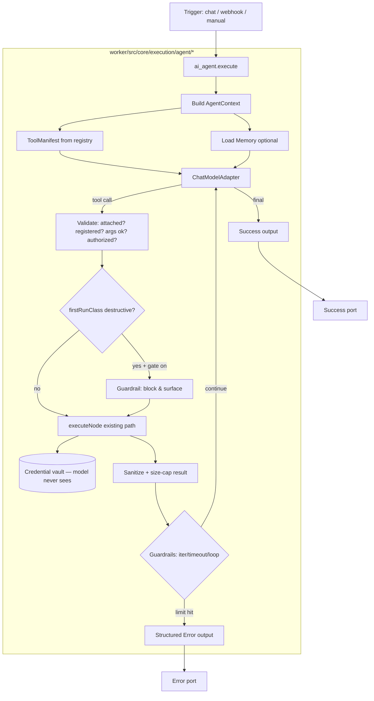

# AI Agent Node — Phase 2 Design

> **Status: DESIGN ONLY. No code written. Builds on the approved [Phase 1 Analysis](AI_AGENT_IMPLEMENTATION_ANALYSIS.md).**
> Locked decisions carried in: **D1** ChatModelAdapter (native Gemini first + JSON fallback) · **D2** metadata-driven tool eligibility · **D3** guardrail gate now / async later · **D4** replace `AgentSettings.tsx` · **D5** zero-tools == today's single-shot node.
> Core mandate: **universal & dynamic, zero node hardcoding** (Analysis §11c).

---

## 1. Architecture overview

The agent is a **first-class container node** (`ai_agent`) whose `execute()` runs a bounded reasoning loop. It owns **no** node-specific logic: it discovers tools from the registry, asks a chat model which tool to call, and runs each tool through the **existing** per-node executor (`executeNode()`), which already handles credentials, validation, and observability.



**New module (isolated, provider- and node-agnostic):** `worker/src/core/execution/agent/`
- `agent-executor.ts` — the loop + orchestration
- `tool-manifest.ts` — registry → generic tool schemas
- `chat-model-adapter.ts` — provider interface + Gemini impl (+ JSON-fallback base)
- `agent-guardrails.ts` — iteration/timeout/loop/size/cancellation
- `result-sanitizer.ts` — untrusted tool-output handling
- `agent-memory.ts` — thin wrapper over `HybridMemoryService`
- `agent-types.ts` — shared interfaces

**Reused unchanged:** registry, `executeNode()` (`execute-workflow.ts:2659`), credential vault/injection, `HybridMemoryService`, DAG engine, workflows table.

---

## 2. Node schema (`ai_agent`)

Registry override at `overrides/ai-agent.ts` replaces the single-LLM delegate with the loop. Schema fields (in `node-library.ts` + frontend `nodeTypes.ts`), all with `fillMode`/ownership metadata per the contract:

| Field | Type | Ownership | Purpose |
|-------|------|-----------|---------|
| `userInput` | string | value (runtime) | The task/message (existing handle) |
| `systemPrompt` | string | value | Agent persona/instructions (existing) |
| `model` | enum | value | Chat model; provider inferred (existing) |
| `maxIterations` | number (default 10, range 1–25) | value | Guardrail |
| `timeoutMs` | number (default 60000) | value | Global guardrail |
| `maxToolResultChars` | number (default 8000) | value | Result size cap fed back to model |
| `memoryScope` | enum `none`\|`conversation`\|`user` (default `none`) | value | Memory strategy (see §7) |
| `requireApprovalFor` | enum `none`\|`destructive`\|`write_and_destructive` (default `destructive`) | value | HITL gate policy (D3) |
| `outputFormat` | enum text/json/keyvalue/markdown | value | Existing; preserved |

**Attachments are edges, not config** (see §11): `chat_model` (1, required for tool use), `memory` (0–1), `tool` (0–N). `chatModel` may be accepted as an alias at UI/import boundaries, but `chat_model` is the canonical persisted/backend handle. `credentialSchema` on the agent itself = **none** (tools carry their own).

**D5 invariant:** if **zero** `tool` edges are attached, `execute()` takes the exact legacy single-shot path and returns the identical `{response_text, response_json, confidence_score, used_tools:[], memory_written, error_flag, error_message}` shape. Existing workflows are byte-compatible.

---

## 3. Tool schema & the generic manifest (zero hardcoding)

For each **attached** tool edge, resolve the source node's type, then build a tool descriptor **purely from registry metadata** — no node named in code:

```ts
interface AgentToolDescriptor {
  toolId: string;          // the attached node's id (unique per agent)
  nodeType: string;        // canonical registry type
  name: string;            // def.label / aiSelectionCriteria
  description: string;     // def.description + whenToUse
  parameters: JSONSchema;  // derived from getInputSchema() + operationContracts
  firstRunClass: 'none'|'read'|'write'|'destructive'; // for HITL gating
}
```

**Eligibility predicate (metadata-driven, §11c):** exclude normalized `category === 'trigger'` (and raw `category === 'triggers'` when looking at NodeLibrary schemas), `schema.internalOnly === true`, and the agent's own type. Everything else is eligible automatically — current *and* future nodes.

**Parameter schema derivation** (generic): map each `NodeInputField` where `ownership !== 'credential'` (credentials are never exposed) into JSON-schema `properties`; `required` from `requiredInputs` + operation-contract `requiredFields`; `enum` from `ui.options`; description from field `description`/`fieldIntelligence.purpose`. The **selected `operationContract`** (if any) narrows required/forbidden fields so the model sees a coherent operation.

**Adapter mapping:** native Gemini receives `tools:[{functionDeclarations:[…]}]`; JSON-fallback providers receive the same descriptors embedded in the system prompt with a strict response schema.

---

## 4. Execution context

`AgentContext` is assembled once and threaded through the loop:
```ts
interface AgentContext {
  agentNode: WorkflowNode;
  graph: { nodes: WorkflowNode[]; edges: WorkflowEdge[] }; // needed to resolve attached tool/model/memory nodes
  workflowId: string; userId?: string; currentUserId?: string;
  db: DbClient; nodeOutputs: LRUNodeOutputsCache;   // reused execution plumbing
  attachedTools: AgentToolDescriptor[];
  chatModel: ResolvedChatModel;                      // provider+model+key resolver (key stays server-side)
  memory?: AgentMemoryHandle;                        // optional
  limits: { maxIterations; timeoutMs; maxToolResultChars };
  gatePolicy: RequireApprovalPolicy;
  conversation: AgentMessage[];                      // system, user, assistant, tool
  signal?: AbortSignal;                              // cancellation
}
```
Each tool call is executed by constructing a synthetic `WorkflowNode` for the tool (type + model-supplied args as `config`) and calling the **existing** `executeNode(node, input, nodeOutputs, db, workflowId, userId, currentUserId)` — so credential injection and validation happen exactly as in a normal run.

---

## 5. The agent loop

```mermaid
sequenceDiagram
    participant U as Trigger/User
    participant AG as ai_agent.execute
    participant AD as ChatModelAdapter
    participant RG as Registry
    participant EX as executeNode (existing)
    participant CV as Credential Vault
    U->>AG: userInput + config
    AG->>RG: build tool manifest (attached tools only)
    AG->>AD: system + user + memory + tools
    loop until final / guardrail
      AD-->>AG: final answer OR tool call(name,args)
      alt tool call
        AG->>AG: validate attached+registered+args+authorized
        AG->>AG: HITL gate if firstRunClass ∈ policy
        AG->>EX: executeNode(synthetic tool node, args)
        EX->>CV: inject secrets (model never sees)
        EX-->>AG: raw result
        AG->>AG: sanitize + size-cap; append tool message
        AG->>AG: guardrails (iter++, timeout, loop-detect)
        AG->>AD: tool result
      else final
        AG-->>U: Success {output, iterations, toolCalls, metadata}
      end
    end
```

Explicit termination: model returns final · `iterations >= maxIterations` · elapsed `>= timeoutMs` · loop detected (same tool+args N× consecutively) · `signal.aborted` · unrecoverable error. Each produces either a Success (final) or a structured Error.

---

## 6. Model adapter (D1)

```ts
interface ChatModelAdapter {
  supportsNativeToolCalling(): boolean;
  complete(req: {
    system: string; messages: AgentMessage[];
    tools: AgentToolDescriptor[]; temperature?: number; maxTokens?: number; signal?: AbortSignal;
  }): Promise<{ kind: 'final'; text: string } | { kind: 'tool_call'; toolId: string; args: Record<string, unknown> }>;
}
```
- **GeminiChatModelAdapter** — native function-calling: sends `functionDeclarations`, parses `functionCall`. Additive extension to `llm-adapter.ts` (`tools` in `LLMOptions`, parse `functionCall` part). Key resolved via the **existing** `resolveGeminiApiKeyForNode` chain (connection → inline → wallet → pool). Backward-compatible: no `tools` ⇒ current behavior.
- **JsonProtocolChatModelAdapter** (base for OpenAI/Claude/others) — uses structured output / prompt-embedded tool list; the model returns `{action, toolId, args}`. Key **required** from the user's connection (no platform fallback), matching existing OpenAI/Claude behavior.
- Selection by `LLMAdapter.detectProvider(model)`; unknown/unsupported native ⇒ JSON fallback. **Adding a provider = add one adapter, no loop change** (§36 satisfied).

---

## 7. Memory adapter

Thin wrapper over the existing `HybridMemoryService` (`shared/memory.ts`, Redis+DB, session-scoped). `memoryScope`:
- `none` — stateless (default; safest).
- `conversation` — key = trigger session id (`chat_trigger` sessionId / execution id). Loads recent turns before the loop, appends the final exchange after.
- `user` — key = `userId` (cross-session personal memory).

Isolation: keys are namespaced by scope; **never** cross user/workspace. No new memory system.

---

## 8. Tool adapter (execution bridge)

The only bridge to node execution. Responsibilities: build the synthetic tool `WorkflowNode`, call `executeNode()`, normalize `_error` objects into structured tool errors, and hand raw output to the sanitizer. **Contains zero node-type logic.** This guarantees credential/validation/observability parity with normal runs.

---

## 9. Error model

Follows the existing `NodeExecutionResult` conventions. Success and Error are the two new semantic output ports, but the legacy `output` handle must remain valid as a success alias for existing workflows.

**Success (with tools):**
```json
{ "success": true, "output": "…", "iterations": 3,
  "toolCalls": [{ "toolId":"…","nodeType":"…","ok":true,"ms":812 }],
  "metadata": { "model":"…", "tokens":{…}, "memoryScope":"conversation" } }
```
**Error:**
```json
{ "success": false, "error":"…", "code":"ITERATION_LIMIT|TOOL_NOT_ATTACHED|INVALID_ARGS|TOOL_FAILED|CRED_FAILED|MODEL_FAILED|TIMEOUT|CANCELLED|LOOP_DETECTED",
  "iteration": 2, "tool": "…" }
```
Errors are structured, never swallowed, and **never contain secrets** (sanitizer + existing masking). Zero-tools mode keeps the legacy `error_flag/error_message` shape (D5).

---

## 10. Frontend representation

- **Node** (`WorkflowNode.tsx`): agent renders top `userInput`, bottom `Success`/`Error` (plus legacy `output` compatibility), and **bottom-anchored sub-node handles** `chat_model` / `memory` / `tool` (visually distinct from flow edges — dashed, labeled), matching the n8n-style reference.
- **Config** (replace orphaned `AgentSettings.tsx`, D4): standard `configFields` (model, systemPrompt, limits, memoryScope, approval policy) + a **Tools panel** listing attached tools with their connection status.
- **Catalog** (`nodeTypes.ts`): extend the existing `ai_agent` def; keep it consistent with the registry (dual-catalog rule).

## 11. Port / edge representation

Attachments are **ordinary edges** into named `targetHandle`s on the agent (`chat_model`/`memory`/`tool`) — the codebase already reads port-specific `targetHandle` for `ai_agent` around `execute-workflow.ts:20069-20256` (`targetHandle` is read at `20107`). Rules:
- Sub-node edges are **attachments, not execution order** — the runtime execution plan/toposort, `execution-order-enforcer.ts`, and the linear-DAG compiler rule must **exempt** these handles while still preserving them for the agent loop. Manual execution needs this exemption, not only AI-generated workflows.
- Registry/backend port metadata must be updated with `incomingPorts` including `userInput`, `input`, `chat_model`, `memory`, and `tool`; `outgoingPorts` should include `success`, `error`, and legacy `output` compatibility.
- Backend handle normalization must preserve those attachment handles. As verified, `node-handle-registry.ts` currently maps target `chat_model`/`memory`/`tool` to `input` before checking valid target handles, so Phase 4 must correct that ordering or add an `ai_agent` attachment exception.
- Connection validity (`WorkflowCanvas.tsx`, `workflowStore.onConnect`): `chat_model` accepts exactly one AI-model node; `memory` one memory node; `tool` accepts many eligible nodes; reject ineligible sources (triggers/internal) generically.
- Existing normal edges are untouched.

## 12. Persistence representation

No schema change. Agent config lives in node `config`; attachments live in `edges` (with handles); per-tool connection bindings reuse the existing node-level connection system (`/api/workflows/{id}/nodes/{nodeId}/connections`, `connectionRefs`). Survives refresh/reload/restart/redeploy because it's all in the `workflows` table JSON + connections table. (§16 Analysis: expected **no migration**; run-history enrichment, if wanted, is a separate backward-compatible decision.)

## 13. Guardrails

`maxIterations` (default 10, capped) · `timeoutMs` global · **loop detection** (identical tool+args repeated ≥ N) · **result size cap** (`maxToolResultChars`, truncate with notice before feeding back) · **token/cost** via existing `recordLlmUsage`/wallet · **cancellation** via `AbortSignal` hooked to the execution engine's cancel path · **HITL gate** (D3): tools whose `firstRunClass` ∈ policy are blocked-and-surfaced (structured pending result), with omitted `firstRunClass` treated as `write` per the shared contract, and the loop structured for future true async pause.

## 14. Observability

Reuse existing `logger` + execution history. Emit per phase: agent start, each model call, each tool selected/executed/result, final. Run history surfaces iteration count, tools used, duration, model, success/failure, token/cost where available. **Never** log secrets (existing masking + sanitizer).

## 15. Security model

- **Credential isolation:** tools run via `executeNode()`; secrets injected at the vault boundary; the model receives **only** tool schemas (credential-ownership fields stripped) and **sanitized** results. The agent node has no credentials of its own.
- **Tool confinement:** the model can call **only** tools attached to *this* agent and present in the registry; unknown/unattached/ineligible calls are rejected (`TOOL_NOT_ATTACHED`). No arbitrary node execution.
- **Prompt/tool injection defense (§38):** tool results are treated as **untrusted data** — sanitized, size-capped, and clearly framed as data (not instructions); system policy is not redefinable by tool output; credentials are never in context, so exfiltration has nothing to leak.
- **Tenant isolation:** memory keys namespaced by user/scope; execution runs under the workflow owner's `userId`; connection resolution is per-owner.
- **HITL** for side-effecting/destructive tools (D3).

---

## Anti-hardcoding guarantees (restated, enforced in Phase 4 tests)
1. Grep-guard: no node-type literal / `nodeType === '…'` / `switch(nodeType)` in `agent/`.
2. Coverage test: manifest includes every registry node passing the generic eligibility predicate.
3. Future-node test: a fake registered node becomes a tool with a correct derived schema — no agent edit.
4. Tools execute **only** through `executeNode()`.

---

## Codex Re-Verification Notes (2026-08-21)

These edits reflect the live repo state re-checked before implementation: canonical attachment handles are `chat_model`/`memory`/`tool`; `ai_agent` registry ports currently need explicit override work; `output` must remain a success-compatible legacy handle; trigger category checks must handle both raw NodeLibrary `triggers` and normalized registry `trigger`; and attachment-edge execution-order filtering is required for manual runtime execution, not only the Stage-N generation pipeline.

---

## STOP — end of Phase 2
No code written. Next is **Phase 3 — Implementation Plan** (`AI_AGENT_IMPLEMENTATION_PLAN.md`): exact per-file change list (File / Current / Change / Reason / Dependencies / Risk / Testing), staged A–M per ANALASISI.txt §29–30. Awaiting your go-ahead to write the Plan (still no implementation).
