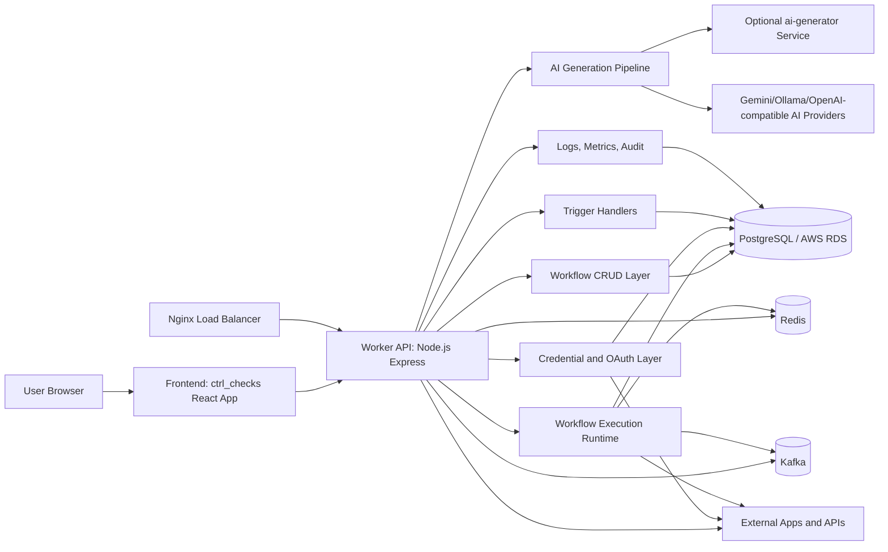
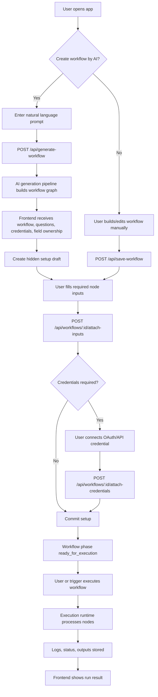
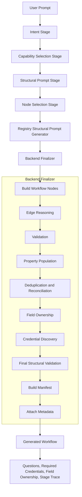
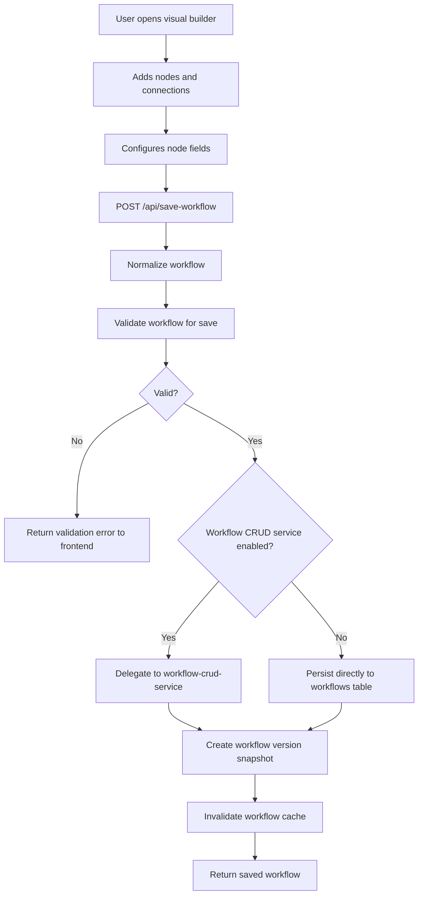
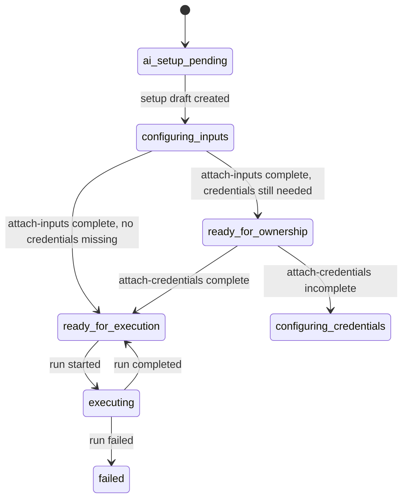
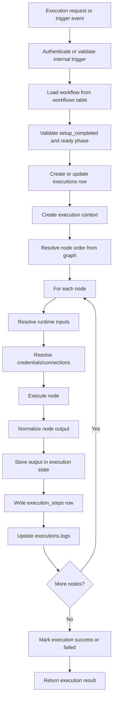
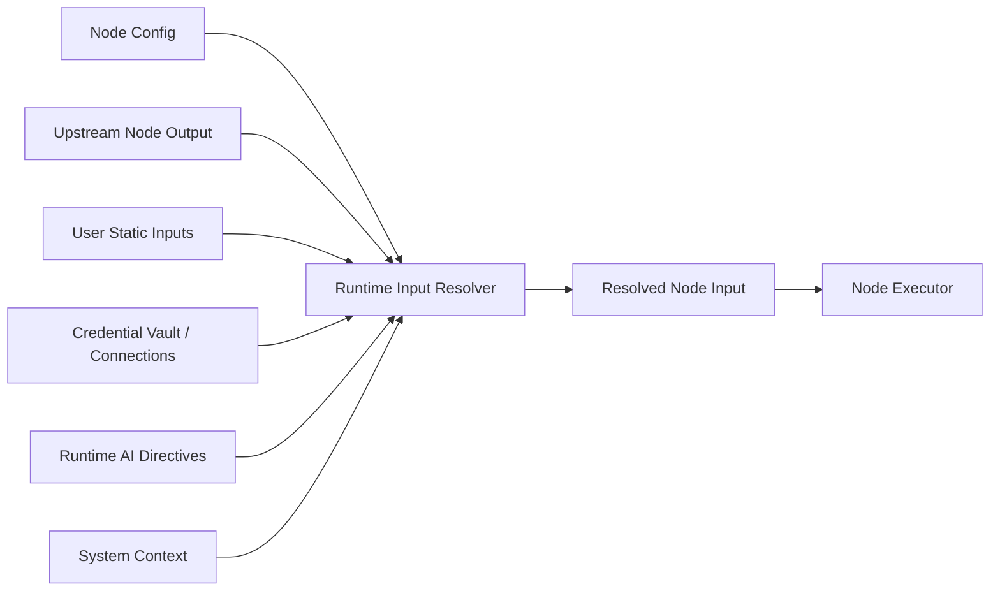
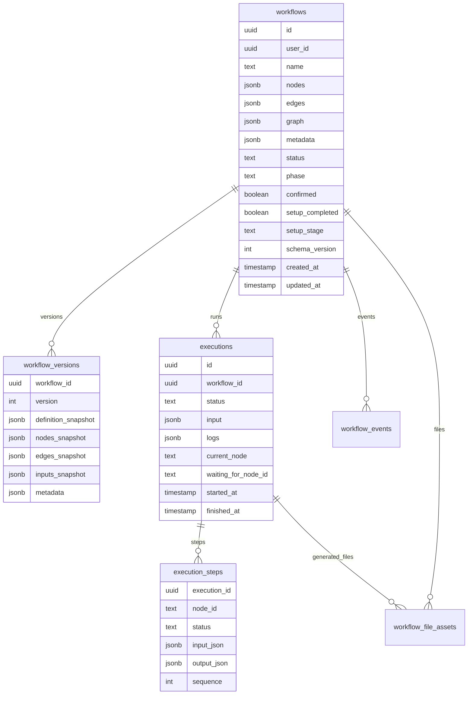

# CtrlChecks End-to-End Detailed Architecture

Prepared for client and engineering handover  
Project: CtrlChecks AI Workflow Automation Platform  
Date: 2026-07-26  
Scope: End-to-end setup, user journey, AI generation workflow, normal/manual workflow, storage, annotations, execution, and operational flow.

## 1. Purpose

This document explains how CtrlChecks works end to end. It is intended to help a client, technical reviewer, or onboarding engineer understand:

- What the platform does.
- How users create workflows.
- How AI-generated workflows are produced stage by stage.
- How manually created workflows move through save, setup, and execution.
- Where workflow data, metadata, credentials, logs, files, and annotations are stored.
- Which services are involved.
- Which APIs are used in each major flow.
- How to set up and operate the platform.

This document does not include secret values. It names required variables and storage locations only.

## 2. System Summary

CtrlChecks is an AI-assisted workflow automation platform. A user can describe an automation in natural language, review an AI-generated workflow, configure required inputs and credentials, save the workflow, and execute it. A user can also build or edit workflows manually on the visual canvas.

The system is composed of:

- A React/TypeScript frontend in `ctrl_checks/`.
- A Node.js/Express/TypeScript worker backend in `worker/`.
- Supporting microservices in `services/`.
- PostgreSQL/RDS as the primary persistent database.
- Redis for cache, coordination, and runtime state.
- Kafka for durable request/execution queueing.
- Nginx for API and WebSocket load balancing.
- AI generation through local worker logic and optional remote `ai-generator` service.
- External integrations through OAuth/API credentials and node executors.

## 3. Repository Map

```text
ctrlchecks-hostinger/
  ctrl_checks/                       Frontend web app
  worker/                            Main backend worker and execution engine
  services/
    ai-generator/                    Extracted AI generation service
    workflow-crud-service/           Workflow save/load/version service
    trigger-service/                 Trigger service for webhook/form/chat/schedule
    credential-service/              Credential and OAuth service
    execution-engine/                Extracted execution service
    notification-service/            Notification service
  infra/
    docker-compose.yml               Production-style local/server orchestration
    nginx.conf                       Load balancer and WebSocket proxy
    grafana/                         Dashboard definitions
    prometheus/                      Metrics collection config
  infrastructure/terraform/          AWS infrastructure-as-code
  docs/                              Client and handover documentation
  testing/                           Workflow test fixtures
  tests/                             Load and platform tests
```

## 4. Technology Stack

### Frontend

- React 18
- TypeScript
- Vite
- Tailwind CSS
- Radix UI / shadcn-style components
- React Router
- TanStack Query
- Zustand
- XYFlow / React Flow for workflow canvas
- Vitest and Playwright

### Backend

- Node.js
- Express.js
- TypeScript
- Prisma and direct PostgreSQL clients
- Redis
- Kafka
- WebSocket
- Sentry
- Prometheus metrics

### Data and Infrastructure

- PostgreSQL / AWS RDS
- PgBouncer
- Redis
- Kafka and Zookeeper
- Nginx
- Docker Compose
- Terraform for AWS VPC, EC2, ALB, CloudFront, S3, Route53, IAM, and CloudWatch

## 5. System Context Flowchart



## 6. Main Actors and Responsibilities

### User

The user creates a workflow using either:

- AI prompt-based generation.
- Manual visual builder.
- Template copy/edit.

The user then fills required inputs, connects credentials, saves the workflow, and runs it.

### Frontend

The frontend is responsible for:

- Showing the workflow canvas.
- Sending generation prompts to the backend.
- Displaying AI progress by stage.
- Showing capability options, questions, missing inputs, and missing credentials.
- Collecting node configuration fields.
- Starting save, setup, credential attachment, and execution requests.
- Showing run status, logs, and output.

### Worker API

The worker is responsible for:

- Authentication and request validation.
- AI workflow generation.
- Workflow normalization and validation.
- Workflow persistence.
- Setup lifecycle and phase transitions.
- Credential discovery and injection.
- Execution runtime.
- Runtime input resolution.
- Logs, metrics, and health endpoints.

### Microservices

The services directory contains extracted bounded contexts:

- `workflow-crud-service`: save/load/list/delete/version snapshots.
- `ai-generator`: optional remote AI stage execution.
- `trigger-service`: webhook/form/chat/schedule trigger ownership.
- `credential-service`: OAuth, credential vault, connection CRUD.
- `execution-engine`: extracted workflow runtime responsibilities.
- `notification-service`: email, in-app, and webhook notifications.

The worker currently remains the main integration point and can delegate to services through canary-style client logic where enabled.

## 7. End-to-End User Journey



## 8. AI Workflow Generation Architecture

The canonical AI workflow generation entry point is:

```text
POST /api/generate-workflow
worker/src/api/generate-workflow.ts
worker/src/services/ai/pipeline/workflow-generation-pipeline.ts
```

The older `AiFirstPipeline` is deprecated and kept for compatibility. The active pipeline is `WorkflowGenerationPipeline`.

### AI Pipeline Summary



## 9. AI Generation Stage Details

The platform tracks each AI stage with a progress value and a user-facing log label.

| Stage | Progress | User-facing text | Main responsibility |
| --- | ---: | --- | --- |
| `intent` | 10 | `Extracting intent...` | Convert natural language prompt into structured intent. |
| `capability_selection` | 18 | `Preparing capability options...` | Map intent actions to registry-backed candidate node types. |
| `structural_prompt` | 28 | `Building structural blueprint...` | Create a structural description/blueprint for the workflow. |
| `node_selection` | 40 | `Selecting workflow nodes...` | Select minimal valid nodes from the node registry. |
| `edge_reasoning` | 50 | `Reasoning about edges...` | Determine graph order and edges. |
| `validation` | 62 | `Validating graph structure...` | Validate graph structure, semantic alignment, completeness, and data flow. |
| `property_population` | 74 | `Populating node properties...` | Populate build-time AI fields and runtime field directives. |
| `credential_discovery` | 85 | `Discovering credentials...` | Detect required and missing credentials. |
| `field_ownership` | 93 | `Assigning field ownership...` | Decide whether fields are AI-built, runtime AI, user-owned, or credential-owned. |
| `build_manifest` | 99 | `Finalizing workflow...` | Seal build metadata and attach canonical workflow metadata. |

Source:

```text
worker/src/services/ai/stage-progress-map.ts
```

## 10. Stage Prompt Contracts

The internal prompt builder creates deterministic prompts with four mandatory parts:

1. Role and objective.
2. Node catalog.
3. Output JSON schema.
4. Hard constraints for the stage.

Source:

```text
worker/src/services/ai/system-prompt-builder.ts
```

### 10.1 Intent Stage

Purpose:

- Read the user prompt.
- Extract structured intent.
- Do not generate workflow nodes yet.

Input:

```json
{
  "userPrompt": "When a form is submitted, check if experience is greater than 3 years and send a Slack message if approved."
}
```

Output contract:

```json
{
  "intent": "string",
  "triggerType": "schedule | webhook | form | chat_trigger | manual_trigger",
  "actions": ["string"],
  "dataFlows": [
    {
      "from": "string",
      "to": "string",
      "dataDescription": "string"
    }
  ],
  "constraints": ["string"]
}
```

Important rules:

- Preserve service names exactly, such as Gmail, Slack, Google Sheets, Notion.
- Do not generalize a named service into a generic service.
- Do not include utility/transformation actions unless explicitly requested.
- Preserve distinct branch actions separately.

### 10.2 Capability Selection Stage

Purpose:

- Convert structured intent into step-wise candidate node choices.
- Use only canonical node types from the live node catalog.
- Add one trigger step and one step for each user action.

Output contract:

```json
{
  "steps": [
    {
      "stepId": "trigger",
      "stepText": "manual trigger",
      "intentClass": "trigger",
      "candidateNodeTypes": ["manual_trigger"],
      "defaultSuggestedNodeType": "manual_trigger",
      "confidence": 0.9,
      "ambiguous": false,
      "reason": "Trigger selected from structured intent",
      "selectionPolicy": {
        "multiSelectAllowed": false,
        "required": true
      }
    }
  ]
}
```

Important rules:

- Use only registered node types.
- Prefer the exact service mentioned by the user.
- Detect conditional logic and select `if_else` or `switch`.
- Prefer domain-specific nodes over generic alternatives.
- Repair missing destination coverage when the prompt explicitly mentions a destination service.

### 10.3 Structural Prompt Stage

Purpose:

- Produce a structural workflow blueprint from structured intent and selected capabilities.
- This can use the remote `ai-generator` service first, then local fallback.

Example structural output format:

```text
WORKFLOW: Automate form submission review and notification

TRIGGER: Form - triggered on form submission

FLOW:
1. Form - starts the workflow
2. If/Else - evaluates conditions and routes to the appropriate branch
  -> Case "true": Slack Message - notify reviewer
  -> Case "false": Gmail - send rejection email

CONNECTIONS: Form outputs data -> If/Else reads the routing field -> each branch node receives the full upstream payload.
```

### 10.4 Node Selection Stage

Purpose:

- Select the minimal set of workflow nodes required by the user prompt.
- Enforce registry-backed node types.
- Avoid helper, logging, retry, or utility nodes unless explicitly requested.

Output contract:

```json
{
  "selectedNodes": [
    {
      "type": "manual_trigger",
      "role": "trigger",
      "reason": "Starts the workflow"
    },
    {
      "type": "google_sheets",
      "role": "action",
      "reason": "Stores data in Google Sheets"
    }
  ]
}
```

Important rules:

- Exactly one trigger node.
- Minimal necessary nodes only.
- Utility nodes are forbidden unless explicitly requested.
- Branches must have independent node instances.
- Use `if_else` for binary decisions.
- Use `switch` for multi-case routing.
- Use `loop` for per-item processing.

### 10.5 Structural Prompt Generator

Purpose:

- Convert selected nodes and structured intent into a readable workflow description.
- Registry-driven and deterministic.
- Uses registry labels instead of raw internal node type strings.

Source:

```text
worker/src/services/ai/stages/structural-prompt-generator.ts
```

Output sections:

```text
WORKFLOW
TRIGGER
FLOW
CONNECTIONS
```

### 10.6 Edge Reasoning Stage

Purpose:

- Determine execution order.
- Generate edge list.
- Keep graph acyclic and connected.
- Use deterministic linear graph building when the workflow is linear.
- Use LLM edge reasoning for branching or complex graph shapes.

Output contract:

```json
{
  "orderedNodes": ["node_manual_trigger_1", "node_google_sheets_1"],
  "edges": [
    {
      "source": "node_manual_trigger_1",
      "target": "node_google_sheets_1",
      "type": "main"
    }
  ]
}
```

Important rules:

- No cycles.
- Exactly one trigger.
- Every non-terminal node has an outgoing edge.
- Every non-trigger node has an incoming edge.
- If/Else edges must be `true` and `false`.
- Switch edges must use semantic case values.
- Merge nodes are required when branches reconverge.
- Graph materialization goes through `UnifiedGraphOrchestrator`.

### 10.7 Validation Stage

Purpose:

- Validate the workflow graph before returning it to the frontend.
- The LLM validates semantics and data flow.
- The `UnifiedGraphOrchestrator` validates graph structure as a safety net.

Validation dimensions:

- Structural validity.
- Semantic alignment.
- Completeness.
- Data flow coherence.

Output contract:

```json
{
  "status": "pass",
  "issues": []
}
```

If validation fails, an automated repair pass may run. If structural validation still fails, generation returns an error.

### 10.8 Property Population Stage

Purpose:

- Populate node configuration fields that can be safely filled at build time.
- Generate directives for fields that must be resolved by AI at runtime.
- Never mutate workflow edges.
- Never fail the whole pipeline because of one node field failure.

Field modes:

| Mode | Meaning |
| --- | --- |
| `buildtime_ai_once` | AI fills this once during workflow generation/setup. |
| `runtime_ai` | AI resolves the field at execution time from live payload/context. |
| `manual_static` | User owns and provides the value. |
| `credential` ownership | Credential/service connection supplies the value. |

Stored node annotations:

```json
{
  "_fillMode": {
    "subject": "buildtime_ai_once",
    "body": "runtime_ai",
    "recipient": "manual_static"
  },
  "_fieldDirectives": {
    "body": "Write professional message body using upstream form fields."
  }
}
```

### 10.9 Field Ownership Stage

Purpose:

- Resolve each node input field into an ownership/fill policy.
- Write normalized `_fillMode` metadata onto node configuration.
- Return both legacy and rich policy maps to the frontend.

Frontend usage:

- Shows which fields are already AI-filled.
- Shows which fields require user input.
- Shows which fields are credential-owned.
- Shows which fields are resolved at runtime.

### 10.10 Credential Discovery Stage

Purpose:

- Discover which credentials are required by the generated workflow.
- Check which credentials are already satisfied.
- Return missing credentials to the frontend.

This stage is non-blocking during generation. Missing credentials are handled during setup.

### 10.11 Build Manifest Stage

Purpose:

- Seal the final generation metadata.
- Store a SHA-256 integrity hash.
- Preserve the original prompt, structured intent, structural blueprint, authorized nodes, graph specification, field ownership snapshot, and credential discovery summary.

Stored location:

```text
workflow.metadata.buildManifest
```

Manifest shape:

```json
{
  "version": 1,
  "correlationId": "uuid",
  "createdAt": "ISO timestamp",
  "userPrompt": "original user prompt",
  "intent": {
    "intent": "string",
    "triggerType": "manual_trigger",
    "actions": [],
    "dataFlows": [],
    "constraints": []
  },
  "structuralBlueprint": "blueprint text",
  "authorizedNodes": [],
  "branchingSpec": {
    "mode": "linear"
  },
  "graphSpec": {
    "kind": "deterministic_plan_chain",
    "planChain": []
  },
  "hydrationSpec": {
    "populatedNodeIds": [],
    "populatedFieldsByNodeId": {}
  },
  "credentialDiscovery": {
    "requiredCredentialKeys": []
  },
  "fieldOwnershipSnapshot": {},
  "integrity": {
    "contentHash": "sha256"
  }
}
```

## 11. Generated Workflow Response

After successful generation, the backend returns:

```json
{
  "success": true,
  "phase": "ready",
  "workflow": {
    "nodes": [],
    "edges": [],
    "metadata": {}
  },
  "validationIssues": [],
  "comprehensiveQuestions": [],
  "requiredCredentials": [],
  "missingCredentials": [],
  "discoveredCredentials": [],
  "credentialStatuses": [],
  "fieldOwnershipMap": {},
  "fieldOwnershipPolicyMap": {},
  "stageTrace": [],
  "propertyPopulationSummary": {},
  "capabilityOptions": [],
  "appliedCapabilitySelectionsByStep": {},
  "correlationId": "uuid"
}
```

Streaming mode uses NDJSON when the `x-stream-progress` header is enabled. Each stage emits:

```json
{
  "current_phase": "node_selection",
  "progress_percentage": 40,
  "log": "Selecting workflow nodes..."
}
```

The final NDJSON event includes the generated workflow and same terminal payload fields as the non-streaming response.

## 12. Normal Manual Workflow Architecture

Manual workflow flow is used when a user builds or edits a workflow directly on the canvas instead of generating from AI.



Manual save endpoint:

```text
POST /api/save-workflow
worker/src/api/save-workflow.ts
```

The save flow:

1. Authenticates user.
2. Requires workflow name.
3. Requires `nodes` and `edges` arrays.
4. Normalizes the workflow.
5. Validates with fail-fast save validation.
6. Delegates to `workflow-crud-service` if enabled for that user.
7. Otherwise saves directly to PostgreSQL.
8. Creates a version snapshot.
9. Invalidates memory/cache.
10. Returns workflow ID and saved workflow row.

## 13. AI Setup Lifecycle

AI-generated workflows are often saved first as hidden setup drafts so the frontend can guide the user through inputs and credentials before the workflow is visible/ready.



Key endpoints:

```text
POST /api/workflows/setup-draft
POST /api/workflows/:workflowId/attach-inputs
POST /api/workflows/:workflowId/attach-credentials
POST /api/workflows/:workflowId/commit-setup
GET  /api/workflows/:workflowId/missing-items
GET  /api/workflows/:workflowId/field-ownership-catalog
```

### Setup Draft

Purpose:

- Store generated graph as a hidden draft.
- Mark workflow as setup pending.
- Validate that the graph is safe to open in editor.

Important stored fields:

```json
{
  "status": "draft",
  "phase": "draft",
  "confirmed": false,
  "setup_completed": false,
  "setup_stage": "ai_setup_pending",
  "metadata": {
    "aiSetup": {
      "pending": true,
      "stage": "ai_setup_pending"
    }
  }
}
```

### Attach Inputs

Purpose:

- Apply user-provided node configuration values.
- Apply field ownership changes.
- Preserve topology after the workflow is frozen.
- Set workflow phase based on missing inputs and credentials.

Important input key patterns:

```text
input_<nodeId>_<fieldName>
config_<nodeId>_<fieldName>
resource_<nodeId>_<fieldName>
op_<nodeId>_<fieldName>
mode_<nodeId>_<fieldName>
unlock_<nodeId>_<fieldName>
ownership_<nodeId>_<fieldName>
```

Important metadata:

```json
{
  "freezeBoundary": {
    "frozen": true,
    "frozenAt": "ISO timestamp",
    "lifecyclePhase": "ready_for_ownership",
    "freezePolicy": "topology_only",
    "baselineTopologyFingerprint": "hash",
    "baselineProtectedConfigFingerprint": "hash"
  },
  "lastAttachInputs": {
    "payloadHash": "hash",
    "topologyFingerprint": "hash"
  }
}
```

### Attach Credentials

Purpose:

- Inject credential references into credential-owned fields.
- Reject credentials that are not required by the workflow.
- Preserve graph topology after freeze.
- Move workflow to `ready_for_execution` when all credentials are satisfied.

Important protections:

- Requires phase `ready_for_ownership`.
- Requires a frozen topology boundary.
- Blocks topology mutation during credential attachment.
- Writes workflow events such as `CREDS_ATTACHED` and `READY`.

## 14. Execution Architecture

Main execution route:

```text
worker/src/api/execute-workflow.ts
```

Execution can be started by:

- User clicking run.
- Manual trigger.
- Webhook trigger.
- Form trigger.
- Chat trigger.
- Schedule/interval trigger.
- Internal trigger service.
- Queue worker.



Execution runtime uses:

- `executions` table for run status, trigger, input, logs, current node, errors, and finish time.
- `execution_steps` table for per-node input/output/status/retry data.
- In-memory and persistent execution state layers.
- Redis cache/coordination where configured.
- Optional object storage for large payloads.
- `workflow_file_assets` for file/binary payload references.

## 15. Runtime Input Resolution

At runtime, each node receives inputs from multiple possible sources:



Input source examples:

- Static config value: user typed it or AI generated it during setup.
- Template reference: `{{$json.fieldName}}` from upstream output.
- Runtime AI: value is generated during execution using stored `_fieldDirectives`.
- Credential: value comes from connection/vault lookup.
- System value: workflow ID, execution ID, trigger payload, timestamps.

## 16. Storage Architecture



### Primary Workflow Storage

Primary table:

```text
workflows
```

Important columns:

```text
id
user_id
name
nodes
edges
graph
metadata
status
phase
confirmed
setup_completed
setup_stage
setup_completed_at
schema_version
settings
quota_source
created_at
updated_at
```

The `graph` column stores a synced payload:

```json
{
  "nodes": [],
  "edges": [],
  "metadata": {}
}
```

The separate `nodes` and `edges` columns remain important because multiple older and newer code paths read them directly.

### Workflow Version Storage

Version snapshots are written after successful save/update.

Table:

```text
workflow_versions
```

Purpose:

- Audit changes.
- Support rollback.
- Compare definitions.
- Preserve previous and current workflow state.

### Execution Storage

Execution tables:

```text
executions
execution_steps
```

Purpose:

- Track run status.
- Track per-node execution.
- Preserve resolved inputs.
- Preserve outputs.
- Support resume/waiting states.
- Support frontend execution logs.
- Support AI execution analysis.

### File and Binary Storage

Large or binary payloads are stored through:

```text
workflow_file_assets
```

Fields include:

```text
user_id
workflow_id
execution_id
node_id
file_name
mime_type
size_bytes
checksum_sha256
storage_provider
storage_key
visibility
expires_at
```

This allows workflow node outputs to reference large files without putting the whole payload into execution logs.

## 17. Annotation Model

CtrlChecks stores several important annotations on workflows and nodes.

### Workflow Metadata

Typical metadata keys:

```json
{
  "originalUserPrompt": "User prompt",
  "structuralBlueprintSummary": "Shortened structural blueprint",
  "aiPipelineCorrelationId": "uuid",
  "timestamp": "ISO timestamp",
  "buildManifest": {},
  "aiSetup": {},
  "freezeBoundary": {},
  "appliedMigrations": [],
  "lastAttachInputs": {}
}
```

### Node Config Annotations

Typical node config metadata keys:

```json
{
  "_fillMode": {
    "fieldName": "manual_static | buildtime_ai_once | runtime_ai"
  },
  "_fieldDirectives": {
    "fieldName": "Instruction used by runtime AI resolver"
  },
  "_ownershipUnlock": {
    "fieldName": true
  },
  "connectionRefs": {
    "provider": "connection-id"
  }
}
```

### Stage Trace Annotation

Every generation stage produces a trace entry:

```json
{
  "stage": "node_selection",
  "startedAt": 1710000000000,
  "completedAt": 1710000001000,
  "durationMs": 1000,
  "inputSummary": "actions=2",
  "outputSummary": "selectedNodes=3",
  "llmCall": {
    "model": "gemini-3.5-flash",
    "temperature": 0.1,
    "promptTokens": 100,
    "completionTokens": 50
  },
  "error": null
}
```

## 18. API Map

### Generation and Setup

```text
POST /api/generate-workflow
POST /api/workflows/setup-draft
POST /api/workflows/:workflowId/attach-inputs
POST /api/workflows/:workflowId/attach-credentials
POST /api/workflows/:workflowId/commit-setup
GET  /api/workflows/:workflowId/missing-items
GET  /api/workflows/:workflowId/field-ownership-catalog
GET  /api/workflows/:workflowId/last-resolved-inputs
```

### Workflow CRUD

```text
POST   /api/save-workflow
GET    /api/workflows
GET    /api/workflows/:id
DELETE /api/workflows/:id
GET    /api/workflow/version/:workflowId
GET    /api/workflows/:id/versions
POST   /api/workflows/:id/rollback
```

### Execution

```text
POST /api/execute-workflow
POST /api/internal/engine-execute
GET  /api/execution-status/:executionId
GET  /api/execution-queue/stats
GET  /api/execution-queue/job/:jobId
POST /api/execution-queue/job/:jobId/cancel
GET  /api/workflow-logs/:executionId
GET  /api/workflow-logs/workflow/:workflowId
```

### Triggers

```text
GET  /api/form-trigger/:workflowId/:nodeId
POST /api/form-trigger/:workflowId/:nodeId/submit
GET  /api/chat-trigger/:workflowId/:nodeId
POST /api/chat-trigger/:workflowId/:nodeId/message
POST /api/gmail/webhook/:workflowId/:nodeId
POST /api/github/webhook/:workflowId/:nodeId
POST /api/slack/webhook/:workflowId/:nodeId
```

Exact trigger support depends on enabled route handlers and configured credentials.

### Credential and Connection APIs

```text
GET    /api/credential-connections/registry/nodes
GET    /api/credential-connections/credential-types
GET    /api/credential-connections/connections
POST   /api/credential-connections/connections
PUT    /api/credential-connections/connections/:id
DELETE /api/credential-connections/connections/:id
POST   /api/credential-connections/connections/:id/test
GET    /api/credential-connections/oauth/start
POST   /api/credential-connections/oauth/start
GET    /api/credential-connections/oauth/callback
POST   /api/credential-connections/oauth/callback
```

## 19. API Request Examples

### Generate Workflow

```http
POST /api/generate-workflow
Authorization: Bearer <user_token>
Content-Type: application/json
```

```json
{
  "prompt": "When a form is submitted, if experience is greater than 3 years send a Slack message, otherwise send a Gmail email.",
  "userId": "user-id"
}
```

### Save Manual Workflow

```http
POST /api/save-workflow
Authorization: Bearer <user_token>
Content-Type: application/json
```

```json
{
  "name": "Manual Workflow",
  "nodes": [],
  "edges": [],
  "settings": {},
  "metadata": {}
}
```

### Attach Inputs

```http
POST /api/workflows/<workflowId>/attach-inputs
Authorization: Bearer <user_token>
Content-Type: application/json
```

```json
{
  "inputs": {
    "input_node_google_gmail_1_subject": "Application status",
    "mode_node_google_gmail_1_body": "runtime_ai"
  },
  "originalUserPrompt": "Original prompt"
}
```

### Attach Credentials

```http
POST /api/workflows/<workflowId>/attach-credentials
Authorization: Bearer <user_token>
Content-Type: application/json
```

```json
{
  "credentials": {
    "google": "connection-or-vault-reference"
  }
}
```

## 20. End-to-End Setup

### 20.1 Prerequisites

Install:

- Node.js matching `.nvmrc`
- npm
- PostgreSQL or access to configured AWS RDS/PostgreSQL
- Redis if running queue/cache features locally
- Kafka if running distributed queue features locally
- Terraform if deploying AWS infrastructure

### 20.2 Frontend Setup

```powershell
cd ctrl_checks
npm install
Copy-Item .env.production.example .env.local
npm run dev
```

Common frontend environment variables:

```text
VITE_SUPABASE_URL
VITE_SUPABASE_PUBLISHABLE_KEY
VITE_API_URL
VITE_PYTHON_BACKEND_URL
```

### 20.3 Worker Setup

```powershell
cd worker
npm install
Copy-Item env.example .env
npm run dev
```

Common worker environment variables:

```text
DATABASE_URL
DIRECT_DATABASE_URL
REDIS_URL
KAFKA_BROKERS
KAFKA_REQUEST_TOPIC
KAFKA_DEAD_LETTER_TOPIC
SUPABASE_URL
SUPABASE_SERVICE_ROLE_KEY
OLLAMA_HOST
OLLAMA_BASE_URL
FASTAPI_OLLAMA_URL
PYTHON_BACKEND_URL
PORT
CORS_ORIGIN
SENTRY_DSN
AI_GENERATOR_URL
```

### 20.4 Microservice Setup

Each service follows the same basic pattern:

```powershell
cd services\workflow-crud-service
npm install
npm run dev
```

Services:

```text
services/ai-generator
services/workflow-crud-service
services/trigger-service
services/credential-service
services/execution-engine
services/notification-service
```

### 20.5 Production-Style Docker Setup

Production-style orchestration is defined in:

```text
infra/docker-compose.yml
```

It includes:

- Nginx
- Three worker app replicas
- Request worker replicas
- Execution worker replicas
- Redis
- Kafka
- Zookeeper
- PgBouncer
- AWS RDS PostgreSQL connection

Start example:

```powershell
cd infra
docker compose up --build
```

### 20.6 AWS Terraform Setup

Terraform infrastructure is under:

```text
infrastructure/terraform/
```

Expected AWS resources:

- VPC
- Public/private subnets
- EC2 instances
- ALB
- CloudFront
- S3
- Route53
- CloudWatch
- IAM

Commands:

```bash
cd infrastructure/terraform
terraform init
terraform plan
terraform apply
```

## 21. Operational Checks

Health and readiness:

```text
GET /health
GET /health/live
GET /health/ready
GET /metrics
```

Recommended checks before client handover:

1. Frontend loads.
2. User authentication works.
3. `POST /api/generate-workflow` returns a graph.
4. Generated graph opens in the editor.
5. Attach-inputs stores config and freeze metadata.
6. Attach-credentials preserves topology and moves workflow to ready state.
7. Manual save works through `/api/save-workflow`.
8. Execution creates `executions` and `execution_steps` rows.
9. Logs appear in frontend.
10. Metrics endpoint is reachable.

## 22. Security Model

Security principles:

- Never commit `.env` files.
- Keep service-role keys server-side only.
- OAuth credentials should be stored through approved credential flows.
- API routes that modify workflows require authenticated users.
- Workflow CRUD is user-scoped by `user_id`.
- Attach-inputs rejects credential-shaped input keys unless they follow allowed wizard formats.
- Attach-credentials rejects unknown credential keys.
- Frozen workflow topology prevents setup-time credential/input mutation from changing graph structure.
- Rate limits are applied to AI generation endpoints.
- Audit events are written for key lifecycle transitions.

## 23. Reliability and Data Integrity

Important integrity mechanisms:

- Fail-fast save validation.
- Graph normalization before save.
- `UnifiedGraphOrchestrator` for graph creation/reconciliation/validation.
- Topology fingerprinting during setup.
- Freeze boundary after inputs are attached.
- Credential attachment topology preservation.
- Version snapshots after saves and major setup updates.
- Cache invalidation after workflow save/update.
- Execution logs and per-node execution steps.
- Kafka dead-letter topic for queue failures.
- Circuit breaker support for provider-level reliability.

## 24. Client Handover Checklist

Before final client delivery, confirm:

- Production frontend URL.
- Production API URL.
- Database host and ownership.
- OAuth app ownership for each integration.
- Required environment variable names.
- Secret transfer process.
- Backup and restore process.
- Monitoring dashboard URL.
- Alerting channel.
- Known limitations.
- Test evidence.
- Support/maintenance owner.

## 25. Source References

Important implementation files:

```text
ctrl_checks/package.json
worker/package.json
worker/src/api/generate-workflow.ts
worker/src/services/ai/pipeline/workflow-generation-pipeline.ts
worker/src/services/ai/pipeline/backend-finalizer.ts
worker/src/services/ai/stage-progress-map.ts
worker/src/services/ai/system-prompt-builder.ts
worker/src/services/ai/stages/intent-stage.ts
worker/src/services/ai/stages/capability-selection-stage.ts
worker/src/services/ai/stages/node-selection-stage.ts
worker/src/services/ai/stages/edge-reasoning-stage.ts
worker/src/services/ai/stages/validation-stage.ts
worker/src/services/ai/stages/property-population-stage.ts
worker/src/services/ai/stages/field-ownership-stage.ts
worker/src/core/types/workflow-build-manifest.ts
worker/src/api/save-workflow.ts
worker/src/api/workflow-setup-lifecycle.ts
worker/src/api/attach-inputs.ts
worker/src/api/attach-credentials.ts
worker/src/api/execute-workflow.ts
services/workflow-crud-service/src/lib/save-workflow.ts
services/workflow-crud-service/src/lib/workflow-repo.ts
infra/docker-compose.yml
infra/nginx.conf
infrastructure/terraform/README.md
```

