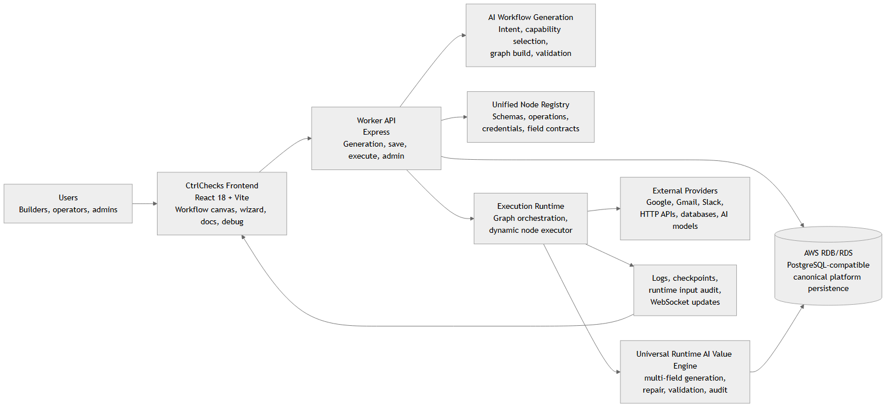
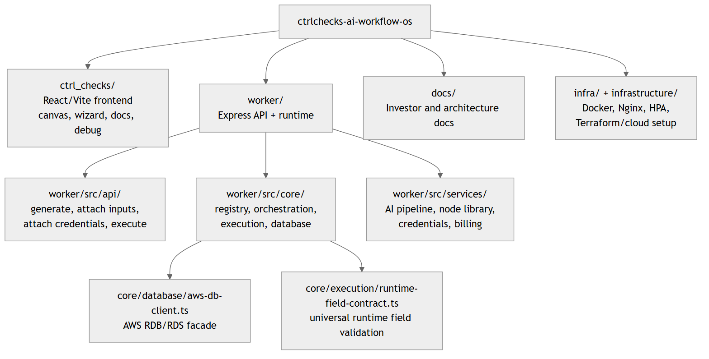
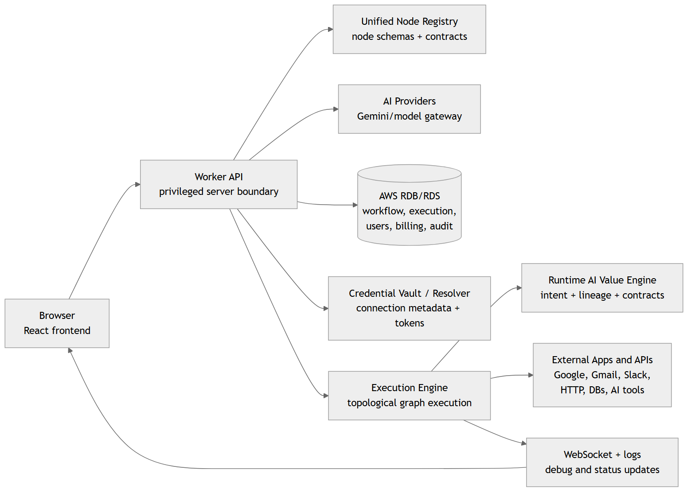
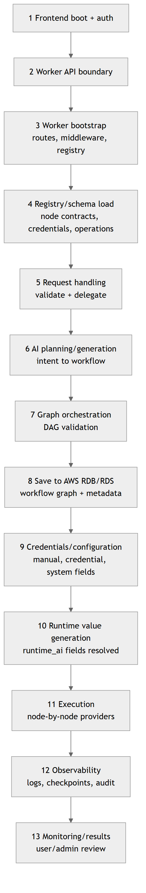
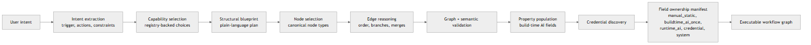
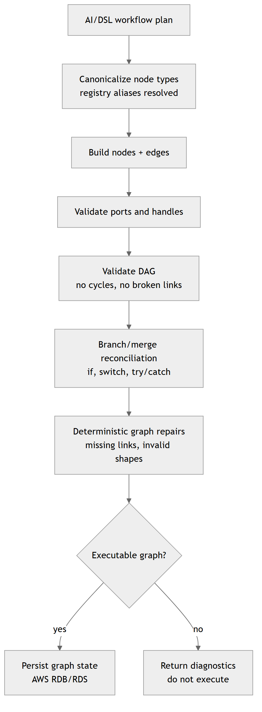
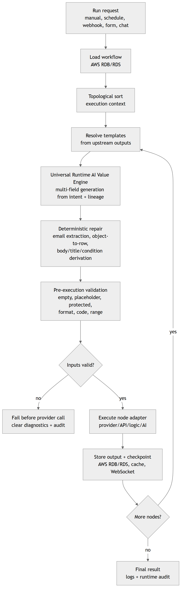
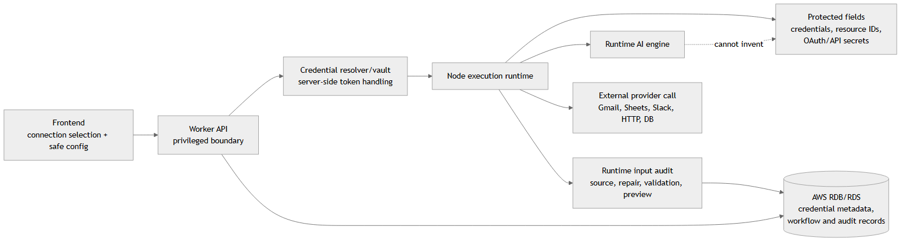
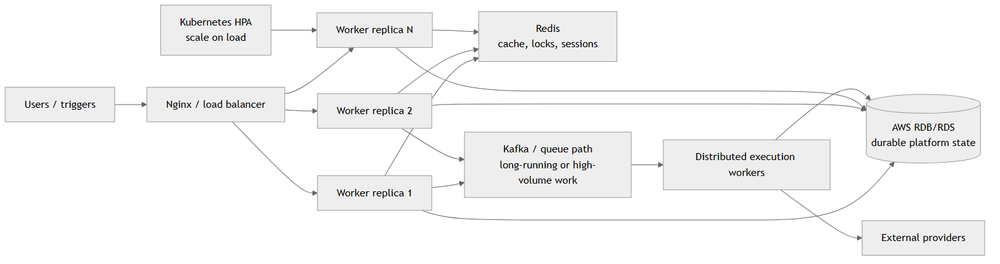
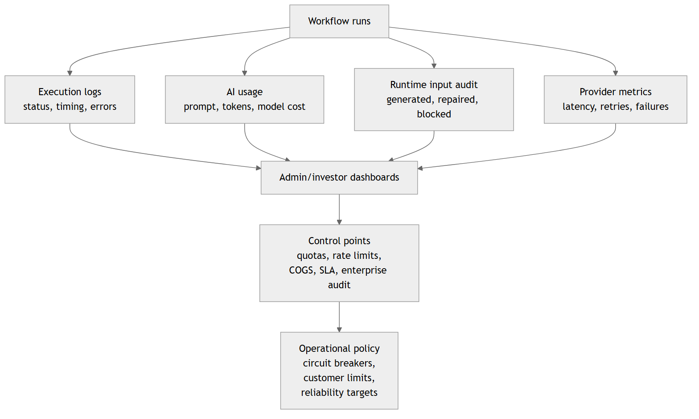

# CtrlChecks AI Workflow OS: Investor Architecture Report

Date: 2026-05-25
Version: 1.1
Prepared for: Investor architecture review
Scope: Current monorepo architecture, frontend, worker, AWS RDB/RDS data layer, AI generation, universal runtime value generation, execution, security, and scaling path.

## Document Safety Note

This report intentionally describes environment variables and secret categories generically. It does not include private keys, database URLs, service-role tokens, payment secrets, OAuth tokens, API keys, or values from local environment files.

## Executive Architecture Summary

CtrlChecks is an AI-native workflow automation platform. Users can build automations manually on a visual canvas or describe an automation in natural language and let the backend generate an executable workflow graph.

The backend worker is the architectural authority. It owns workflow generation, node contracts, graph validation, execution, credentials, server-side AI calls, runtime value generation, audit, and persistence. The frontend is primarily the interaction, visualization, configuration, and debugging layer.

The core architectural moat is the combination of:

- A unified node registry that defines supported node behavior and field contracts.
- A deterministic graph orchestration layer that keeps workflows executable.
- A staged AI generation pipeline that converts user intent into registry-backed workflow graphs.
- A universal runtime AI value engine that generates execution-time values from intent, upstream outputs, node contracts, and lineage.
- AWS RDB/RDS-backed persistence for workflow, execution, user, billing, credential metadata, and audit data.

## Repository Architecture

The monorepo separates product UI, backend runtime, documentation, and infrastructure assets. This split lets investor, client, engineering, and deployment materials evolve without changing runtime code.

| Area | Path | Responsibility |
| --- | --- | --- |
| Frontend | `ctrl_checks/` | React 18, Vite, workflow canvas, dashboard, docs, auth UI, execution console |
| Worker API | `worker/src/index.ts` | Express bootstrap, route mounting, CORS, middleware, health |
| AI generation | `worker/src/api/generate-workflow.ts` | Primary prompt-to-workflow API |
| Pipeline | `worker/src/services/ai/pipeline/workflow-generation-pipeline.ts` | Intent, selection, validation, population, manifest |
| Execution | `worker/src/api/execute-workflow.ts` | Manual and trigger execution path |
| Runtime engine | `worker/src/core/execution/` | Dynamic executor, field contracts, validation, repair, audit |
| Registry/orchestration | `worker/src/core/` | Unified node registry, graph orchestrator, execution core |
| Database | `worker/src/core/database/aws-db-client.ts` | AWS RDB/RDS PostgreSQL-compatible database facade |
| Infrastructure | `infra/`, `infrastructure/` | Docker, Nginx, HPA, Terraform/cloud setup |

## Runtime Topology

The browser talks to the worker for workflow intelligence, workflow persistence, node definitions, AI-assisted operations, credential and input attachment, workflow execution, and debug data.

The worker performs privileged operations. It persists platform data through the AWS RDB/RDS-backed database client, calls model providers for AI tasks, resolves credentials server-side, and calls third-party APIs during node execution.

## End-to-End Lifecycle

The platform lifecycle starts with either natural-language intent or manual graph editing. The flow then moves through generation, graph validation, save/configure, credential binding, runtime value resolution, execution, and observability.

This lifecycle matters for investors because the product is not only a prompt UI. It includes runtime infrastructure, credential systems, workflow persistence, deterministic graph controls, and execution feedback loops.

| Stage | Name | Investor-readable purpose |
| --- | --- | --- |
| 1 | Frontend boot and auth | React app loads user session and workflow shell. |
| 2 | API boundary | Frontend uses worker APIs for privileged workflow, AI, execution, and persistence operations. |
| 3 | Worker bootstrap | Express loads configuration categories, middleware, registries, and routes. |
| 4 | Registry/schema load | Node contracts, defaults, credentials, operations, and execution behavior become available. |
| 5 | Request handling | API route authenticates, validates, and delegates to service layers. |
| 6 | AI planning/generation | Model-assisted stages convert intent into a registry-backed workflow. |
| 7 | Graph orchestration | The graph orchestrator builds and validates the DAG. |
| 8 | Persistence | Workflow JSON, graph state, metadata, and versions are stored in AWS RDB/RDS. |
| 9 | Credentials/configuration | Required inputs and OAuth/API credentials are resolved without exposing secrets to the frontend. |
| 10 | Runtime value generation | Runtime-owned fields are generated, repaired, validated, and audited before node execution. |
| 11 | Execution | Workflow runs node-by-node with branches, merges, retries, checkpoints, and side effects. |
| 12 | Observability | Logs, durations, outputs, errors, AI usage, and runtime input audit data are captured. |
| 13 | Monitoring/results | Users and admins review execution status, diagnostics, and business outputs. |

## AI Workflow Generation Pipeline

The generation pipeline converts a user prompt into an executable workflow through staged reasoning and validation. Model providers help with interpretation and configuration, while the registry and graph orchestrator keep the output grounded in supported node contracts.

The pipeline is designed for graceful degradation. If an AI step is weak or incomplete, deterministic registry-backed logic and validation still constrain the workflow before it reaches execution.

| Stage | Responsibility |
| --- | --- |
| Intent | Extract trigger, actions, data flows, and constraints from the prompt. |
| Capability selection | Map actions to registry-backed capability choices. |
| Structural prompt | Produce a plain-language build blueprint. |
| Node selection | Choose node types from the node catalog. |
| Edge reasoning | Create execution order and branch-aware connections. |
| Validation | Check structural and semantic correctness. |
| Property population | Fill build-time fields such as subjects, messages, conditions, cases, and prompts where allowed. |
| Credential discovery | Identify required credentials without blocking generation. |
| Field ownership + manifest | Record which fields are user-owned, AI-built, runtime-owned, credential-owned, or system-owned. |

## Universal Runtime AI Value Engine

The most important recent backend update is the universal runtime AI value engine. It solves the failure class where a node could be configured as runtime-AI-owned but still execute with empty, placeholder, partial, or invalid values.

The implementation is universal and metadata-driven. Node-specific knowledge belongs in declarative field contracts, not in hardcoded runtime branches. The shared runtime engine uses those contracts for all node types.

Core capabilities:

- Collect all missing or invalid `runtime_ai` fields for a node execution.
- Resolve multiple fields together as one structured object instead of one isolated value.
- Use user intent, selected operation, node schema, trigger output, upstream outputs, and workflow lineage.
- Run deterministic repair before AI when a safe rule exists.
- Validate required fields, protected fields, placeholder values, email lists, row arrays, A1 ranges, conditions, switch cases, JSON payloads, and code fields.
- Block execution before provider calls when required runtime fields remain invalid.
- Record runtime input audit entries showing field, fill mode, source, repair result, validation result, and value preview.

Examples:

| Pattern | Runtime expectation |
| --- | --- |
| Form to Google Sheets append | Generate non-empty `values` row arrays from form output. Reject empty row arrays and invalid ranges. |
| Form to Gmail | Generate valid recipients, subject, and body from form data and intent. Reject placeholder recipients. |
| Form to If/Else | Generate condition rules using upstream fields and intent, such as age eligibility. |
| Form to Function | Generate or require valid code only when allowed; never execute empty code. |

## Graph Orchestration and DAG Correctness

CtrlChecks treats workflow structure as a deterministic graph problem. The unified graph orchestrator initializes workflows, reconciles edges, handles branches and merges, and validates that the workflow remains executable.

This is one of the most important architecture advantages: AI can propose a plan, but graph correctness is enforced by system contracts rather than by trusting raw model output.

## Execution Architecture

Execution starts from a manual run, schedule, webhook, form trigger, or chat trigger. The worker loads the workflow, obtains execution context, applies graph order, resolves templates, resolves runtime-owned fields, validates inputs, and executes nodes in graph order.

AI nodes call model providers at runtime. Non-AI nodes generally call external APIs, databases, communication services, storage providers, or internal utility operations. Every run produces outputs, timing, status, diagnostics, and audit records for review.

## Data, Security, and Credential Architecture

AWS RDB/RDS is the canonical persistence layer for platform data. The worker uses a PostgreSQL-compatible database facade backed by `pg.Pool`, preserving familiar query patterns while keeping privileged database access server-side.

Credentials and OAuth tokens are represented as reusable connections and injected into node execution only when needed. Runtime AI cannot invent protected values such as credentials, API keys, OAuth identifiers, spreadsheet identifiers, database identifiers, or other external resource IDs unless those values are safely supplied by configuration, upstream output, or system context.

Security principles:

- Frontend does not expose private server database credentials.
- Worker performs privileged database, AI, credential, and provider operations.
- Secrets are described generically in documentation and resolved through server-side credential services.
- Protected fields are blocked from runtime AI generation.
- Input validation happens before external provider calls.
- Runtime input audit explains the source of each final value used during execution.

## Frontend and Backend Changes Reflected in This Report

Frontend updates reflected here:

- Workflow canvas and wizard remain the primary user-facing workflow creation surface.
- Properties, input ownership, AI editor, node docs, and execution debug surfaces are schema-driven.
- Execution results can be inspected in structured views such as JSON, tree, table, and schema-oriented debug panels.
- The frontend is treated as a client of worker APIs for privileged persistence and execution operations.

Backend updates reflected here:

- The worker is the central authority for workflow generation, graph validation, runtime execution, and persistence.
- Node behavior is registry-driven through unified node contracts.
- Runtime field ownership and fill modes are enforced through shared execution logic.
- The runtime AI value engine supports multi-field generation, deterministic repair, validation, execution blocking, and audit.
- Database access is routed through the AWS RDB/RDS-backed database client.

Database updates reflected here:

- AWS RDB/RDS is documented as the canonical platform database.
- Database access is server-side through `worker/src/core/database/aws-db-client.ts`.
- Workflow state, execution state, user/admin data, subscription/payment records, credential metadata, checkpoints, and audit data are described as AWS RDB/RDS-backed persistence concerns.

## Deployment and Scaling Architecture

The repo includes a scale path with multiple worker replicas, Nginx, Redis, Kafka, and Kubernetes HPA configuration. The product can run synchronously for normal workflows and route longer or higher-volume workloads through distributed execution paths.

The current architecture has the right components for scale, but investor planning should still reserve work for production-grade rate limits, shared session state, tracing, queue durability, and operational dashboards.

## Observability and Investor Control Points

Investor control points are the metrics that connect architecture to unit economics: workflow builds, AI usage, execution counts, retries, latency, failures, runtime input repair/block rates, provider call volume, and per-customer cost.

The platform already has logging, execution state, and AI usage primitives. The next maturity step is turning those into enforceable quotas, COGS reporting, SLA dashboards, and enterprise audit exports.

| Next area | Why it matters |
| --- | --- |
| Cost observability | Use captured AI usage and execution counts to build COGS dashboards. |
| Rate limits and quotas | Protect expensive AI generation and high-volume execution endpoints. |
| Circuit breakers | Reduce retry storms against unstable external APIs. |
| Distributed sessions | Move in-memory session surfaces to durable/shared state for horizontal scaling. |
| Runtime value analytics | Track generated, repaired, blocked, and user-supplied values by field and node type. |
| Enterprise audit | Expand governance, security review, and SLA monitoring for larger customers. |

## Investor Conclusion

CtrlChecks is best understood as an automation runtime with AI-native workflow authoring, not a lightweight chatbot wrapper. The architecture separates user experience, AI generation, graph correctness, credentials, runtime value generation, execution, persistence, and audit.

The strongest investor story is that CtrlChecks can use AI for speed while preserving deterministic runtime guarantees through registry contracts, graph validation, runtime field validation, and AWS RDB/RDS-backed persistence. The major remaining investment areas are operational hardening, cost observability, distributed reliability, and enterprise controls.

## Source Files Verified

| Claim area | Repo evidence |
| --- | --- |
| Worker entrypoint | `worker/src/index.ts` |
| Primary generation API | `worker/src/api/generate-workflow.ts` |
| AI generation pipeline | `worker/src/services/ai/pipeline/workflow-generation-pipeline.ts` |
| Workflow execution | `worker/src/api/execute-workflow.ts` |
| Dynamic execution | `worker/src/core/execution/dynamic-node-executor.ts` |
| Runtime field contracts | `worker/src/core/execution/runtime-field-contract.ts` |
| AI input resolver | `worker/src/core/ai-input-resolver.ts` |
| Unified node contract types | `worker/src/core/types/unified-node-contract.ts` |
| Node metadata/contracts | `worker/src/services/nodes/node-library.ts` |
| AWS RDB/RDS database facade | `worker/src/core/database/aws-db-client.ts` |
| Database connection pool | `worker/src/core/database/db-pool.ts` |
| Credential resolver/vault | `worker/src/services/credential-resolver.ts`, `worker/src/services/credential-vault.ts` |
| Infrastructure scale path | `infra/docker-compose.yml`, `infra/k8s-hpa.yaml`, `infrastructure/terraform/` |
