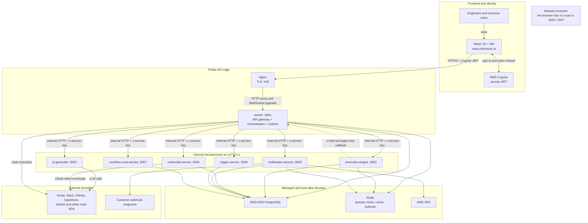
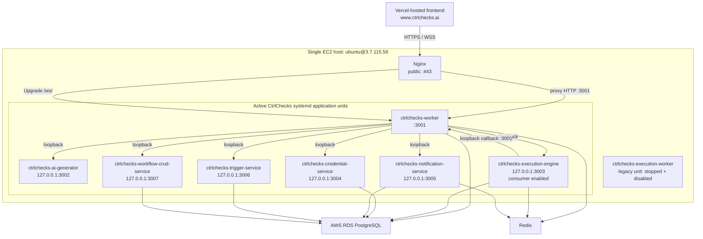
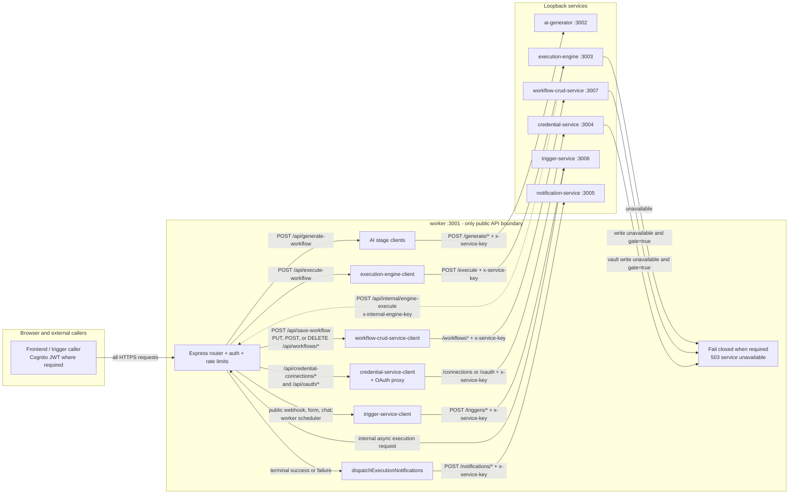
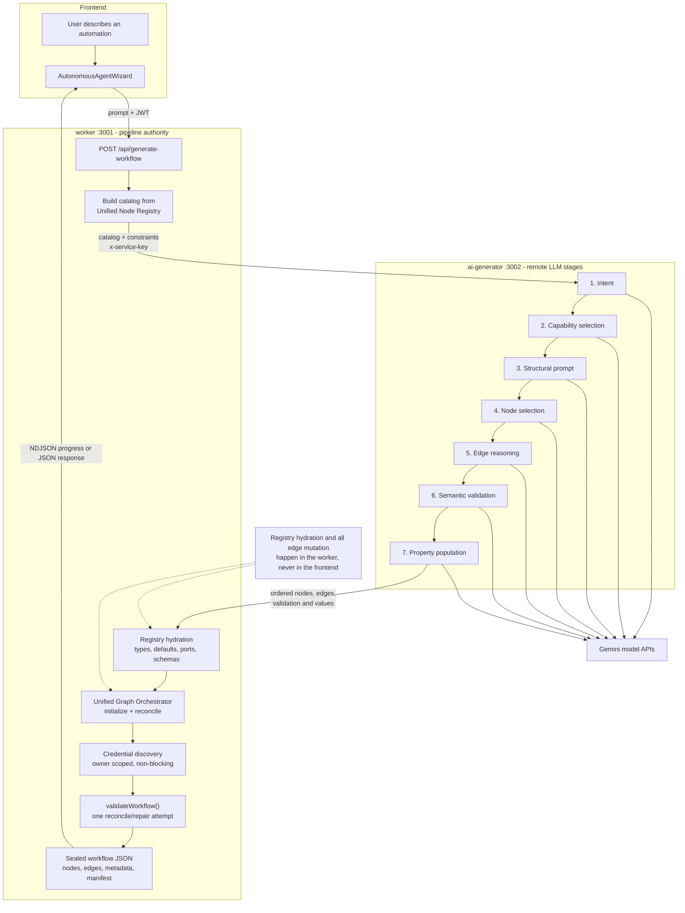
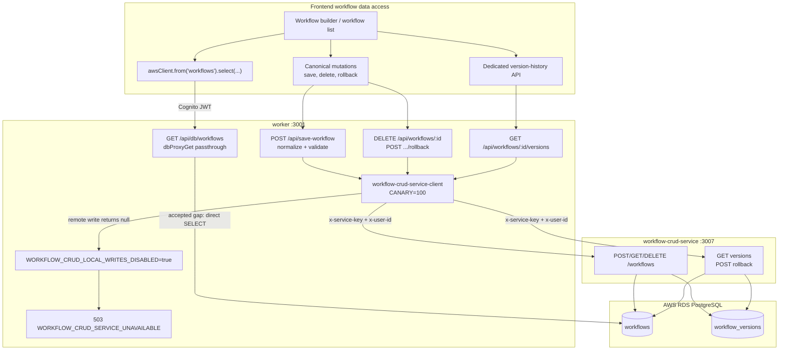
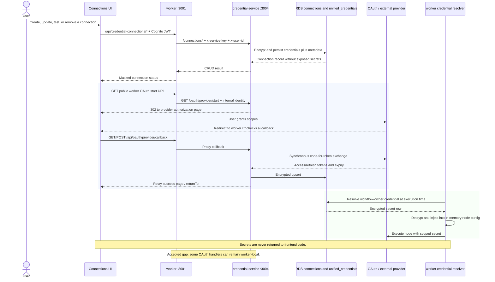
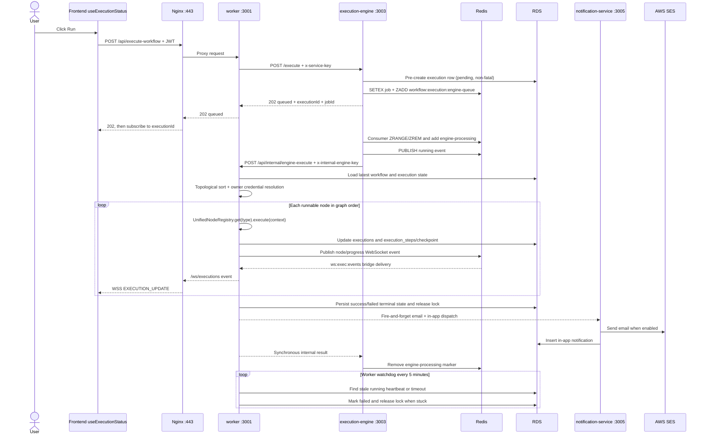
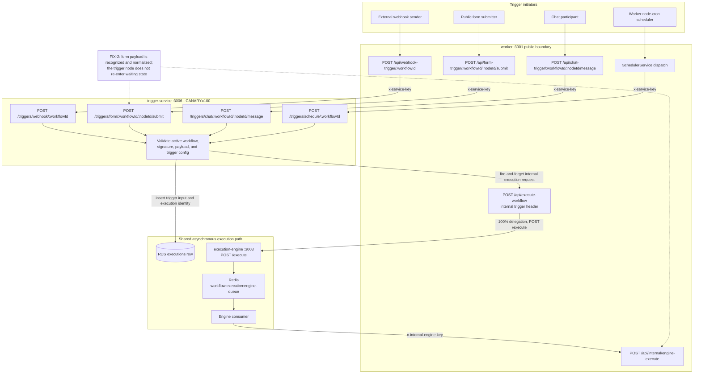
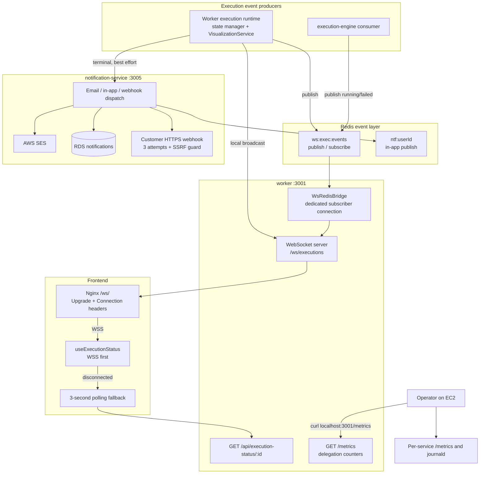
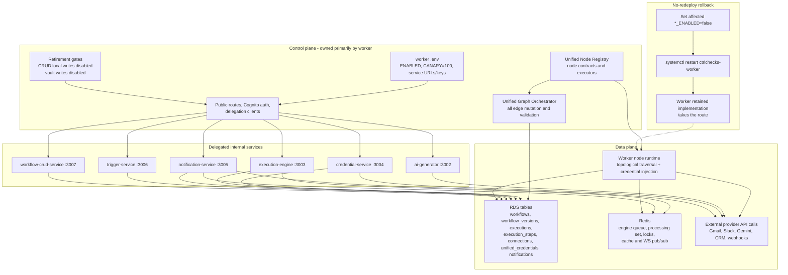

# CtrlChecks Live Microservices: End-to-End Architecture

**Production baseline:** 2026-06-20, after T10 full-pass smoke testing and the T9 retirement-gate flip. This document describes the live single-EC2 deployment, not the removed monolith topology. The React 18/Vite frontend is served at `https://www.ctrlchecks.ai`; `https://worker.ctrlchecks.ai` is the sole public API boundary, with TLS terminated by Nginx before traffic reaches the worker on port 3001.

The normal production path delegates at 100% to the six internal services on ports 3002-3007. Those services are reachable only on EC2 loopback and are never called by browser code. AWS Cognito authenticates user-facing worker routes, while service-to-service requests use shared internal keys.

## Service inventory

| Service | Port | Public? | Live responsibility | Key environment flags and settings |
|---|---:|---|---|---|
| `worker` | 3001 | Yes, through Nginx as `worker.ctrlchecks.ai` | API gateway, Cognito enforcement, delegation clients, Unified Node Registry, Unified Graph Orchestrator, WebSocket server, scheduler/watchdog, and the current node execution runtime | `ENABLE_EXECUTION_QUEUE=true`; `DATABASE_URL`; `REDIS_URL`; `WORKER_INTERNAL_KEY`; all `*_SERVICE_ENABLED`, `*_CANARY_PERCENT`, URL, and service-key settings |
| `ai-generator` | 3002 | No; loopback only | Runs the remote LLM portions of intent, capability, structural-prompt, node-selection, edge-reasoning, validation, and property-population stages; normal production traffic is fully delegated | Worker: `AI_GENERATOR_URL=http://127.0.0.1:3002`, `AI_GENERATOR_SERVICE_KEY`; service: `AI_GENERATOR_SERVICE_KEY`, Gemini/model settings |
| `execution-engine` | 3003 | No; loopback only | Accepts execution requests, owns `workflow:execution:engine-queue`, and consumes queued jobs before calling the worker runtime | `EXECUTION_ENGINE_ENABLED=true`; `EXECUTION_ENGINE_CANARY_PERCENT=100`; `EXECUTION_ENGINE_CONSUMER_ENABLED=true`; `EXECUTION_ENGINE_SERVICE_KEY`; `WORKER_INTERNAL_KEY`; `WORKER_INTERNAL_URL` |
| `credential-service` | 3004 | No; loopback only | Connection CRUD, encrypted credential persistence, and proxied OAuth start/callback flows | `CREDENTIAL_SERVICE_ENABLED=true`; `CREDENTIAL_SERVICE_CANARY_PERCENT=100`; `CREDENTIAL_SERVICE_OAUTH_ENABLED`; `CREDENTIAL_SERVICE_OAUTH_PROVIDERS`; `CREDENTIAL_SERVICE_VAULT_WRITES_DISABLED=true`; `CREDENTIAL_ENCRYPTION_KEY` |
| `notification-service` | 3005 | No; loopback only | Email through AWS SES, in-app notification rows and Redis publish, and guarded outbound webhooks | `NOTIFICATION_SERVICE_ENABLED=true`; `NOTIFICATION_SERVICE_CANARY_PERCENT=100`; `NOTIFICATION_SERVICE_KEY`; `DATABASE_URL`; `REDIS_URL`; `SES_FROM_EMAIL`; `SES_REGION` |
| `trigger-service` | 3006 | No; loopback only | Validates and dispatches webhook, form, chat, and scheduled triggers, then starts the common execution path | `TRIGGER_SERVICE_ENABLED=true`; `TRIGGER_SERVICE_CANARY_PERCENT=100`; `TRIGGER_SERVICE_KEY`; `WORKER_INTERNAL_URL`; `DATABASE_URL` |
| `workflow-crud-service` | 3007 | No; loopback only | Workflow save/delete, dedicated load/list APIs, templates, version history, and rollback | `WORKFLOW_CRUD_SERVICE_ENABLED=true`; `WORKFLOW_CRUD_SERVICE_CANARY_PERCENT=100`; `WORKFLOW_CRUD_LOCAL_WRITES_DISABLED=true`; `WORKFLOW_CRUD_SERVICE_KEY`; `DATABASE_URL` |

## Accepted gaps and boundaries

| Gap | Live behavior and impact |
|---|---|
| Workflow CRUD read passthrough | The frontend's `awsClient.from('workflows').select(...)` still uses the worker's authenticated `GET /api/db/workflows` proxy. The service has dedicated list/load endpoints, but these common frontend reads do not use them yet. |
| OAuth bypasses | Some provider-specific OAuth paths can still execute a worker-local handler instead of the credential-service proxy. The credential write retirement gate covers delegated connection CRUD, but the remaining OAuth migration is separate work. |
| Executor remains in worker | The execution-engine owns acceptance, queueing, and consumption, but calls `POST /api/internal/engine-execute`; topological traversal, credential injection, and `UnifiedNodeRegistry.get(type).execute()` still run in the worker. |
| Trigger notification identity | A trigger-created execution with no usable `userId` can complete successfully while terminal notification dispatch is skipped. This is a documented, rare form-trigger gap rather than an execution failure. |

The legacy `ctrlchecks-execution-worker` unit is stopped and disabled after cutover. It appears only in the deployment diagram so all eight installed application unit names are accounted for; it is not part of the live execution path.

## 1. System Context (C4 Level 1)

### Explanation

A user initiates every interactive flow in the Vite frontend, which obtains a Cognito access token and sends HTTPS requests only to Nginx and the worker. Nginx synchronously terminates TLS and forwards HTTP or upgraded WebSocket traffic to port 3001; the browser has no network path to ports 3002-3007. The worker synchronously validates, routes, or delegates requests, while execution and terminal notifications become asynchronous after the engine returns `202 Accepted`. Durable workflow, execution, credential, and notification state lives in RDS, while Redis carries queues, locks, caches, and cross-process events. The worker still owns graph authority and node execution, even though the six extracted services own their listed service domains. A failed mandatory engine, CRUD-write, or credential-write delegation returns a service error under the live cutover gates; optional notification delivery remains best-effort.

## 2. Deployment Topology (Single EC2 Host)

### Explanation

The browser loads the frontend from Vercel and initiates all backend traffic through Nginx on one EC2 host. Nginx forwards public HTTPS and `/ws/` upgrades only to the worker; the six extracted services listen on loopback ports and are reached synchronously by worker clients. Seven CtrlChecks application units are active, while the eighth installed application unit, `ctrlchecks-execution-worker`, is a stopped and disabled legacy consumer. RDS and Redis are shared infrastructure rather than per-service databases or queues. A service process failure is isolated at the systemd-unit level, but the single EC2 host remains an accepted single-host failure domain. Operational rollback changes the worker's delegation flag and restarts `ctrlchecks-worker`; it does not require rebuilding or redeploying the service units.

## 3. Request Routing and API Gateway Pattern

### Explanation

The browser or an external trigger initiates a request against a stable worker URL, and the worker applies public authentication and routing before any internal call. Generation, CRUD writes, connection CRUD, manual execution, trigger dispatch, and terminal notifications each use a dedicated worker client with an `x-service-key`; the engine-to-worker callback uses the narrower `x-internal-engine-key`. Most request/response delegations are synchronous, but `POST /execute` returns `202` after queueing and trigger notification to the execution path is fire-and-forget. The target service persists its domain state in the shared RDS database, while the engine persists queue payloads in Redis. With execution-engine enabled at the post-cutover route, an engine error produces `503 EXECUTION_ENGINE_UNAVAILABLE` rather than silently executing on the gateway. The workflow and credential retirement gates similarly prevent a failed delegated write from being duplicated through a worker-local write path. Trigger and notification fallback code remains in the worker for operational rollback, but the normal production routing percentage is 100%.

## 4. AI Workflow Generation Pipeline (End to End)

### Explanation

The user initiates generation in `AutonomousAgentWizard`, which submits the prompt to the worker and receives either streaming NDJSON progress or a final JSON response. The worker builds the authoritative node catalog and synchronously delegates the LLM portions of each stage to ai-generator at the live 100% normal-path setting. AI output is not trusted as executable structure: the worker rehydrates selected types from the Unified Node Registry and sends every edge mutation through the Unified Graph Orchestrator. Credential discovery checks what the workflow will require and which connections are present, but missing credentials are returned as setup work rather than blocking JSON construction. The worker persists nothing merely because generation succeeded; persistence occurs later through the workflow save path. Remote stage clients retain in-process fallbacks for service errors, while irreparable node, edge, or structural-validation failures return a generation error instead of a malformed workflow. Registry hydration, graph initialization, reconciliation, final validation, and manifest sealing all remain in the worker.

## 5. Workflow Save, Load, and CRUD Delegation

### Explanation

The workflow builder initiates canonical saves, deletes, and rollbacks through authenticated worker routes, where saves are normalized and validated before delegation. At `CANARY=100`, the worker synchronously calls workflow-crud-service, which writes `workflows` and maintains `workflow_versions`; dedicated history and rollback routes use the same service. `WORKFLOW_CRUD_LOCAL_WRITES_DISABLED=true` is the retirement gate, so a failed remote mutation returns `503` instead of creating a second write through the worker. The common frontend list/load pattern is different: `awsClient.from('workflows').select(...)` still calls the worker's generic authenticated DB proxy and reads RDS directly. That read passthrough is an accepted gap even though the service also implements dedicated `GET /workflows` and `GET /workflows/:id` endpoints. The service stores workflow JSON but does not author or mutate graph edges; those changes must already have passed through the worker's graph orchestrator. Disabling workflow-crud-service delegation and restarting the worker is the no-redeploy rollback path to the retained local implementation.

## 6. Credential and OAuth Flow

### Explanation

The user initiates connection CRUD or OAuth from the Connections page, but every public URL remains on the worker so provider redirect URIs do not expose port 3004. Connection CRUD is a synchronous worker-to-service call, and credential-service encrypts the secret material before persisting connection and unified credential state in RDS. OAuth start and callback involve browser redirects, but the code-for-token exchange and encrypted upsert occur server-side. During workflow execution, the credential resolver remains in the worker: it resolves credentials for the workflow owner, decrypts them, and injects them only into the in-memory node execution config. No secret value is included in frontend connection responses, workflow JSON, or WebSocket events. With `CREDENTIAL_SERVICE_VAULT_WRITES_DISABLED=true`, a failed delegated CRUD write returns `503 CREDENTIAL_SERVICE_UNAVAILABLE` rather than falling back to a local vault write. Some OAuth provider paths can still bypass the service proxy; this accepted gap is controlled separately from the CRUD canary and retirement gate.

## 7. Execution Flow - Manual Trigger (Happy Path)

### Explanation

The user initiates a run, and the worker immediately delegates to execution-engine, which writes the Redis job and returns `202` without waiting for node execution. The engine consumer asynchronously removes the job from `workflow:execution:engine-queue`, publishes a running event, and then makes one synchronous internal call back to the worker. Inside that call the worker loads the latest workflow, resolves owner credentials, performs a topological traversal, and executes every node through the Unified Node Registry. Execution state and resumable step checkpoints are persisted in RDS, while progress events move through Redis and the worker's `/ws/executions` server to `useExecutionStatus`. Terminal email and in-app notifications are dispatched after the execution state is durable and do not block the run result. There is no monolith fallback when the live engine delegation itself fails: the public request receives `503`, and a consumer/runtime failure emits a failed event. Independently, `TimeoutWatchdog` scans stale `running` rows every five minutes, marks them failed, and releases their execution locks.

## 8. Trigger Flows - Form, Webhook, Schedule, and Chat

### Explanation

Webhook senders, form users, and chat users initiate public requests on worker URLs, while scheduled work is initiated by the scheduler that still runs in the worker. At `TRIGGER_SERVICE_CANARY_PERCENT=100`, the corresponding worker client synchronously asks trigger-service to validate the active workflow and channel-specific payload. Trigger-service persists an execution row and returns a queued identity, while its notification into the worker execution route is fire-and-forget. The worker then delegates that request to execution-engine, which places the job on the same engine queue used by manual runs; the consumer ultimately uses the same internal worker runtime described in section 7. FIX-2 ensures form submission data is recognized, normalized, and not re-paused as though the trigger were still waiting. Invalid signatures, inactive workflows, malformed messages, or a failed trigger-service database lookup return a channel-appropriate `4xx` or `503` before enqueue. If an asynchronous handoff stalls after the execution row exists, WebSocket/polling exposes the lack of progress and the worker watchdog eventually fails a stale `running` row.

## 9. Real-Time Observability and Notifications

### Explanation

The worker runtime and execution-engine initiate lifecycle events, with local worker events broadcast directly and cross-process events published on Redis `ws:exec:events`. `WsRedisBridge` uses a duplicated subscriber connection so Redis pub/sub cannot put the shared command connection into subscriber-only mode. Nginx forwards `/ws/` upgrade headers, and the frontend's `useExecutionStatus` subscribes to `/ws/executions` with the execution ID and Cognito token. If the socket is disconnected, the hook polls `GET /api/execution-status/:id` every three seconds and stops polling when WebSocket connectivity returns. Terminal notification delivery is asynchronous: notification-service sends email through SES, inserts in-app rows in RDS and publishes their Redis event, and can deliver a configured HTTPS webhook with SSRF checks and retry. Notification failures do not roll back a completed workflow execution, and a trigger execution without a usable user ID can skip terminal dispatch. Operators inspect worker delegation counters with `curl localhost:3001/metrics`, service-local metrics, and each unit's journald logs.

## 10. Data and Control Planes

### Explanation

The worker's environment and code initiate control-plane decisions: public routing, service enablement, 100% canary settings, retirement gates, registry contracts, and graph validation. The six internal services apply those decisions to production data, but they do not replace the worker's node registry or graph orchestrator. The data plane consists of RDS rows, Redis queue and coordination keys, the worker runtime's in-memory node context, and outbound calls made by nodes or service integrations. The engine queue and processing set are control signals carried in Redis, while execution results and resumable state are durable in RDS. A rollback sets the affected service's `*_ENABLED=false` and restarts only the worker, causing the retained implementation to take the route without a redeploy. Retirement gates remain important on the live delegated path because they convert a failed credential or workflow write into `503` rather than an implicit double-write. This deployment has no live Kubernetes, Kafka, or multi-region control plane; the operational unit is the single EC2 host plus its managed AWS dependencies.

## Glossary

| Term | Meaning in the live CtrlChecks system |
|---|---|
| **Canary** | Deterministic delegation controlled by a worker environment percentage. Credential, notification, trigger, and workflow CRUD routing hashes a stable user or workflow ID; production is at 100%, so every eligible request uses the service normal path. Execution-engine is also configured with `CANARY=100`, although the Phase 5 worker route delegates unconditionally whenever the engine is enabled. |
| **Retirement gate** | A fail-closed switch used after a successful service soak. `WORKFLOW_CRUD_LOCAL_WRITES_DISABLED=true` and `CREDENTIAL_SERVICE_VAULT_WRITES_DISABLED=true` prevent a remote write failure from silently falling through to a second worker-local write. |
| **engine-queue** | The Redis sorted set `workflow:execution:engine-queue`, owned and consumed by execution-engine when `EXECUTION_ENGINE_CONSUMER_ENABLED=true`. A separate job key stores the serialized payload, and an engine-processing sorted set tracks dequeued work. |
| **db-proxy passthrough** | The worker's authenticated `/api/db/:table` layer, which turns the frontend's database-like `awsClient.from(...)` calls into user-scoped SQL against RDS. For workflows, common reads still use this path instead of workflow-crud-service; that is the documented CRUD read gap. |
| **Delegation client** | A worker-side `*-service-client.ts` adapter that applies flags/canary policy, adds internal auth headers, enforces a timeout, records delegation metrics, and translates a service response back to the public worker route. |

## Traceability map

| Topic | Primary repository evidence |
|---|---|
| Production cutover, ports, flags, gates, and accepted gaps | [MICROSERVICES_CUTOVER_COMPLETE.md](../../.claude/logs/MICROSERVICES_CUTOVER_COMPLETE.md), [MICROSERVICES_OPS_PLAYBOOK.md](../../.claude/logs/MICROSERVICES_OPS_PLAYBOOK.md), [PRODUCTION_GROUND_TRUTH_AUDIT.md](../../.claude/logs/PRODUCTION_GROUND_TRUTH_AUDIT.md) |
| Service APIs and ownership | [execution-engine-contract.md](../engineering/execution-engine-contract.md), [credential-service-contract.md](../engineering/credential-service-contract.md), [notification-service-contract.md](../engineering/notification-service-contract.md), [trigger-service-contract.md](../engineering/trigger-service-contract.md), [workflow-crud-service-contract.md](../engineering/workflow-crud-service-contract.md) |
| Worker-to-service routing and internal auth | `worker/src/services/*-service-client.ts`, `worker/src/middleware/credential-oauth-proxy.ts`, `worker/src/api/internal-engine-execute.ts` |
| Generation pipeline and worker graph authority | `worker/src/api/generate-workflow.ts`, `worker/src/services/ai/pipeline/workflow-generation-pipeline.ts`, `worker/src/services/ai/pipeline/backend-finalizer.ts`, `worker/src/core/registry/unified-node-registry.ts`, `worker/src/core/orchestration/unified-graph-orchestrator.ts` |
| Execution queue, consumer, runtime, and watchdog | `services/execution-engine/src/routes/execute.ts`, `services/execution-engine/src/runner/engine-consumer.ts`, `services/execution-engine/src/runner/engine-runner.ts`, `worker/src/api/execute-workflow.ts`, `worker/src/core/execution/dynamic-node-executor.ts`, `worker/src/services/execution/timeout-watchdog.ts` |
| Trigger routing and FIX-2 | `worker/src/api/webhook-trigger.ts`, `worker/src/api/form-trigger.ts`, `worker/src/api/chat-trigger.ts`, `worker/src/services/scheduler/`, `services/trigger-service/src/`, [MICROSERVICES_CUTOVER_COMPLETE.md](../../.claude/logs/MICROSERVICES_CUTOVER_COMPLETE.md) |
| Frontend DB and realtime touchpoints | `ctrl_checks/src/integrations/aws/client.ts`, `ctrl_checks/src/components/workflow/AutonomousAgentWizard.tsx`, `ctrl_checks/src/hooks/useExecutionStatus.ts`, `ctrl_checks/src/hooks/useExecutionWebSocket.ts` |
| WebSocket bridge and notification terminal path | `worker/src/services/ws-redis-bridge.ts`, `worker/src/services/notifications/dispatch-execution-notifications.ts`, `worker/src/services/notification-service-client.ts`, `services/notification-service/src/` |
